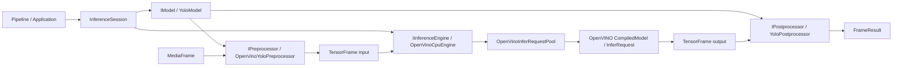
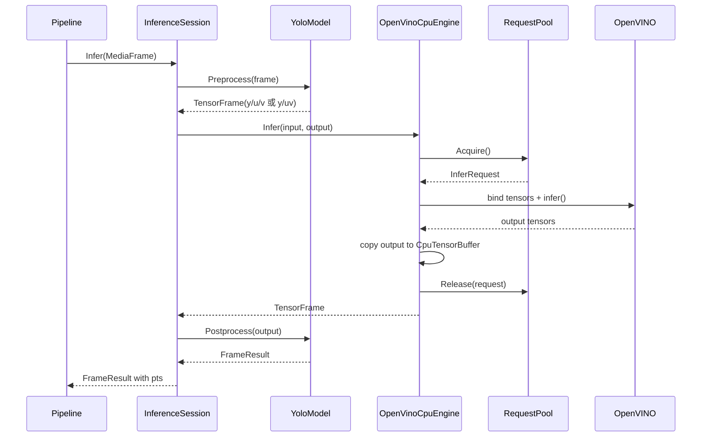
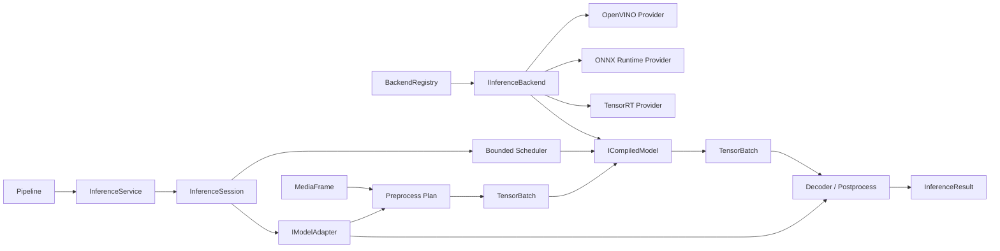

# Inference 模块设计、改进与扩展计划

本文档说明当前 Inference 模块的架构、接口契约、OpenVINO 实现、已知问题、测试现状和后续扩展计划。文档以仓库当前代码为准，先把 OpenVINO + YOLOv5 检测链路做稳定，再演进为支持多种推理框架、设备和模型任务的平台。

本文档也是 Inference 模块的长期进度记录。后续实现应更新第 11 章任务状态和第 13 章实施记录，避免设计、代码和完成状态脱节。

最后更新：2026-08-04。

## 1. 目标、范围与当前结论

### 1.1 最终目标

Inference 平台最终应提供以下能力：

- 对 pipeline 暴露稳定、与具体推理框架无关的会话接口。
- 支持 OpenVINO，并能按相同边界接入 ONNX Runtime、TensorRT 等后端。
- 将模型语义、前后处理、运行时执行、设备内存和调度策略拆分为可独立测试的组件。
- 支持同步推理、异步推理、有界排队、背压、取消和优雅关闭。
- 支持检测、分类、分割、姿态、OCR 等任务，并保留帧和流上下文。
- 提供结构化错误、能力查询、性能指标和可重复的兼容性测试。

近期目标不是同时接入多个框架，而是先把 OpenVINO 做成第一个符合这些边界的后端。第二个后端的意义是验证抽象，不应在 OpenVINO 契约尚未稳定时提前复制当前问题。

### 1.2 当前能力基线

| 维度 | 当前状态 | 说明 |
|---|---|---|
| 推理框架 | OpenVINO | CMake 默认根目录指向 OpenVINO 2026.2.1 Windows Toolkit |
| 设备 | CPU | `OpenVinoCpuEngine` 强制使用 `CPU`，传入的 `EngineConfig::device` 当前不生效 |
| 模型格式 | OpenVINO IR | 已验证 `models/yolov5/yolov5s.xml` 与配套 `.bin` |
| 模型任务 | YOLO 目标检测 | `TaskType` 已预留其他任务，但没有对应实现 |
| 输入格式 | I420、NV12 | YOLO 预处理器只接受这两种格式；NV21 和 packed RGB/GRAY 尚未贯通 |
| 前处理 | OpenVINO PrePostProcessor | 支持 YUV 转 RGB、线性 resize、类型转换和 scale |
| 后处理 | YOLO decode + class-aware NMS | 支持有限的二维/三维 FP32 输出布局猜测 |
| 同步推理 | 已贯通 | `MediaFrame -> FrameResult` 可用 |
| 异步推理 | 引擎层初步实现 | `IInferenceEngine` 支持异步；`InferenceSession` 和 pipeline 未接入 |
| request pool | 已实现 | 固定大小、阻塞获取、关闭时等待归还 |
| batch | 未真正贯通 | 配置和 capability 有字段，但会话、前后处理和结果都按单帧工作 |
| dynamic shape | 部分识别 | 能读取动态维度；缺少 reshape 策略、profile 和端到端测试 |
| 错误模型 | `bool`/空结果 + 日志 | 无错误码、错误阶段和可编程恢复信息 |
| 自动测试 | 2 项 | smoke 预处理测试、YOLOv5 OpenVINO 端到端测试 |

结论：当前代码是一个可运行的 OpenVINO/YOLOv5 原型，已经验证了基本数据链路，但还不是稳定的多框架平台 API。短期应优先修正生命周期、错误模型、模型输出契约和异步语义，再扩展设备或框架。

### 1.3 模块边界

Inference 接收解码后的 `MediaFrame`，输出与输入帧关联的 `FrameResult`。

```text
pull/demux -> decode -> MediaFrame -> inference -> FrameResult
                                      |              |
                                      |              +-> OSD / analytics / metadata
                                      +-----------------> original frame continues to encode/publish
```

Inference 当前不负责：

- 拉流、解码、编码和发布。
- 把检测结果绘制到视频帧；该职责属于 OSD/filter 或应用编排层。
- 目标跟踪、跨帧事件规则和告警业务。
- 模型下载、模型仓库、版本分发和权限控制。

## 2. 当前总体架构

### 2.1 组件关系



### 2.2 当前分层职责

| 层级 | 核心类型 | 当前职责 | 当前边界问题 |
|---|---|---|---|
| 会话编排 | `InferenceSession` | 连接 model 和 engine，执行预处理、推理、后处理 | 只有同步接口；无状态机、错误和请求上下文 |
| 模型语义 | `IModel`、`YoloModel` | 模型元信息、前处理和后处理 | `YoloModel` 直接创建名为 OpenVINO 的处理器，模型语义与后端策略耦合 |
| 前处理 | `IPreprocessor`、`OpenVinoYoloPreprocessor` | 校验视频帧并把 I420/NV12 plane 封装成 tensor | 接口缺少虚析构；只覆盖 YUV；配置不匹配仅告警 |
| 执行引擎 | `IInferenceEngine`、`OpenVinoCpuEngine` | 加载、编译、同步/异步执行和模型 I/O 描述 | 通用加载配置包含 OpenVINO 专用类型；实现固定 CPU |
| 请求资源 | `OpenVinoInferRequestPool`、`RequestLease` | 复用 `ov::InferRequest` 并协调关闭 | `Acquire()` 无限阻塞；异步回调与关闭存在重入风险 |
| 后处理 | `IPostprocessor`、`YoloPostprocessor` | YOLO 输出解析、NMS、坐标恢复 | 接口缺少虚析构；依赖 shape 启发式；只接受 FP32 |
| 张量交换 | `TensorBuffer`、`TensorPlane`、`TensorFrame` | 在处理器和引擎间交换命名张量及图像变换元信息 | 公共枚举带框架名；公开可变字段较多；复制总是退化为 CPU 深拷贝 |
| 结果模型 | `FrameResult`、`ObjectResult` | 表达帧级对象、框、可选姿态/掩码/分类 | 无 success/error、stream id、模型 id；部分字段没有默认值 |

### 2.3 当前同步调用时序



`Acquire()` 在没有空闲 request 时会阻塞调用线程。因此即使上层并发调用同步 `Infer()`，并发量仍由 `request_count` 限制，但当前没有超时、取消或过载返回。

## 3. 核心数据与接口契约

### 3.1 `MediaFrame`

`MediaFrame` 是 inference 的上游输入，包含：

- `type`：当前推理链路要求 `MediaType::VIDEO`。
- `time`：使用微秒时间戳；当前 Session 只把 `pts_us` 写入结果。
- `VideoFrameMeta`：像素格式、宽高、plane 数量、offset、stride 和 size。
- `buffer`：通过 `shared_ptr<IMediaBuffer>` 持有底层字节。
- `backend`：已有后端句柄字段，但当前 inference 未使用。

当前 YUV 输入约束：

| 格式 | tensor 名称 | tensor shape | 说明 |
|---|---|---|---|
| NV12 | `y`、`uv` | `[1,H,W,1]`、`[1,H/2,W/2,2]` | 宽高必须为偶数 |
| I420 | `y`、`u`、`v` | `[1,H,W,1]`、两个 `[1,H/2,W/2,1]` | 宽高必须为偶数 |

plane 连续且无 padding 时，`MediaFramePlaneTensorBuffer` 共享原 `MediaFrame::buffer`，不复制像素。stride 大于有效行宽时，预处理器逐行复制为紧凑 `CpuTensorBuffer`。因此调用者必须提供准确的 plane offset、stride 和足够大的 buffer。

### 3.2 `TensorBuffer`、`TensorPlane` 与 `TensorFrame`

`TensorBuffer` 抽象原始内存，`TensorPlane` 增加名称、类型、shape、memory type 和 buffer，`TensorFrame` 聚合多个命名 tensor 以及 `TensorMeta`。

当前所有权规则：

- `TensorPlane::buffer` 使用 `shared_ptr` 持有内存，`data` 只是指向该 buffer 的缓存指针。
- 移动 `TensorPlane`/`TensorFrame` 转移所有权，不复制数据。
- 复制 `TensorPlane`/`TensorFrame` 会执行 CPU 深拷贝，并把 memory type 改为 `OPENVINO_CPU`。
- OpenVINO 输入用外部内存构造 `ov::Tensor`，输入 buffer 必须存活到同步推理返回或异步 callback 完成。
- OpenVINO 输出总是复制到新的 `CpuTensorBuffer`，不会把 `ov::Tensor` 生命周期暴露给上层。
- `TensorFrame::tensors_` 是 `unordered_map`，不能依赖 `FirstTensor()` 的稳定顺序。当前后处理选择“第一个 FP32 tensor”，多输出模型会有不确定性。

`TensorMeta` 当前记录源图像尺寸、模型输入尺寸和 `LetterBoxInfo`。实际 OpenVINO 前处理使用直接 resize，`pad_x/pad_y` 为 0，`scale_x/scale_y` 可以不同；因此该结构目前更接近通用几何变换元信息，而不是真正的 letterbox 描述。

### 3.3 模型配置与模型元信息

`ModelConfig` 表达模型语义配置：名称、动态 shape、类别数和字符串 `options`。`YoloModel` 当前识别：

- `options["input_width"]`，默认 640。
- `options["input_height"]`，默认 640。

置信度阈值和 NMS 阈值目前没有从 `ModelConfig` 传入 `YoloPostprocessor`，实际固定使用 0.25 和 0.45。

`ModelMeta` 由 model 初始化，并在 `InferenceSession::Initialize()` 时尝试使用 engine 的第一个输入 shape 回写宽高和动态 shape。当前 shape 推断只基于常见 NCHW/NHWC 通道位置；多输入、动态空间维度或非图像模型不能依赖这一逻辑。

### 3.4 引擎配置和能力

`EngineConfig` 当前包含模型路径、backend/device 字符串、batch、request 数和能力字段。需要区分“用户请求值”和“运行时实际值”：

- `backend` 最终强制为 `OPENVINO`。
- `device` 最终强制为 `CPU`。
- `request_count` 至少为 1，并决定 request pool 大小。
- `support_async` 由引擎加载后强制设为 `true`。
- `support_dynamic_shape` 来自编译后模型端口描述。
- `max_batch_size` 当前直接等于配置的 `batch_size`，没有 reshape、批输入或批结果实现支撑。

`EngineCapability::BATCH` 因而只能视为预留标记，不能作为端到端 batch 可用的承诺。

### 3.5 结果模型

当前 `FrameResult` 包含 `frame_id`、`pts` 和对象列表。每个 `ObjectResult` 包含基础检测信息，并预留 pose、mask 和 classification。

当前实际语义：

- `frame_id` 固定为 0，没有从 pipeline 分配或透传。
- `pts` 来自输入 `MediaFrame::time.pts_us`，有符号值被转换为 `uint64_t`。
- `ObjectMeta::id` 默认为 -1；当前没有 tracker，所以不会生成稳定对象 id。
- box 最终转换回源图像坐标，表达为左上角 `x/y` 加 `width/height`。
- 空 `objects` 既可能表示“没有目标”，也可能表示“推理或后处理失败”，调用方无法区分。

### 3.6 当前初始化契约

有效的 YOLOv5/OpenVINO YUV 链路顺序如下：

1. `YoloModel::Initialize(ModelConfig)`。
2. `OpenVinoCpuEngine::LoadModel(EngineLoadConfig)`，YUV 输入时必须启用 OpenVINO preprocess。
3. `InferenceSession::Initialize(model, engine)`，由 Session 回写模型输入元信息。
4. 对像素格式与加载配置一致的 `MediaFrame` 调用 `InferenceSession::Infer()`。
5. 停止链路时调用 `engine->Release()`；析构也会再次幂等调用。

当前没有一个统一 factory 或 builder 执行以上步骤。`model_factory.h` 还是空占位，测试和应用调用点都直接构造具体类。

## 4. OpenVINO 实现细节

### 4.1 模型加载

`OpenVinoCpuEngine::LoadModel()` 当前执行：

1. 调用 `Release()` 清理旧模型。
2. 校验模型路径存在。
3. 用 `ov::Core::read_model()` 读取模型。
4. 可选构建 OpenVINO `PrePostProcessor`。
5. 用 `CPU` 编译模型。
6. 从 compiled model 构建输入输出 `TensorModelDesc`。
7. 创建指定数量的 `ov::InferRequest`。
8. 标记同步和异步入口可用。

任一步抛出异常时，接口记录日志、清空主要资源并返回 `false`。失败原因不会返回给调用方。

### 4.2 OpenVINO 内部前处理

启用 `OpenVinoPreprocessConfig` 后，目前执行以下操作：

- 输入 tensor 类型固定为 `u8`，空间维度设为动态。
- NV12 使用 `NV12_TWO_PLANES`；I420 使用 `I420_THREE_PLANES`。
- packed BGR/RGB/GRAY 在 engine 侧已有颜色格式映射，但 `OpenVinoYoloPreprocessor` 尚不能生成相应 tensor。
- 模型 layout 可显式配置，也可从静态 shape 的通道维猜测。
- 使用线性 resize 到模型空间。
- 转换为模型原始 element type。
- `scale > 0` 时调用 OpenVINO scale，当前典型值为 255。

注意：当前没有 padding，因此不是常见 YOLO letterbox。坐标恢复使用独立的 X/Y 比例，与直接 resize 一致，但可能和模型训练/导出时的预处理假设不一致，必须用标注图片做精度回归。

### 4.3 输入绑定

引擎按以下优先级为每个 OpenVINO input port 查找 `TensorPlane`：

1. port 的所有显式名称。
2. `get_any_name()`。
3. `input_N` fallback。
4. 两输入模型按 `y/uv` fallback。
5. 三输入模型按 `y/u/v` fallback。
6. 单输入且 `TensorFrame` 只有一个 tensor 时使用该 tensor。

绑定前会检查 data 非空，并验证由 type + shape 构造的 `ov::Tensor` 所需字节数不大于 buffer 大小。尚未检查多余字节、内存对齐、device memory 兼容性和所有 shape 乘法溢出。

### 4.4 输出收集

每个 OpenVINO 输出都会复制成 CPU tensor：

```text
ov::Tensor -> allocate CpuTensorBuffer -> memcpy -> TensorPlane
```

这样简化了生命周期，但增加了一次完整输出复制，也阻断了后处理在设备端执行或跨后端零拷贝的可能。后续应先把所有权契约稳定，再按测量结果增加可选的 borrowed/owned device buffer，不能直接让上层持有短生命周期的 `ov::Tensor::data()`。

### 4.5 异步推理与 request pool

引擎层异步流程已经存在：深拷贝输入 `TensorFrame`、阻塞获取 request、绑定输入、设置 OpenVINO callback、启动异步执行，在 callback 中收集输出并归还 request。

当前语义和限制：

- `InferAsync()` 本身可能在 `Acquire()` 中无限阻塞，不是非阻塞 submit。
- callback 在 OpenVINO 工作线程上执行，调用方不能假设回到 pipeline 线程。
- callback 没有 executor 参数，也没有取消 token、deadline 或 queue policy。
- 用户 callback 执行完以后才归还 request；慢 callback 会降低 request pool 吞吐。
- callback 捕获当前 request 的强引用，而 callback 又存储在 request 内，存在自引用生命周期风险。
- 如果用户 callback 在当前实现中同步调用同一 engine 的 `Release()`，`Release()->WaitAll()` 会等待当前 callback 尚未归还的 request，可能死锁。
- Session 没有异步方法，`InferContext` 和 `InferTask` 尚未进入实际链路。

异步接口在解决这些问题并增加专项测试前，不应作为生产级公开能力使用。

### 4.6 生命周期与线程边界

当前预期生命周期可以概括为：

```text
Created -> LoadModel -> Ready -> Infer/InferAsync -> Release -> Released
                    \-> LoadModel(new config) 会先 Release 旧模型
```

`OpenVinoCpuEngine` 的 `initialized_`、`compiled_model_`、描述和配置没有统一锁保护。虽然局部复制 pool/model 能延长部分对象生命，但 `LoadModel()`、`Release()`、`Infer()`、`GetModelDesc()` 并发调用的完整行为没有被定义或测试。当前调用方应在外部串行化加载与释放，并确保不从 inference callback 内释放同一个 engine。

## 5. YOLOv5 模型适配

### 5.1 模型语义

`YoloModel` 当前负责：

- 保存检测任务的模型元信息。
- 创建 YUV plane 打包预处理器。
- 创建 YOLO 检测后处理器。
- 在 engine 描述可用后更新输入宽高并重建处理器。

它没有负责加载权重；权重由 engine 加载。这一方向是合理的，但当前类名和具体处理器仍带 OpenVINO 语义，应进一步拆分为“YOLO 输入策略”和“OpenVINO provider 输入绑定策略”。

### 5.2 输出解析

`YoloPostprocessor` 当前支持 rank 2 或 rank 3 的候选框输出，并根据较小维是否不大于 256 来猜测 `[N,attrs]` 或 `[attrs,N]`。rank 3 的 batch 维没有参与校验，实际隐含 `batch == 1`。

objectness 的识别规则是：

```text
attrs == 84 -> 认为是 YOLOv8 风格 4 + 80 classes
其他 attrs >= 6 -> 认为是 YOLOv5 风格 5 + classes
```

这只能覆盖少数 COCO 导出形状。自定义类别数的 YOLOv8、已融合 NMS 的模型、多输出 head、FP16 输出、归一化坐标和其他 YOLO 导出变体都可能被误判或拒绝。

当前 NMS：

- 按 confidence 降序。
- 只在同 class 内抑制。
- IoU 大于 `nms_threshold` 时移除低分框。
- 复杂度为 O(N²)。

### 5.3 后处理应改为显式契约

后续不应继续扩大 shape 猜测。模型配置或模型清单至少应显式提供：

- decoder 类型和版本，例如 `yolov5_raw`、`yolov8_raw`、`yolo_nms_fused`。
- 输出 tensor 名称。
- box 格式：`cxcywh` 或 `xyxy`。
- 坐标单位：绝对像素或 0 到 1 归一化。
- objectness 是否存在。
- class 数量和标签表。
- 输出 dtype、layout 和 batch 规则。
- confidence/NMS 阈值及 class-agnostic 开关。

加载阶段应校验该 schema 与 engine 返回的 `TensorModelDesc`，不兼容时直接返回结构化错误，而不是等到首帧输出后再猜测。

## 6. 构建、运行与集成

### 6.1 构建开关

`VIDEO_PIPELINE_BUILD_INFERENCE` 默认开启。开启后：

- 必须找到 `openvino::runtime`。
- 全部 `src/inference/*.cpp` 编入单一 `video_pipeline_lib` 静态库。
- `VIDEO_PIPELINE_HAS_INFERENCE=1` 作为 public compile definition 暴露。
- Windows 构建后复制 OpenVINO 和 TBB runtime DLL。

当前问题是 OpenVINO 被直接 public link 到整个核心库。即使未来只使用其他推理后端，单体 target 仍可能把 OpenVINO 变成构建和分发依赖。目标结构应至少拆成：

```text
video-pipeline::inference-core
video-pipeline::inference-openvino
video-pipeline::inference-model-yolo
```

`inference-core` 不包含任何 OpenVINO header、类型、链接库或 runtime 复制规则。

### 6.2 当前 Windows 配置注意事项

`VIDEO_PIPELINE_OPENVINO_ROOT` 当前默认值是本机绝对路径：

```text
C:/vcpkg_env/openvino_toolkit_windows_2026.2.1.21919.ede283a88e3_x86_64
```

这适合当前开发机，但不适合作为可移植默认值。后续应优先接受显式 `OpenVINO_DIR`、环境/toolchain 配置或依赖管理器路径，本机路径只保留在 user preset，不进入共享默认配置。

### 6.3 当前使用示例

```cpp
auto model = std::make_shared<YoloModel>();
ModelConfig model_config;
model_config.name = "yolov5s";
model_config.class_count = 80;
model_config.options["input_width"] = "640";
model_config.options["input_height"] = "640";
model->Initialize(model_config);

auto engine = std::make_shared<OpenVinoCpuEngine>();
EngineLoadConfig load_config;
load_config.engine.model_path = "models/yolov5/yolov5s.xml";
load_config.engine.request_count = 1;
load_config.preprocess = OpenVinoPreprocessConfig{
    true, PixelFormat::kI420, PixelFormat::kRGB24, "NCHW", 255.0f};
engine->LoadModel(load_config);

InferenceSession session;
session.Initialize(model, engine);
FrameResult result = session.Infer(frame);
engine->Release();
```

生产调用点不应长期保留这一串手工装配。完成 factory/config 校验后，应由单一入口创建完整会话，并返回所有配置错误。

## 7. 测试现状与缺口

### 7.1 当前测试

| 测试 | 类型 | 当前覆盖 |
|---|---|---|
| `test_inference_smoke` | 组件 smoke | 构造 I420 frame、YOLO model 初始化、Y/U/V tensor 和基本 `TensorMeta` |
| `test_yolov5_inference` | 本地端到端 smoke | 加载仓库 YOLOv5 IR 并调用 I420 -> OpenVINO CPU -> YOLO 后处理；当前没有断言执行状态或预期检测结果 |
| `test_rtsp_server_publisher` 中的 inference 路径 | 手工集成 | 摄像头解码帧同步推理，并统计检测数；不是 inference 定向自动测试 |

在 Visual Studio developer prompt 中可定向构建和运行：

```powershell
cmake --build build --config Debug --target test_inference_smoke test_yolov5_inference
ctest --test-dir build -R "test_(inference_smoke|yolov5_inference)" --output-on-failure
```

普通 PowerShell 可先运行 `build.ps1`，由脚本加载 MSVC 环境并配置项目：

```powershell
.\build.ps1 -Action build -Config Debug -Tests
ctest --test-dir build -R "test_(inference_smoke|yolov5_inference)" --output-on-failure
```

2026-08-04 验证：重新构建 `test_inference_smoke` 和 `test_yolov5_inference` 后，两项 CTest 2/2 通过，总耗时约 5.28 秒。该结果只代表现有断言通过；由于端到端测试尚未断言执行状态和 golden result，不能据此宣称模型精度或全部推理阶段已经验证。

### 7.2 关键测试缺口

| 类别 | 必须补充的用例 |
|---|---|
| 前处理 | NV12/I420 stride padding、错误 plane count/offset/size、奇数尺寸、格式不匹配、零拷贝与紧凑复制所有权 |
| 几何正确性 | 非正方形输入、直接 resize、真实 letterbox、边界框往返和裁剪 |
| 后处理 | YOLOv5/YOLOv8、自定义 class 数、转置布局、错误 shape、buffer 过小、FP16、多输出 tensor、NMS 边界 |
| engine | 模型不存在、非法配置、输入名/type/shape/bytes 不匹配、多输入/多输出、重复 Load/Release |
| request pool | 多线程 acquire/release、shutdown 唤醒、所有请求归还、部分初始化失败 |
| 异步 | callback 成功/异常、并发 submit、慢 callback、Release 竞态、callback 内关闭、对象析构和内存泄漏 |
| Session | 未初始化、预处理失败、engine 失败、后处理失败、frame/stream/PTS 透传 |
| 设备与性能 | CPU hint/threads/streams、AUTO/GPU 可用性、吞吐/延迟基线、长时间运行 |
| 构建 | inference OFF 不找 OpenVINO，inference core 可单独构建，OpenVINO provider 独立打包 |

后处理测试应使用手工构造的小 tensor，不依赖完整模型；模型端到端测试只验证 provider 集成和少量 golden image。这样错误定位不会全部落在 3 秒以上的模型测试上。

## 8. 已知问题与改进建议

状态说明：`待处理` 表示代码中仍存在；`部分完成` 表示已有实现但契约或测试不足。

### 8.1 P0：先保证正确性和可诊断性

| ID | 问题 | 影响 | 建议 | 状态 |
|---|---|---|---|---|
| INF-001 | `IPreprocessor`、`IPostprocessor` 没有虚析构 | 通过 `unique_ptr<接口>` 删除派生对象属于未定义行为 | 增加 `virtual ~...() = default` 并加析构测试 | 待处理 |
| INF-002 | 异步 callback 捕获 request 强引用，request 又保存 callback | 最后一轮请求可能形成自引用，资源释放不完整 | callback 不强持有自身；在归还前清除 callback，或使用独立 operation state | 待处理 |
| INF-003 | 用户 callback 执行前 request 未归还，callback 内 `Release()` 可能死锁 | 关闭路径不可组合，生产停机可能卡住 | 先收集输出并完成 pool bookkeeping，再在指定 executor 调用户 callback；明确禁止/支持重入并测试 | 待处理 |
| INF-004 | `bool`、空 tensor、空结果和日志混合表达失败 | 调用方无法区分无目标、过载、配置错和执行失败 | 引入 `InferenceStatus`/`StatusOr<T>`，包含 code、stage、message 和 provider detail | 待处理 |
| INF-005 | YOLO 输出由 shape 和 `attrs==84` 猜测 | 自定义类别或导出变体可能静默得到错误结果 | 引入显式 output schema，加载时校验 tensor 名称、shape、dtype | 待处理 |
| INF-006 | decode 未验证 shape 所需字节数不超过 tensor buffer | 错误/伪造 tensor 可能越界读取 | 计算并检查 `count * attrs * sizeof(dtype)`，增加溢出保护 | 待处理 |
| INF-007 | `FrameResult` 不能表达执行状态，部分数值字段无默认初始化 | 空结果语义含混，默认构造容易产生不确定值 | 所有字段值初始化；结果包含 status、context、model id 和 timing | 待处理 |
| INF-008 | 输入像素格式与 engine preprocess 配置不一致时只告警 | 后续可能缺 tensor、颜色错误或首帧运行失败 | Session 初始化或每次提交时返回明确的 `InvalidInputFormat` | 待处理 |

### 8.2 P1：完成 OpenVINO 生产边界

| ID | 问题 | 影响 | 建议 | 状态 |
|---|---|---|---|---|
| INF-101 | `InferenceSession` 只有同步 API | engine 异步能力无法被 pipeline 正确使用 | 增加 `Submit()`、有界队列、完成 executor、取消与 drain | 待处理 |
| INF-102 | `Acquire()` 无限等待 | 解码线程可能被推理负载拖死 | 支持 try/timeout acquire；在 Session 实现 drop/block/latest 等背压策略 | 待处理 |
| INF-103 | engine 生命周期字段没有统一同步 | 并发 Infer/Load/Release 行为未定义 | 建立显式状态机和锁/代际闸门；load/release 与 submit 契约化 | 待处理 |
| INF-104 | device 强制 CPU | 无法使用 OpenVINO GPU/NPU/AUTO | 将类改为通用 `OpenVinoEngine`，校验并传递 device，查询实际执行设备 | 待处理 |
| INF-105 | batch capability 与实际链路不一致 | 上层可能错误启用 batch | 在 batch 真正贯通前不报告 BATCH；之后定义 batch 输入、上下文和拆分结果 | 待处理 |
| INF-106 | dynamic shape 只有描述，没有 reshape/profile 策略 | capability 容易被误解 | 定义动态输入支持条件、shape cache 和编译策略，增加端到端测试 | 待处理 |
| INF-107 | 前处理实际为拉伸，元信息名为 letterbox | 精度策略不透明，模型切换后可能错框 | 引入 `ResizeMode::{Stretch,Letterbox,CenterCrop}` 和通用 transform | 待处理 |
| INF-108 | 阈值固定在后处理器默认值 | 配置无法控制结果 | 使用强类型 decoder config，校验 0..1 范围 | 待处理 |
| INF-109 | 输出总是 CPU memcpy | 大输出或设备后处理成本高 | 先做性能基线，再增加受所有权保护的零拷贝输出选项 | 待处理 |
| INF-110 | 缺少 profiling 和统计 | 无法定位前处理/排队/执行/后处理瓶颈 | 输出分阶段 latency、queue depth、drop、error 和 device 指标 | 待处理 |

### 8.3 P2：稳定多框架扩展边界

| ID | 问题 | 影响 | 建议 | 状态 |
|---|---|---|---|---|
| INF-201 | `EngineLoadConfig` 直接包含 `OpenVinoPreprocessConfig` | 通用 API 泄漏 provider 类型 | generic compile config 与 OpenVINO provider config 分离 | 待处理 |
| INF-202 | `TensorMemoryType` 直接枚举 OPENVINO/CUDA 等实现 | 每增加框架都修改 core；框架和设备内存概念混合 | core 只表达 Host/Device/Shared + device descriptor，由 provider 解释 handle | 待处理 |
| INF-203 | `YoloModel` 直接实例化 OpenVINO 命名处理器 | 模型适配不能复用于其他后端 | 拆成 framework-neutral YOLO adapter 和 provider input adapter | 待处理 |
| INF-204 | `model_factory.h` 为空，调用点直接 new 具体类 | 配置解析、校验和创建逻辑重复 | 实现 model adapter registry 与 backend registry | 待处理 |
| INF-205 | inference 编入单体核心库并 public link OpenVINO | 其他后端仍承担 OpenVINO 构建和部署依赖 | 拆分 core/provider/model CMake targets | 待处理 |
| INF-206 | 字符串 options 缺少 schema 和未知字段检查 | 拼写错误会静默 fallback | 配置入口解析为强类型对象，provider 报告未知/冲突选项 | 待处理 |

### 8.4 代码卫生问题

- `include/inference/info/result.h` 保留大段 `#if 0` 旧结果模型，应在契约稳定后删除，避免两套定义继续漂移。
- 多个 inference 头文件的中文注释已经出现乱码，应统一按 UTF-8 修复。
- include 路径同时使用 `"model/..."`、`"info/..."` 和 `"inference/inference_logger.h"`，依赖额外 public include 目录；拆 target 时应统一从公共根目录包含。
- `TensorShape::ElementCount()` 和 plane 范围计算缺少整数乘加溢出保护。
- `MediaFrame::Stride()`/`PlaneOffset()` 本身没有 index 边界检查，Inference 在访问 plane 前应先验证 `plane_count`。
- `InferTask` 当前未使用，字段又与 `InferContext` 重叠；不应在未定义调度语义前形成两套请求模型。

## 9. 目标架构

### 9.1 设计原则

1. **core 不依赖 provider**：公共头文件不包含 OpenVINO/ONNX Runtime/TensorRT 类型。
2. **模型语义不等于执行框架**：YOLO decoder 可复用于所有输出契约相同的后端。
3. **加载时失败优于首帧失败**：模型 I/O schema、dtype、layout 和配置尽量在 compile/session 创建时校验。
4. **同步是异步的受控封装**：核心调度以 submit/completion 为准，同步接口只是带 deadline 的等待封装。
5. **过载必须显式**：队列满时返回、丢最旧、丢最新或阻塞都必须由策略决定并可观测。
6. **上下文完整透传**：request id、stream id、frame id、PTS、model id 不由后端猜测。
7. **所有权先于零拷贝**：每类 buffer 必须说明 owner、设备、可访问性、同步方式和有效期。
8. **能力来自实测契约**：只报告已经端到端实现并测试的 async、batch、dynamic、device 能力。

### 9.2 目标组件



| 组件 | 目标职责 | 禁止承担的职责 |
|---|---|---|
| `InferenceService` | backend/model 注册、会话创建、共享资源和全局指标 | 解析 YOLO tensor、直接调用 provider API |
| `InferenceSession` | 绑定 adapter + compiled model + scheduler，校验输入，维护生命周期 | 持有 OpenVINO 类型、猜测模型输出布局 |
| `IModelAdapter` | 声明输入/输出 schema，执行通用前处理和后处理 | 加载/编译 provider 模型、管理线程池 |
| `IInferenceBackend` | 识别模型源、编译并返回 provider-specific compiled object | 理解检测框、类别和业务事件 |
| `ICompiledModel` | 描述实际 I/O，执行/提交 tensor，查询实际能力 | 接收 `MediaFrame`、绘制 OSD |
| Scheduler | 有界排队、优先级、背压、deadline、取消、drain | 解析模型 tensor |
| Tensor/Buffer | 跨层数据与所有权协议 | 暗含具体模型或 pipeline 状态 |

### 9.3 建议的请求与结果模型

下面是目标语义示意，不是当前已存在的 API：

```cpp
struct InferenceContext {
    uint64_t request_id{0};
    uint32_t stream_id{0};
    uint64_t frame_id{0};
    int64_t pts_us{0};
    std::string model_id;
};

struct InferenceResult {
    InferenceStatus status;
    InferenceContext context;
    std::vector<ObjectResult> objects;
    InferenceTiming timing;
};
```

状态码至少区分：未初始化、配置非法、模型不兼容、输入非法、队列已满、已取消、deadline 超时、provider 编译失败、provider 执行失败、后处理失败和关闭中。

### 9.4 配置边界

建议把配置拆成四部分：

| 配置 | 示例内容 | 所有者 |
|---|---|---|
| `ModelSource` | 路径、格式、版本、校验值 | backend/service |
| `ModelAdapterConfig` | decoder、labels、threshold、resize/normalize | model adapter |
| `CompileConfig` | backend id、device、precision/performance hint | provider |
| `SessionConfig` | queue capacity、drop policy、request 数、deadline、completion executor | session/scheduler |

provider 专用属性可以使用带命名空间的标量 property map 进入 provider，但必须由对应 provider 做 schema 校验并拒绝未知字段。公共配置中不保存 `ov::*` 等第三方类型。

### 9.5 目标目录与构建布局

```text
include/inference/
  core/                 status, context, tensor, capability
  backend/              provider-neutral interfaces and registry
  model/                model adapter interfaces
  session/              session and scheduler interfaces
  providers/openvino/   OpenVINO public provider config

src/inference/
  core/
  backend/
  model/yolo/
  session/
  providers/openvino/

test/inference/
  core/
  model/
  providers/openvino/
  integration/
```

目录迁移应在行为测试建立后分阶段进行，不要和接口语义修改混在一个提交中。

## 10. OpenVINO 完善方案

### 10.1 第一阶段：固定正确性基线

- 修复接口虚析构、字段默认初始化和 tensor/plane 边界检查。
- 为当前 YOLOv5 模型增加至少一张有标注的 golden image，验证类别、置信度范围和坐标误差。
- 把 resize 策略显式化；当前模型若继续使用 stretch，应在配置和测试中写明。
- 将 decoder schema 显式配置，移除关键路径上的 `attrs==84` 猜测。
- 让错误从 preprocess、bind、infer、collect、decode 各阶段返回到 Session。

### 10.2 第二阶段：稳定生命周期和异步执行

- 为 engine/session 定义 `Created/Loading/Ready/Draining/Released/Failed` 状态。
- `Submit()` 不在调用线程无限等待 request；队列满返回结构化过载结果。
- request 的归还与用户 callback 解耦，完成回调投递到配置的 executor。
- `StopAccepting()`、`Drain(deadline)`、`CancelPending()`、`Release()` 语义分开。
- 使用 generation 或 operation state 阻止旧模型 callback 写入新会话。
- 对 callback 重入、并发 Release、重复 Release 和析构做专项测试。

### 10.3 第三阶段：OpenVINO 设备和性能能力

- 将 `OpenVinoCpuEngine` 泛化为 `OpenVinoEngine`，支持至少 CPU 和 `AUTO`；GPU/NPU 按实际部署环境验证后开放。
- 映射并记录 OpenVINO performance hint、streams、threads、cache dir、profiling 等常用属性。
- capability 返回请求能力、模型能力和实际编译能力的交集。
- 记录 queue、preprocess、infer、postprocess 和 total latency 的 P50/P95/P99。
- 基于压测决定 request 数，而不是把配置值直接当能力。
- 评估 remote tensor/共享 surface 前先保留 CPU 路径作为正确性基线。

### 10.4 第四阶段：模型和输入能力

- 在 YOLOv5 基线稳定后增加 YOLOv8 或同类检测 adapter，验证显式 decoder schema。
- 增加 packed RGB/BGR 输入，必要时增加 NV21 到 NV12 的明确转换路径。
- 增加分类任务作为第二种 `TaskType`，验证结果模型不只适配检测。
- batch 和 dynamic shape 分别立项；只有 Session、adapter、provider 和测试全部贯通后才公开 capability。

## 11. 路线图与任务状态

### 11.1 状态约定

| 状态 | 含义 |
|---|---|
| 已完成 | 代码、测试、文档和验收证据齐全 |
| 进行中 | 已开始实施；必须在第 13 章记录当前进展 |
| 待开始 | 已确认范围，尚未实施 |
| 阻塞 | 依赖外部决策、设备或上游修改；必须记录阻塞原因 |
| 取消 | 不再实施；必须记录替代方案或取消原因 |

### 11.2 总体里程碑

| 里程碑 | 目标 | 关键交付物 | 状态 |
|---|---|---|---|
| M0 | 建立当前 OpenVINO 基线 | 模块原型、YOLOv5 IR、同步 E2E、本文档 | 已完成 |
| M1 | 修正核心正确性问题 | P0 问题关闭、结构化错误、显式 decoder schema、单元测试 | 待开始 |
| M2 | 异步 Session 和背压 | Submit/queue/cancel/drain、生命周期与并发测试 | 待开始 |
| M3 | OpenVINO 生产化 | CPU/AUTO、设备配置、profiling、性能与稳定性基线 | 待开始 |
| M4 | 扩展模型能力 | 第二个 YOLO schema、分类任务、更多输入格式 | 待开始 |
| M5 | 验证多框架抽象 | inference core 拆包、接入第二个 backend、交叉一致性测试 | 待开始 |
| M6 | 平台化运维 | 模型仓库/热更新、metrics、健康检查、兼容矩阵 | 待开始 |

### 11.3 推荐工作包

#### M1：核心正确性

| 任务 | 内容 | 验收条件 | 状态 |
|---|---|---|---|
| M1-1 | 修复虚析构、默认初始化、旧 `#if 0` 定义和乱码注释 | ASan/常规测试无析构问题；公共头文件清晰 | 待开始 |
| M1-2 | 引入结构化 `InferenceStatus` | 所有公开失败路径不只依赖日志；空检测与失败可区分 | 待开始 |
| M1-3 | 固化 tensor/plane 契约 | type/shape/bytes/plane/overflow 负例齐全 | 待开始 |
| M1-4 | 引入显式 YOLO output schema | YOLOv5 和至少一种转置布局有纯后处理测试 | 待开始 |
| M1-5 | 固化预处理几何 | stretch/letterbox 配置明确，golden image 框坐标通过 | 待开始 |
| M1-6 | 统一创建和配置校验 | 单一 builder/factory 能创建当前 YOLOv5 Session | 待开始 |

#### M2：异步和生命周期

| 任务 | 内容 | 验收条件 | 状态 |
|---|---|---|---|
| M2-1 | 定义 Session/engine 状态机 | 重复 load/release 和非法状态有确定结果 | 待开始 |
| M2-2 | 重构 OpenVINO async operation | 无 request 自引用；callback 可安全触发关闭 | 待开始 |
| M2-3 | 实现有界 scheduler | block/drop-latest/drop-oldest 策略可配置且有指标 | 待开始 |
| M2-4 | 上下文透传 | stream/frame/request/model/PTS 在成功失败路径一致 | 待开始 |
| M2-5 | 取消、drain 和 deadline | 停止有最大等待时间；晚到 callback 不污染新代际 | 待开始 |
| M2-6 | pipeline 接入 | 解码线程不被慢推理无限阻塞，结果可回到指定执行上下文 | 待开始 |

#### M3：OpenVINO 生产化

| 任务 | 内容 | 验收条件 | 状态 |
|---|---|---|---|
| M3-1 | 通用 `OpenVinoEngine` | CPU/AUTO 配置生效，报告实际设备 | 待开始 |
| M3-2 | provider 属性映射 | 性能 hint、streams、threads、cache/profiling 有校验 | 待开始 |
| M3-3 | 性能基准 | 固定模型/分辨率下记录吞吐、P50/P95/P99 和内存 | 待开始 |
| M3-4 | 长稳和故障注入 | 24 小时运行、重复加载、停止中请求、模型损坏用例通过 | 待开始 |
| M3-5 | 构建与部署整理 | OpenVINO 路径可移植，DLL 精确复制，inference OFF 独立通过 | 待开始 |

#### M4 到 M6：扩展与平台化

| 任务 | 内容 | 依赖 | 状态 |
|---|---|---|---|
| M4-1 | YOLOv8/其他导出 schema | M1 | 待开始 |
| M4-2 | 分类 adapter | M1、结果契约 | 待开始 |
| M4-3 | RGB/BGR/NV21 输入 | M1、预处理策略 | 待开始 |
| M4-4 | batch 与 dynamic shape | M2、M3 性能基线 | 待开始 |
| M5-1 | 拆分 inference CMake targets | M1 API 稳定 | 待开始 |
| M5-2 | backend/model registry | M1、M5-1 | 待开始 |
| M5-3 | 接入第二 backend | M5-1、M5-2 | 待开始 |
| M5-4 | 同模型跨 backend 一致性 | M5-3 | 待开始 |
| M6-1 | 模型版本、校验和热更新 | M2 生命周期 | 待开始 |
| M6-2 | metrics/HTTP API/健康状态 | M2、M3 | 待开始 |
| M6-3 | 设备与模型兼容矩阵 | M3、M4、M5 | 待开始 |

### 11.4 推荐实施顺序

1. 先完成 M1-1 到 M1-3，把内存、错误和数据边界变成可测试契约。
2. 完成 M1-4、M1-5，用 golden image 确认当前 YOLOv5 精度，而不只确认“程序能跑完”。
3. 完成 M1-6，消除测试和应用里的重复手工装配。
4. 再执行 M2；异步重构必须先有 request pool 和生命周期测试。
5. M3 在 M2 稳定后进行，性能数据才不会被同步阻塞和 callback 行为污染。
6. M4 可在 M3 后半段并行，但 batch/dynamic shape 必须依赖 M2 调度契约。
7. 最后用第二个 backend 完成 M5，验证 core 中没有残留 OpenVINO 假设。

## 12. 验收标准

### 12.1 OpenVINO 第一阶段 Definition of Done

- YOLOv5 的 I420 和 NV12 输入都有确定的预处理配置与自动测试。
- 至少一张真实 golden image 验证检测类别和坐标，不只使用灰色视频帧。
- 所有公开 API 失败都能返回结构化状态，空检测表示成功且无目标。
- 模型 I/O schema 在 Session 创建阶段完成校验。
- Session 支持有界异步提交、过载策略、停止接收、drain 和安全释放。
- callback 内触发关闭不会死锁；反复加载/释放不会泄漏 request。
- CPU 设备 24 小时稳定性测试无持续内存增长、死锁和未完成请求。
- 文档、文件地图、测试命令和任务状态与代码一致。

### 12.2 多框架平台边界 Definition of Done

- `inference-core` 的公共头文件和链接依赖不包含 OpenVINO。
- OpenVINO 作为独立 provider 注册，禁用后不影响 core 和其他 provider 构建。
- 同一个 model adapter 能绑定至少两个 provider，而不复制 decoder 业务逻辑。
- provider 能力、设备、dtype/layout 和错误通过统一类型表达。
- 同一模型、同一输入在两个 provider 上的结果误差满足预先定义的容差。
- 新增 provider 不需要修改现有 provider 实现和 model adapter 核心逻辑。

## 13. 实施记录

本章按时间追加记录，不覆盖历史。每次完成工作包时至少记录：日期、任务 ID、改动、验证、偏差/遗留和下一步。

### 13.1 当前基线记录

#### 2026-07-25：Inference 初始实现

- 提交 `0f378cd` 建立 model、preprocessor、engine、request pool、session、tensor 和 result 基础结构。
- 引入 OpenVINO 与 YOLOv5 IR 模型，建立预处理 smoke test。
- 阶段性质：原型基线，不等同于稳定公共 API。

#### 2026-07-25：YOLOv5 OpenVINO 链路验证

- 提交 `5e7bc66` 整理 inference 目录并增加 `test_yolov5_inference`。
- 将 YOLOv5 推理接入手工 RTSP publisher 摄像头链路。
- 当前集成仍为同步调用，只统计检测结果，未形成异步 pipeline 节点。

#### 2026-08-04：设计与测试基线复核

- 新增本文档，按当前代码记录架构、数据契约、已知问题和路线图。
- 重新构建并执行 `test_inference_smoke` 与 `test_yolov5_inference`，2/2 通过。
- 识别的最高优先级问题：接口虚析构、异步 request 生命周期/关闭重入、结构化错误、显式 YOLO 输出 schema 和结果上下文。
- 下一步：从 M1-1 开始，不在修正基础契约前扩展第二推理框架。

### 13.2 后续记录模板

```markdown
#### YYYY-MM-DD：<阶段或功能名称>

- 任务：M?-? / INF-???
- 改动：<新增、修改、删除的行为和接口>
- 验证：<测试 target、输入、结果、性能数据>
- 偏差与遗留：<相对计划的变化、未解决风险>
- 下一步：<明确的后续任务 ID>
```

## 14. 文件地图

### 公共接口与数据

- `include/inference/engine/i_engine.h`
- `include/inference/engine/inference_task.h`
- `include/inference/model/i_model.h`
- `include/inference/preprocessor/i_preprocessor.h`
- `include/inference/postprocessor/i_postprocessor.h`
- `include/inference/session/session.h`
- `include/inference/tensordata/tensor_buffer.h`
- `include/inference/tensordata/tensor_data.h`
- `include/inference/tensordata/tensor_frame.h`
- `include/inference/info/processor.h`
- `include/inference/info/result.h`

### OpenVINO 与 YOLO 实现

- `include/inference/engine/openvino_engine.h`
- `include/inference/engine/openvino_request_pool.h`
- `include/inference/preprocessor/openvino_preprocessor.h`
- `include/inference/postprocessor/openvino_postprocessor.h`
- `include/inference/model/yolo_model.h`
- `src/inference/engine/openvino_engine.cpp`
- `src/inference/engine/openvino_request_pool.cpp`
- `src/inference/preprocessor/openvino_preprocessor.cpp`
- `src/inference/postprocessor/openvino_postprocessor.cpp`
- `src/inference/model/yolo_model.cpp`
- `src/inference/session/session.cpp`

### 模型、测试与集成入口

- `models/yolov5/yolov5s.xml`
- `models/yolov5/yolov5s.bin`
- `test/inference/test_inference_smoke.cpp`
- `test/inference/test_yolov5_inference.cpp`
- `test/media/test_rtsp_server_publisher.cpp`
- `CMakeLists.txt`
- `test/CMakeLists.txt`

## 15. 关联文档

- [Publisher 模块设计与扩展计划](publisher-protocol-design.md)
- [OSD 模块移植与技术计划](osd-module-porting-plan.md)
- [RTSP / ZLMediaKit Pipeline 排障记录](rtsp-zlm-pipeline-troubleshooting.md)
