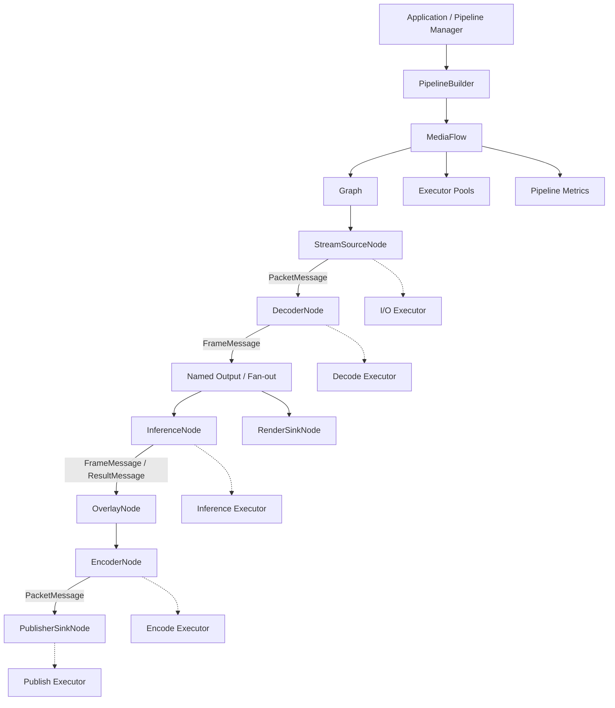

# MediaFlow 框架迁移设计与扩展计划

本文档评估并设计将用户指定的源框架迁移到当前 `video-pipeline` 工程的方案。迁移后的模块命名为 `MediaFlow`。目标不是替换现有媒体、推理和发布模块，而是在其上增加统一的 Pipeline 编排与执行层，使拉流、解码、推理、编码、发布和渲染能够通过类型安全的图进行组合。

最后更新：2026-08-04。

## 1. 结论

迁移总体可行，源框架的 Graph、Node、Port、Transport、Scheduler 和 Executor 分层与当前工程的数据模型能够较好匹配。推荐采用“迁移编排内核 + 新增业务适配节点 + 保留现有模块接口”的方式，避免把现有组件直接改写成 MediaFlow 内部实现。

迁移前必须处理以下基础问题：

- 源框架依赖 `common::BoundedSpscQueue<T>`，当前工程提供的是全局命名空间下的 `BoundedSpscQueue<T>`，接口也缺少 `full()`；直接复制无法通过编译。
- 源框架默认在 SPSC 队列生产侧执行 `pop()` 来实现 `DropOldest`，这会与消费线程形成两个消费者，不满足 SPSC 队列的并发约束。
- `Graph::Stop()` 会关闭 Transport，但 `Graph::Start()` 只重新打开节点 Dispatch，没有重新打开 Transport；同一个 Graph 实例停止后不能可靠重启。
- Edge 队列虽然有容量限制，但 `NodeContext` 内部的 `std::deque<Task>` 没有上限。Drain 可以把有界 Edge 队列快速搬到无界 Dispatch 队列，导致背压失去实际效果。
- `DropFrameScheduler` 当前与 `FIFOScheduler` 行为相同，还没有真正实现按延迟、帧类型或队列深度丢帧。

因此，建议先完成一个只承载 `std::shared_ptr<MediaPacket>` 和 `std::shared_ptr<MediaFrame>` 的最小编排内核，再逐步接入推理、编码、发布和多路流能力。

## 2. 迁移目标与边界

### 2.1 迁移目标

1. 为当前工程提供统一的 Pipeline 拓扑描述、生命周期和线程调度能力。
2. 让现有模块通过适配节点接入，不改变 `IDecoder`、`IEncoder`、`InferenceSession` 和 `IPublisher` 的核心职责。
3. 为节点间传输提供明确的有界队列、背压、丢帧和统计语义。
4. 支持一条流按需组合以下链路：

```text
Puller -> Decoder -> Filter/Inference -> Encoder -> Publisher
                         |                         |
                         +-> Renderer             +-> Recorder（后续）
```

5. 为后续多输入、多输出、音视频分支、动态配置和多路 Pipeline 管理预留稳定边界。

### 2.2 非目标

第一阶段不包含以下内容：

- 不重写 FFmpeg 拉流、解码、编码或发布实现。
- 不在 MediaFlow 内部定义第二套 `MediaPacket`、`MediaFrame` 或 `TensorFrame`。
- 不支持运行中任意修改 Graph 拓扑。
- 不实现分布式 Pipeline、跨进程 Transport 或远程调度。
- 不一次性替换当前测试中的手工回调链路。

### 2.3 “frame”在本方案中的含义

当前工程没有独立的 `frame` 目录或框架模块，因此本方案将目标落点定义为新的 `pipeline` 编排层，并将模块命名为 MediaFlow。`MediaFrame` 继续表示解码后的音视频帧，MediaFlow 负责节点、边、线程和生命周期，不把两者混为同一概念。

## 3. 当前工程基础

### 3.1 可直接复用的数据模型

| 数据类型 | 当前文件 | Pipeline 中的用途 |
|---|---|---|
| `MediaPacket` | `include/media/media_packet.h` | 拉流输出、解码输入、编码输出、发布输入 |
| `MediaFrame` | `include/media/media_frame.h` | 解码输出、滤镜/推理/编码/渲染输入 |
| `TensorFrame` | `include/inference/tensordata/tensor_frame.h` | 预处理、推理和后处理之间的张量数据 |
| `FrameResult` | `include/inference/info/result.h` | 推理结果或业务后处理结果 |

建议 Pipeline 边上优先传递共享指针：

```cpp
using PacketMessage = std::shared_ptr<MediaPacket>;
using FrameMessage = std::shared_ptr<MediaFrame>;
```

原因如下：

- `MediaPacket` 和 `MediaFrame` 的载荷已经由 `shared_ptr<IMediaBuffer>` 管理，共享消息可以避免 fan-out 时复制大块媒体数据。
- `OutputPort<T>` 多下游发送要求 `T` 可复制，`shared_ptr` 正好满足该约束。
- 当前 `IDecoder` 和 `MediaStreamSession` 已经使用相同的共享指针类型，适配成本低。

共享指针只解决所有权和复制成本，不代表载荷可以被任意修改。默认约束应为：节点把输入消息视为只读；需要修改图像内容时创建新 Buffer 或使用显式的独占消息类型。

### 3.2 当前组件接口特征

| 组件 | 当前交互方式 | 适配注意点 |
|---|---|---|
| `MediaStreamSession` | `PacketCallback` 异步输出 | 回调可能来自 I/O 线程，停止时要阻止迟到回调继续 Emit |
| `IDecoder` | `Decode(packet)` + `FrameCallback` | 一次输入可能输出零帧或多帧 |
| `InferenceSession` | 同步 `Infer(const MediaFrame&)` | 应放在独立 inference Executor，避免阻塞 I/O/解码线程 |
| `IEncoder` | `Encode(frame, vector<packet>)` | 一次输入可能输出多个 packet，Stop 时还需要 flush |
| `IPublisher` | 同步 `Publish(const MediaPacket&)` | 网络写入可能阻塞或失败，应使用独立 publish Executor |

### 3.3 当前并发基础

当前工程已经使用 `boost::asio::io_context` 驱动 `MediaStreamSession`，CMake 也已经建立 `video-pipeline::boost` 和 `Threads::Threads` 依赖。MediaFlow 的 Asio Executor 可以复用这套依赖管理，但不应再引入一套无关的全局线程池生命周期。

推荐将命名执行池归属到每个 MediaFlow 实例或上层 Pipeline Manager，避免多个 Pipeline 之间通过全局单例隐式共享和关闭线程池。

## 4. 目标架构



### 4.1 分层职责

| 层级 | 目标组件 | 职责 | 不承担的职责 |
|---|---|---|---|
| Pipeline API | `PipelineConfig`、`PipelineBuilder`、`PipelineHandle` | 面向应用创建、启动、停止和查询 Pipeline | 媒体编解码细节 |
| Flow Core | `MediaFlow`、`Graph` | 管理拓扑、生命周期、节点和边 | 具体业务处理 |
| Scheduling | `IExecutor`、`IScheduler` | 线程池调度、公平性和任务执行 | 媒体格式转换 |
| Transport | `InputPort`、`OutputPort`、`ITransport`、Mailbox | 类型安全传输、队列和背压 | 节点业务状态 |
| Adapter Nodes | Decoder、Inference、Encoder、Publisher 等节点 | 把现有回调/同步接口转换成 Node 输入输出 | 重写底层组件 |
| Domain Modules | 现有 media/inference/render 模块 | 拉流、编解码、推理、发布和渲染 | Graph 编排 |

### 4.2 建议命名空间

源框架使用过于通用的顶层命名空间。迁移后推荐统一放入：

```cpp
namespace video_pipeline::flow {
    // PipelineBuilder, MediaFlow, PipelineConfig
}

namespace video_pipeline::flow::core {
    // Graph, Node, Port, Transport, Executor, Scheduler
}
```

当前工程大量媒体类型仍位于全局命名空间，本次迁移不强制批量改名。新代码使用限定名称，逐步降低未来命名冲突风险。

### 4.3 Graph 的所有权

推荐每路媒体流先对应一个独立 Graph：

```text
PipelineManager
  +-- MediaFlow(stream-001)
  |     +-- Graph
  |     +-- Nodes / Edges
  |     +-- Executor references
  +-- MediaFlow(stream-002)
        +-- Graph
        +-- Nodes / Edges
        +-- Executor references
```

第一阶段采用“一路流一个 Graph”可以简化故障隔离、停止顺序和统计归属。线程池允许由多个 Graph 共享，但线程池的所有权必须由 `PipelineManager` 明确管理，单个 Graph 的 `Stop()` 不应关闭其他 Graph 仍在使用的池。

## 5. MediaFlow 核心设计

### 5.1 Graph 状态机

Graph 应显式维护以下状态：

```text
Created -> Initialized -> Running -> Stopping -> Stopped
   |            |           |
   +---------- Error <------+
```

状态约束：

- `AddNode()` 和 `Connect()` 只允许在 `Created` 或 `Stopped` 且未冻结拓扑时调用。
- `Start()` 必须可检测重复启动，并对部分失败执行完整回滚。
- `Stop()` 必须幂等，多次调用不重复关闭或释放资源。
- `Stopped -> Running` 若被支持，必须重新打开并清空所有 Transport、Dispatch 和调度状态。
- 如果不支持重启，应在接口和测试中明确规定 Graph 为一次性对象，不能保留当前这种“看起来可重启、实际 Transport 已关闭”的状态。

推荐第一版实现可靠重启，因为当前 `MediaStreamSession`、Publisher 和设备链路都存在断线重建需求。

### 5.2 启动顺序

推荐顺序：

1. 校验拓扑、端口类型、重复连接和必需输入是否完整。
2. 打开并清空 Edge Transport 与 Node Dispatch。
3. 按拓扑逆序执行节点 `Init()`，优先准备下游资源。
4. 启动共享 Executor。
5. 按拓扑逆序执行下游节点 `Start()`。
6. 最后启动 SourceNode，允许数据进入 Graph。

任何阶段失败都要记录已成功步骤，并严格逆序回滚。不能只停止 Executor 而遗漏已初始化节点的 `Deinit()`。

### 5.3 停止模式

建议提供两种停止语义：

| 模式 | 行为 | 适用场景 |
|---|---|---|
| `Graceful` | 先停 Source，等待队列排空，flush Decoder/Encoder，最后停止 Sink | 正常退出、录像收尾、文件处理 |
| `Immediate` | 停止生产，关闭边，清空待处理任务并尽快释放资源 | 错误恢复、进程退出、超时保护 |

正常停止顺序：

```text
Stop sources
  -> stop accepting new messages
  -> drain edge and node queues
  -> flush decoder/encoder
  -> stop sinks
  -> stop executors owned by MediaFlow
  -> deinit nodes
  -> clear/open state for optional restart
```

所有来自底层模块的异步回调都应捕获运行代次 `generation` 或弱引用。Graph 已进入 `Stopping/Stopped` 后，迟到回调只能被丢弃并计数，不能继续向关闭的端口发送。

### 5.4 Executor 划分

推荐的初始线程池：

| Pool | 建议线程数 | 承载节点 | 原因 |
|---|---:|---|---|
| `io` | 1 至 2 | Stream Source、轻量协议事件 | 避免被 CPU 重任务阻塞 |
| `decode` | 按路数和硬件能力配置 | Decoder | FFmpeg 解码可能阻塞且消耗 CPU |
| `inference` | 1 或设备并发数 | Preprocess、Inference、Postprocess | 与 OpenVINO 请求池并发保持一致 |
| `encode` | 按编码器并发配置 | Encoder | 编码延迟和资源占用独立 |
| `publish` | 1 至 N | Publisher、Recorder | 网络或磁盘写入可能阻塞 |

节点默认使用 `Serialized` 执行模式。只有确认底层组件可重入、消息顺序不重要，并且测试覆盖并发行为后，才允许配置为 `Concurrent`。

### 5.5 调度公平性

原 `EdgeContext::ExecuteDrain()` 会一次排空整个 Edge，然后把所有消息转移到节点 Dispatch 队列。建议增加：

- `max_batch_size`：单次 Drain 最多处理的消息数。
- `max_drain_time_us`：单次 Drain 的时间预算。
- 超过预算后重新调度，避免一个高流量 Edge 长时间占用 Executor。
- 多输入节点按 Edge 轮转，避免音频、视频或控制消息互相饥饿。

### 5.6 拓扑校验

`PipelineBuilder::Build()` 阶段至少校验：

- 节点 ID 和端口名唯一。
- 连接两端消息类型一致。
- 必需输入端口已经连接。
- 单输入端口是否禁止多条 Edge 同时绑定。
- `DirectTransport` 两端是否允许同步调用。
- SPSC Edge 是否确实只有一个生产线程和一个消费线程。
- 关键媒体 Edge 是否配置了容量和背压策略。
- Graph 是否存在无意的环；需要反馈环时必须显式声明。

## 6. Transport 与背压设计

### 6.1 队列兼容方案

不建议把源工程的 `common/queue` 整目录覆盖到当前工程。两边已有同名队列，但命名空间、底层实现和接口语义不同，直接覆盖会影响 Jitter Buffer 等现有调用方。

推荐在 `pipeline/core/transport` 内部定义 Mailbox 所需的最小队列抽象，并适配当前队列：

```cpp
template <typename T>
class IMailbox {
public:
    virtual MailboxPushResult Push(T value, BackpressurePolicy policy) = 0;
    virtual std::optional<T> TryPop() = 0;
    virtual void Open() = 0;
    virtual void Close() = 0;
    virtual void Clear() = 0;
    virtual std::size_t Size() const = 0;
};
```

实现时以 `push()` 的返回值判断队列是否已满，不依赖 `full()`，也不要求业务消息默认构造。`std::optional<T>` 的无默认构造目标必须贯穿到 Mailbox 底层，不能只在 `ITransport` 表面改成 optional，内部仍然写 `T item;` 或 `T dropped{};`。

### 6.2 SPSC 与 DropOldest

SPSC 队列只允许一个生产者和一个消费者。源框架的 `DropOldest` 路径由生产线程调用 `pop()` 腾位置，而正常 Drain 线程也会调用 `pop()`，等价于两个消费者，不能作为可靠实现迁移。

推荐策略：

| 场景 | 队列类型 | 可用策略 |
|---|---|---|
| 严格单生产者/单消费者 | SPSC | `Block`、`DropNewest` |
| 需要生产侧淘汰旧消息 | MPMC/MPSC 或支持覆盖的专用 Ring Buffer | `DropOldest` |
| 低延迟视频只关心最新帧 | Latest-only Mailbox | 覆盖旧帧，只保留最近 1 至 N 帧 |
| 控制事件、状态变更 | 有界 MPMC | `Block` 或拒绝并上报 |

第一阶段建议正确性优先：Queue Transport 默认使用 MPMC Mailbox；只有拓扑校验能够证明 SPSC 约束时，再显式选择 SPSC 优化。

### 6.3 建议的 Edge 策略

| Edge | 容量建议 | 背压策略 | 说明 |
|---|---:|---|---|
| Puller -> Decoder（视频） | 8 至 32 | `DropOldest` 或关键帧感知策略 | 控制实时延迟，丢包后需等待关键帧恢复 |
| Puller -> Decoder（音频） | 32 至 128 | `Block`/`DropNewest`，按播放策略决定 | 音频连续性通常比最新值更重要 |
| Decoder -> Inference | 1 至 4 | Latest-only | 推理通常不需要处理每一帧 |
| Decoder -> Renderer | 2 至 8 | `DropOldest` | 优先显示最新帧 |
| Filter -> Encoder | 4 至 16 | `Block` 或受控降帧 | 编码链路应保持时间戳和 GOP 规则 |
| Encoder -> Publisher | 32 至 256 | 有界队列 + 关键帧感知 | 网络拥塞不能导致无限内存增长 |
| Control/Event | 16 至 64 | `Block` 或显式拒绝 | 控制消息不能静默丢失 |

容量必须来自配置并进入统计，不能把 `64 + DropOldest` 作为所有媒体类型的统一默认值。

### 6.4 有界 Dispatch

`NodeContext` 的 Dispatch 队列也必须有界，建议配置：

```cpp
struct NodeOptions {
    NodeExecutionMode execution_mode{NodeExecutionMode::Serialized};
    std::size_t max_pending_tasks{64};
    DispatchOverflowPolicy overflow_policy{DispatchOverflowPolicy::Reject};
};
```

更进一步，Queue Edge 不应先把消息从有界 Mailbox 全部搬进任务 lambda。可以让节点 Dispatch 提交一个“继续 Drain 此 Edge”的轻量任务，每次只消费有限 batch，使消息在真正处理前仍受 Edge 容量控制。

### 6.5 DirectTransport

`DirectTransport` 会形成同步调用链，但源实现仍然通过 `NodeContext::Dispatch()` Post 到 Executor，并非严格意义上的同线程直接执行。迁移时需要二选一并写入契约：

- 真正 Direct：调用方线程立即执行下游处理，不经过 Executor。
- Inline-to-Dispatch：无队列，但仍提交到目标 Executor，应使用不同名称避免误解。

媒体 I/O 到推理、编码和发布之间默认不使用真正 Direct，防止慢节点阻塞上游。

## 7. 业务适配节点

### 7.1 StreamSourceNode

输入：无。

输出：`PacketMessage`，可按命名端口区分 `video` 和 `audio`。

职责：

- 包装 `MediaStreamSource` 或 `MediaStreamSession`。
- 在 `Start()` 前注册 Packet、StreamInfo 和 State 回调。
- 把回调线程中的 packet 发送到 Pipeline Edge。
- 在 `Stop()` 时取消回调或使代次失效，拒绝迟到数据。
- 把 StreamInfo 作为控制消息提供给 Decoder/Publisher 初始化流程。

### 7.2 DecoderNode

输入：`PacketMessage`。

输出：`FrameMessage`。

职责：

- 根据对应 track 的 `MediaStreamInfo` 打开 `IDecoder`。
- 调用 `Decode(packet)`。
- 在 FrameCallback 中 Emit 零到多个 Frame。
- 处理重连、codec 参数变化和 flush。
- 将解码失败转换成节点错误和可配置的重建行为。

多轨场景初期建议每个音频/视频 track 使用独立 DecoderNode，避免一个节点内部再维护复杂路由。

### 7.3 InferenceNode

输入：`FrameMessage`。

输出可以选择以下模式之一：

- `FrameResultMessage`：只输出推理结果，通过 Join/Overlay 节点与原帧关联。
- `AnnotatedFrameMessage`：节点内部完成推理与叠加后输出新帧。

推荐长期采用第一种模式，保留原始 Frame 和 Result 的独立性。关联键至少包含 `stream_id + frame_sequence + pts`，不能只依赖裸 PTS。

第一阶段为降低实现量，可以先提供同步 `InferenceNode`，内部调用 `InferenceSession::Infer()`，由独立 inference Executor 隔离阻塞。

### 7.4 EncoderNode

输入：`FrameMessage`。

输出：`PacketMessage`。

职责：

- 根据 `EncoderConfig` 打开 `IEncoder`。
- 对每帧调用 `Encode()`，遍历返回的 packet vector 并逐个 Emit。
- Graceful Stop 时执行 `Encode(nullptr, packets)` flush。
- 保持 packet 的 track、time base、PTS/DTS 和关键帧元数据完整。

### 7.5 PublisherSinkNode

输入：`PacketMessage`。

输出：无。

职责：

- 包装 `IPublisher` 的 Start/Publish/Stop。
- 将 `PublisherResult` 转换为节点状态、错误和指标。
- 网络写阻塞时只影响 publish Executor，不阻塞解码或推理。
- 根据策略决定重连、降级、停止当前分支或停止整个 Pipeline。

### 7.6 RenderSinkNode 与后续节点

渲染节点消费 `FrameMessage`，通过现有 RenderSession 处理 A/V 同步。Recorder、WebRTC、OSD 和事件分析节点在后续阶段按相同适配方式接入，不应把这些职责堆入通用 Graph 或 Node 基类。

## 8. 配置与构建接口

### 8.1 Pipeline 配置

建议先使用 C++ 结构体构建，不在第一阶段引入 YAML/JSON 动态解析：

```cpp
struct PipelineConfig {
    std::string pipeline_id;
    MediaStreamSourceConfig source;
    std::optional<DecoderConfig> decoder;
    std::optional<InferenceConfig> inference;
    std::optional<EncoderConfig> encoder;
    std::optional<PublisherConfig> publisher;
    MediaFlowOptions flow;
};
```

`PipelineBuilder` 根据可选模块构建拓扑：

```cpp
auto pipeline = PipelineBuilder(config)
    .UseSource(source)
    .UseDecoder(decoder)
    .UseInference(inference)
    .UseEncoder(encoder)
    .UsePublisher(publisher)
    .Build();

pipeline->Start();
```

Builder 必须返回结构化错误，指出节点 ID、端口、消息类型或配置字段，不能只返回 `false`。

### 8.2 Graph 低层 API

保留源框架的类型安全 API 思路：

```cpp
graph.AddNode<StreamSourceNode>("source", io_executor, source);
graph.AddNode<DecoderNode>("decoder", decode_executor, decoder);
graph.AddNode<PublisherSinkNode>("publisher", publish_executor, publisher);

graph.Connect<PacketMessage>("source", "video", "decoder", "in", packet_edge);
graph.Connect<FrameMessage>("decoder", "out", "encoder", "in", frame_edge);
graph.Connect<PacketMessage>("encoder", "out", "publisher", "in", publish_edge);
```

应用层优先使用 Builder，测试和高级场景可以直接使用 Graph API。

## 9. CMake 与目录设计

### 9.1 推荐目录

```text
include/pipeline/
  pipeline_builder.h
  pipeline_config.h
  pipeline_handle.h
  pipeline_metrics.h
  core/
    graph/
    node/
    port/
    transport/
    scheduler/
    executor/
  nodes/
    stream_source_node.h
    decoder_node.h
    inference_node.h
    encoder_node.h
    publisher_sink_node.h
    render_sink_node.h

src/pipeline/
  pipeline_builder.cpp
  pipeline_handle.cpp
  nodes/
    stream_source_node.cpp
    decoder_node.cpp
    inference_node.cpp
    encoder_node.cpp
    publisher_sink_node.cpp
    render_sink_node.cpp

test/pipeline/
  test_flow_graph.cpp
  test_flow_backpressure.cpp
  test_flow_lifecycle.cpp
  test_decoder_node.cpp
  test_pipeline_integration.cpp
```

### 9.2 CMake 目标

MediaFlow 内核基本为模板和头文件，建议单独建立 INTERFACE 目标：

```cmake
add_library(video_pipeline_flow INTERFACE)
add_library(video-pipeline::flow ALIAS video_pipeline_flow)

target_include_directories(video_pipeline_flow INTERFACE
    "${CMAKE_SOURCE_DIR}/include"
)

target_link_libraries(video_pipeline_flow INTERFACE
    video-pipeline::boost
    Threads::Threads
)
```

业务节点的 `.cpp` 继续进入 `video_pipeline_lib`，并链接 `video-pipeline::flow`。不要照搬源框架对 `fmt`、`yaml-cpp`、`common_lib` 和多个未实际使用的 Boost component 的顶层依赖；依赖应按迁移后的真实 include 和链接需求收敛。

如果 Mailbox 继续使用 Boost.Lockfree，需要在当前 `find_package(Boost ...)` 和 `video-pipeline::boost` 中显式补充 `lockfree`。如果采用工程现有 moodycamel 队列，则无需仅为 MediaFlow 引入 Boost.Lockfree。

## 10. 已知问题与改进方案

| 优先级 | 问题 | 影响 | 推荐改进 |
|---|---|---|---|
| P0 | 队列命名空间和 `full()` 接口不兼容 | 无法直接编译 | 增加 MediaFlow 内部 Mailbox 适配，不覆盖现有 common queue |
| P0 | SPSC 的 `DropOldest` 由生产侧 `pop()` | 并发未定义、可能丢错数据或破坏队列 | DropOldest 改用 MPMC/覆盖 Ring；SPSC 只用 Block/DropNewest |
| P0 | Transport Close 后无 Open 路径 | Graph 无法可靠重启 | 给 Transport/Edge 增加 Open/Clear，并纳入 Start 回滚测试 |
| P0 | Dispatch 队列无界 | 慢节点导致内存持续增长 | 增加 `max_pending_tasks`、batch Drain 和明确溢出策略 |
| P0 | Init/Start 部分失败回滚不完整 | 资源泄漏、节点状态不一致 | 记录已完成阶段并逆序回滚 |
| P1 | DropFrameScheduler 等同 FIFO | 配置名与实际行为不一致 | 实现 latency/keyframe-aware 策略，未实现前移除或标记 experimental |
| P1 | Drain 一次排空整个 Edge | 公平性差，并把压力转移到 Dispatch | 增加 batch/time budget 和轮转调度 |
| P1 | Node 指标按目标节点聚合 | 无法定位具体拥塞 Edge | 增加 EdgeMetrics 和 queue high watermark |
| P1 | bool 返回值错误信息不足 | 构图和启动失败难排查 | 使用 `PipelineResult`/`FlowError` 结构化错误 |
| P1 | 源框架顶层命名空间过宽 | 易与依赖或应用代码冲突 | 改为 `video_pipeline::flow` |
| P1 | DirectTransport 语义不清 | 线程模型误判 | 区分 Inline 与 ExecutorDispatch 两种 Transport |
| P1 | 多下游共享消息可变 | 数据竞争或结果互相污染 | 默认只读消息；修改时 copy-on-write 或新 Buffer |
| P2 | 全局 Asio Pool Manager | 多 Pipeline 生命周期互相影响 | 上移到 PipelineManager，显式注入 executor |
| P2 | Graph 拓扑在运行期间未冻结 | 并发 Add/Connect 不安全 | Build 后 Freeze，运行期禁止修改 |

## 11. 可观测性

### 11.1 Node 指标

- 输入、处理完成、失败和拒绝消息数。
- 当前 pending task、最大 pending task。
- 处理耗时平均值、P95、P99 和最大值。
- 最近错误码、错误时间和连续错误次数。
- 节点当前生命周期状态。

### 11.2 Edge 指标

- `accepted`、`dropped_newest`、`dropped_oldest`、`closed_rejected`。
- 当前队列深度、容量和 high watermark。
- 消息排队延迟和最老消息年龄。
- Drain 调度次数、batch 大小和调度失败次数。
- 视频关键帧丢弃、等待关键帧恢复次数。

### 11.3 Pipeline 指标

- Pipeline 状态、启动时间、累计在线时长和重启次数。
- 每阶段吞吐和端到端延迟。
- 输入/输出 FPS、音视频时间戳漂移。
- 当前错误归属节点、是否触发降级或整条链路停止。

日志至少带上 `pipeline_id`、`node_id`、`edge_id` 和 `stream_id`，否则多路运行后无法关联问题。

## 12. 错误与恢复策略

节点错误分为三类：

| 类型 | 示例 | 默认动作 |
|---|---|---|
| 消息级错误 | 单帧解码失败、单次推理失败 | 记录并丢弃当前消息，连续超阈值后升级 |
| 节点级可恢复错误 | 解码器失效、Publisher 断线 | 暂停相关分支并重建节点资源 |
| Pipeline 级错误 | 拓扑无效、Executor 停止、资源初始化失败 | 停止整个 Pipeline，返回明确错误 |

Pipeline 不应在任意节点异常后无条件继续运行。每个节点应声明失败策略：`IgnoreMessage`、`RestartNode`、`StopBranch` 或 `StopPipeline`。

## 13. 分阶段实施计划

### M0：迁移内核并建立编译基线（1 至 2 个开发日）

- 将 Graph、Node、Port、Transport、Scheduler、Executor 移入 `include/pipeline/core`。
- 调整命名空间和 include 路径。
- 建立 `video-pipeline::flow` CMake 目标。
- 先以 MPMC 或正确的有界 Mailbox 替换源 SPSC DropOldest 实现。
- 补齐 Transport Open/Clear 和 Graph 状态机。
- 增加 `Source<int> -> Transform<int,int> -> Sink<int>` smoke test。

验收：MSVC Debug/Release 均可编译；基本消息顺序正确；Start/Stop/Start 连续 100 次无失败和资源泄漏。

### M1：接入媒体主链路（2 至 4 个开发日）

- 实现 StreamSourceNode、DecoderNode、EncoderNode 和 PublisherSinkNode。
- 使用 `PacketMessage` 与 `FrameMessage`。
- 建立无推理链路：本地 MP4/RTSP -> Decode -> Encode -> RTSP Publisher。
- 支持 Decoder 多帧回调和 Encoder 多 packet 输出。
- 实现 Graceful Stop 的 Decoder/Encoder flush。

验收：复用当前本地 MP4、RTSP、ZLMediaKit 测试素材，连续运行 30 分钟；输出可由 VLC/ffplay 播放；停止过程无死锁。

### M2：推理、分支和背压（3 至 5 个开发日）

- 实现 InferenceNode 和独立 inference Executor。
- 支持 Decoder Frame fan-out 到推理、渲染或编码分支。
- 实现有界 Dispatch、batch Drain 和 EdgeMetrics。
- 实现 Latest-only 推理边和视频关键帧感知策略。
- 增加慢推理、慢 Publisher 和网络阻塞压力测试。

验收：慢推理时内存保持稳定；实时预览延迟不持续增长；丢帧和队列 high watermark 可观测。

### M3：Pipeline Builder 与多路管理（3 至 5 个开发日）

- 增加 PipelineConfig、PipelineBuilder、PipelineHandle 和 PipelineManager。
- 支持多路 Graph 共享受控 Executor Pool。
- 增加结构化错误、状态回调和在线统计查询。
- 支持单路重启，不影响其他 Pipeline。
- 增加 4 路及以上并发压力测试。

验收：任一路输入断开、Publisher 失败或手动重启时，其他 Pipeline 继续运行；线程和内存随路数近似线性增长且有上限。

### M4：扩展节点和动态能力

- 接入 Render、Recorder、OSD、WebRTC 和事件分析节点。
- 增加音视频命名端口、Join、Tee、RateLimit 和 Control Node。
- 评估受控的在线参数更新，拓扑变化仍优先通过新 Graph 切换完成。
- 增加配置序列化、版本化和能力查询。
- 根据性能数据决定哪些 Edge 从 MPMC 优化为经验证的 SPSC。

## 14. 测试与验收矩阵

### 14.1 MediaFlow 单元测试

- 节点和端口注册、重复 ID、端口类型不匹配。
- Queue/Inline Transport 的消息顺序和关闭行为。
- 各背压策略在满队列下的准确返回值和计数。
- 多下游 fan-out 和共享指针生命周期。
- Serialized 节点不并发，Concurrent 节点按配置并发。
- Drain batch、公平性和有界 Dispatch。
- Init、Executor Start、Node Start 各阶段失败时的逆序回滚。
- `Start -> Stop -> Start -> Stop` 重启与幂等测试。

### 14.2 节点适配测试

- Decoder 输入一个 packet 输出零帧、一帧和多帧。
- Decoder callback 在 Stop 后迟到时被拒绝。
- Encoder 一帧输出多个 packet，Stop 时 flush。
- Inference 抛错、超时和连续失败策略。
- Publisher 阻塞、断线、重连和 Stop 超时。

### 14.3 集成测试

- 本地 MP4 -> Decode -> Encode -> RTSP Publisher。
- RTSP -> Decode -> Render。
- RTSP -> Decode -> Inference -> Encode -> Publisher。
- 视频和音频分别走不同节点后在 Publisher 汇合。
- 输入重连、codec 参数变化和时间戳跳变。
- Publisher 断线时 Decoder/Inference 不出现无界积压。

### 14.4 压力与故障测试

- 慢节点、满队列和持续丢帧 1 小时。
- 1、4、8 路 Pipeline 并发运行。
- 任意生命周期阶段注入失败。
- 连续创建、启动、停止和销毁 1000 次短 Pipeline。
- 持续运行 24 小时，监控内存、线程、句柄、队列深度和端到端延迟。

### 14.5 最小验收指标

| 指标 | 目标 |
|---|---:|
| Graph 重启成功率 | 100 次连续重启全部成功 |
| 慢节点内存增长 | 队列达到上限后保持稳定 |
| Serialized 节点并发数 | 始终为 1 |
| Edge 丢弃统计 | 与测试注入数量一致 |
| 正常 Stop 超时 | 可配置，超时后进入 Immediate Stop |
| 单路故障隔离 | 不影响其他 Pipeline |
| 媒体可播放性 | VLC、ffplay 可稳定播放输出 |

## 15. 推荐提交顺序

1. `feat(pipeline): add media flow core and cmake target`
2. `fix(pipeline): make transport lifecycle restartable`
3. `fix(pipeline): add bounded dispatch and safe backpressure`
4. `test(pipeline): cover graph lifecycle and transport policies`
5. `feat(pipeline): add stream and decoder adapter nodes`
6. `feat(pipeline): add encoder and publisher adapter nodes`
7. `test(pipeline): add media pipeline integration coverage`
8. `feat(pipeline): add inference node and edge metrics`
9. `feat(pipeline): add builder and multi-pipeline manager`

每个提交保持可编译和可测试，避免一次性复制全部源框架后再集中修复。

## 16. 最终建议

推荐的最小闭环为：

```text
MediaFlow
  -> StreamSourceNode
  -> DecoderNode
  -> EncoderNode
  -> PublisherSinkNode
```

先让这条链路具备可靠的有界队列、生命周期、重启和指标，再接入推理与多分支。MediaFlow 的核心价值是让线程、背压和错误边界变得明确；如果只是把现有回调包进 Node，却保留无界 Dispatch、不可重启 Transport 和模糊的丢帧策略，迁移只会增加一层抽象，无法解决当前 Pipeline 的工程问题。

综合评估：

- 架构匹配度：高。
- 数据模型适配成本：低。
- 编译与依赖改造成本：中。
- 生命周期和背压修复成本：中到高。
- 建议实施方式：分阶段迁移，先内核测试，再接业务节点。
- 不建议方式：直接复制目录、覆盖 common queue、立即替换全部现有回调链路。

## 17. 关联文件

用户指定的源框架目录：

- `include/graph/graph.h`
- `include/graph/node_context.h`
- `include/graph/edge_context.h`
- `include/transport/spsc_mailbox.h`
- `include/transport/queue_transport.h`
- `CMakeLists.txt`

当前工程：

- `include/common/queue/spsc_queue.h`
- `include/common/queue/mpmc_queue.h`
- `include/media/media_packet.h`
- `include/media/media_frame.h`
- `include/media/stream/stream_session.h`
- `include/media/decoder/i_decoder.h`
- `include/media/encoder/i_encoder.h`
- `include/inference/session/session.h`
- `include/media/publisher/i_publisher.h`
- `CMakeLists.txt`
