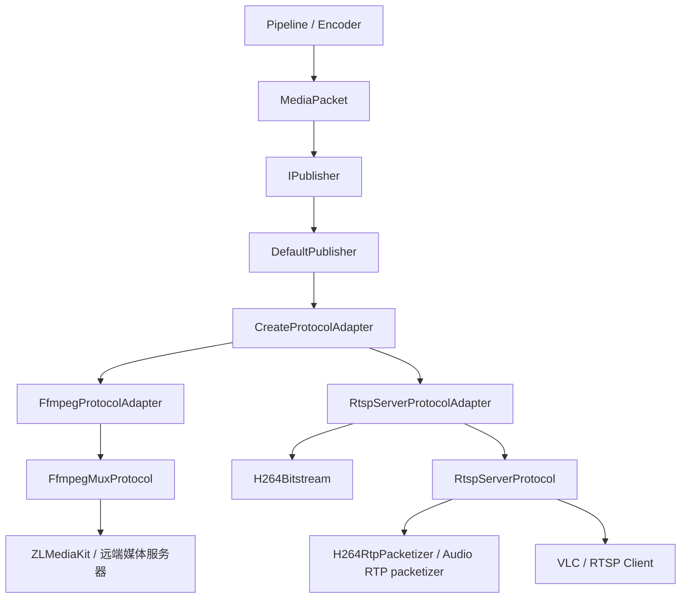

# Publisher 模块设计与扩展计划

本文档说明当前 Publisher 模块的架构、接口契约、协议实现、测试现状和后续改进计划。文档以当前代码为准，覆盖 FFmpeg 复用推流和本机 RTSP Server 两条发布链路。

最后更新：2026-08-04。

## 1. 模块定位

Publisher 位于编码器和网络协议之间，接收已经编码完成的 `MediaPacket`，将它发布到远端媒体服务器，或者在本机提供可供客户端拉流的服务。

当前支持两种发布角色：

| 发布角色 | 配置 | 当前实现 | 使用场景 |
|---|---|---|---|
| Push Client | `PublishMode::PushClient` | `FfmpegMuxProtocol` | 主动向 ZLMediaKit 等服务器推送 RTSP/RTMP 流 |
| Pull Server | `PublishMode::PullServer` | `RtspServerProtocol` | 本机监听 RTSP 端口，VLC 等客户端直接拉流 |

Publisher 不负责拉流、解码、推理和编码。这些步骤由 pipeline 上游完成。Publisher 的输入必须是编码后的 packet，并且 packet 的 codec、track、时间基和 extradata 应与 `PublisherConfig::tracks` 一致。

## 2. 总体架构



模块按职责分为四层：

| 层级 | 核心类型 | 职责 | 不应承担的职责 |
|---|---|---|---|
| 业务入口 | `IPublisher` | 为 pipeline 提供统一生命周期和发布接口 | RTP 分片、RTSP 会话、FFmpeg API 调用 |
| 发布编排 | `DefaultPublisher` | 解析配置、选择 adapter、转发生命周期 | 具体协议实现、数据格式解析 |
| 模型适配 | `IProtocolAdapter` | 将 `MediaPacket` 转成协议层的 `EncodedAccessUnit` | socket 会话、协议状态机 |
| 协议运行时 | `IProtocol` | 管理协议资源，启动、写入、停止和统计 | 依赖具体 pipeline 或编码器 |

codec 解析和 RTP 分片放在独立工具或 packetizer 中，避免 `DefaultPublisher` 和协议会话类继续膨胀。

## 3. 核心数据模型

### 3.1 PublisherConfig

`PublisherConfig` 描述一次发布任务：

```cpp
struct PublisherConfig {
    PublishMode mode;
    PublishProtocol protocol;

    std::string url;
    std::string listen_host;
    std::uint16_t listen_port;
    std::string stream_path;

    std::vector<MediaTrackConfig> tracks;
    FfmpegPublishOptions ffmpeg;
    RtspServerOptions rtsp;
};
```

主要字段：

| 字段 | 含义 |
|---|---|
| `mode` | 网络角色，主动推流或本机等待拉流 |
| `protocol` | 显式选择协议，或者使用 `Auto` |
| `url` | Push Client 的目标地址；Pull Server 也可将其作为输出地址 |
| `listen_host` / `listen_port` | RTSP Server 的监听地址和端口 |
| `stream_path` | RTSP Server 对外暴露的流路径，应以 `/` 开头 |
| `tracks` | 本次发布的所有音视频轨道 |
| `ffmpeg` | FFmpeg 输出格式、I/O 超时、重连和 bitstream filter 选项 |
| `rtsp` | 本机 RTSP Server 的 TCP、UDP、组播和 RTP 包大小配置 |

`Auto` 当前只有两条推断规则：

```text
PullServer -> RtspServer
PushClient -> FfmpegMux
```

建议生产代码显式填写 `protocol`。这样新增协议后不会因为默认推断规则改变而产生行为漂移。

配置校验分为两步：

- `ValidateStructure()` 校验 track 基础参数和 `track_id` 唯一性。
- `ValidateProtocol()` 校验 mode/protocol 组合、协议 codec 能力、RTP payload type、RTSP transport 和组播端口对。
- `Validate()` 依次执行前两步，并返回包含错误码和消息的 `PublisherResult`。

### 3.2 MediaTrackConfig

`MediaTrackConfig` 是 Publisher 的静态轨道描述：

| 字段 | 约束和用途 |
|---|---|
| `track_id` | Publisher 内唯一的轨道编号，也是 RTSP `trackN` 和协议写入时的路由键 |
| `media_type` / `codec_type` | 媒体类型和编码格式 |
| `width` / `height` / `fps` | 视频参数 |
| `sample_rate` / `channels` | 音频参数 |
| `time_base_num` / `time_base_den` | 上游 packet 的时间基描述 |
| `extra_data` | H264 SPS/PPS、AAC AudioSpecificConfig 等初始化数据 |
| `rtp_payload_type` | SDP 和 RTP header 中使用的 payload type |
| `rtp_clock_rate` | RTP timestamp 的时钟频率；H264 通常为 90000，音频使用采样率 |

多轨发布时，FFmpeg adapter 优先使用 packet 的 `stream_index` 匹配配置中的 `track_id`；如果无法匹配，则按媒体类型和 codec 唯一匹配。存在多个候选时会拒绝 packet，避免错误写入其他轨道。

### 3.3 `stream_index` 与 `track_id`

这两个字段都可以用来“找到一条媒体流”，但它们属于不同层次，不能默认视为同一个值。实际链路中还会出现 FFmpeg 输出侧的 `AVStream::index`，因此需要区分下面三种标识：

| 标识 | 所属对象 | 产生方 | 作用域 | 主要用途 |
|---|---|---|---|---|
| `MediaPacket::stream_index` | 输入媒体包 | 上游 demuxer、拉流器或解码链路 | 当前输入源/输入会话 | 表示该 packet 来自输入源的哪条 stream |
| `MediaTrackConfig::track_id` | Publisher 轨道配置 | 应用或 Publisher 配置 | 当前发布任务 | Publisher 内部稳定、唯一的逻辑轨道键 |
| `AVStream::index` / 输出 `AVPacket::stream_index` | FFmpeg 输出对象 | FFmpeg `AVFormatContext` | 当前输出会话 | 表示 packet 应写入 FFmpeg 输出 context 的哪条 `AVStream` |

#### 3.3.1 `MediaPacket::stream_index`

`MediaPacket::stream_index` 描述的是**输入侧身份**。它通常来自上游 FFmpeg `AVPacket::stream_index` 或等价的 demuxer stream 编号，常见形式是：

```text
输入文件/摄像头/远端 RTSP
  AVStream[0] -> 视频 -> MediaPacket.stream_index = 0
  AVStream[1] -> 音频 -> MediaPacket.stream_index = 1
```

它有以下特点：

- 通常从 0 开始，但编号是否连续、视频是否一定为 0、音频是否一定为 1，都不应作为 Publisher 的通用假设。
- 它属于输入源。更换输入文件、摄像头、demuxer，或者改变输入流筛选顺序后，编号可能变化。
- `-1` 表示上游没有提供可用的 stream 编号。此时 adapter 只能依赖媒体类型和 codec 等其它元数据。
- 它只说明 packet 来自哪条输入 stream，不说明 Publisher 是否要把它发布为哪条输出 track。

因此，`stream_index` 适合作为 adapter 的路由线索，但不适合作为跨输入源、跨发布任务持久化的业务 ID。

#### 3.3.2 `MediaTrackConfig::track_id`

`track_id` 描述的是**Publisher 逻辑侧身份**。它由发布配置提供，在一次 `PublisherConfig` 中必须非负且唯一：

```cpp
MediaTrackConfig video;
video.track_id = 10;
video.media_type = MediaType::VIDEO;
video.codec_type = CodecType::H264;

MediaTrackConfig audio;
audio.track_id = 20;
audio.media_type = MediaType::AUDIO;
audio.codec_type = CodecType::AAC;
```

在当前架构中，`track_id` 的职责包括：

- 作为 `EncodedAccessUnit::track_id`，在 adapter 和 protocol 之间传递已经解析完成的逻辑轨道。
- 作为 `FfmpegPublishOptions::bitstream_filters` 的配置键，例如 `track_id -> h264_mp4toannexb`。
- 作为 RTSP Server 内部 track 状态、RTP/RTCP 状态和 SDP `trackN` 控制 URL 的关联键。
- 在重连、会话重建和多轨处理时保持 Publisher 内部语义稳定。

`track_id` 不要求等于输入 `stream_index`，也不要求等于 FFmpeg 输出 `AVStream::index`。它只需要在当前发布任务内唯一，并且在创建配置、发送 packet 和 protocol 运行期间保持一致。

#### 3.3.3 FFmpeg 输出侧 `AVStream::index`

FFmpeg mux protocol 启动时，会按照 `PublisherConfig::tracks` 创建输出 stream：

```text
PublisherConfig::tracks
  track_id = 10, VIDEO -> fmt_ctx->streams[0]
  track_id = 20, AUDIO -> fmt_ctx->streams[1]
```

FFmpeg protocol 会保存一张内部映射表：

```text
track_to_stream_index_
  10 -> 0
  20 -> 1
```

写包时的实际过程是：

```text
EncodedAccessUnit.track_id
  -> track_to_stream_index_
  -> 输出 AVStream::index
  -> AVPacket.stream_index
  -> av_write_frame()
```

这里的输出 `AVPacket::stream_index` 与输入 `MediaPacket::stream_index` 可能数值相同，也可能不同。它们分别属于两个不同的 `AVFormatContext`：一个是输入上下文，一个是输出上下文。即使两个值都为 `0`，也只能说明它们在各自上下文中都是第 0 条 stream，不能说明它们是同一个对象。

#### 3.3.4 当前 adapter 的映射优先级

`FfmpegProtocolAdapter::FindTrackForPacket()` 当前使用以下规则：

```text
1. 如果 packet.stream_index >= 0：
   使用 stream_index 查找 track_id == stream_index 的 track，
   同时校验 media_type 和 codec。

2. 如果没有命中：
   按 packet 的 media_type 和 codec 查找配置中的候选 track。

3. 候选为 0 条：
   返回 InvalidMediaPacket。

4. 候选超过 1 条：
   返回 InvalidMediaPacket，要求上游提供更明确的 stream_index。

5. 候选恰好 1 条：
   将 packet 映射到该 track 的 track_id。
```

第一步是一个兼容性快捷路径，适用于项目约定 `track_id == 输入 stream_index` 的配置；它不是两个字段的定义关系。第二步是单轨或媒体类型/codec 唯一时的安全回退。

转换完成后，adapter 会把配置中的 `track_id` 写入 `EncodedAccessUnit::track_id`，不会继续把 `MediaPacket::stream_index` 当作 Publisher 轨道编号：

```text
MediaPacket(stream_index=0, type=AUDIO, codec=AAC)
  -> 配置中唯一匹配的 track_id=20
  -> EncodedAccessUnit(track_id=20, media_type=AUDIO, codec=AAC)
```

#### 3.3.5 单轨和多轨示例

**示例一：数值恰好相同，但语义仍然不同**

```text
输入：stream_index=0，H264 视频
配置：track_id=0，H264 视频
输出：AVStream::index=0
```

这个例子可以直接命中 adapter 的快捷路径，但三个 `0` 分别来自输入源、Publisher 配置和输出 FFmpeg context。更换输入源或调整 `tracks` 顺序后，输出 stream index 仍可能变化。

**示例二：输入编号和 Publisher track_id 不同**

```text
输入 packet：stream_index=0，AAC 音频
Publisher 配置：
  track_id=10，H264 视频
  track_id=20，AAC 音频
```

`stream_index=0` 无法命中 `track_id=0`，adapter 会根据 `AUDIO + AAC` 唯一匹配到 `track_id=20`。随后 FFmpeg mux protocol 可能将 `track_id=20` 映射为输出 `AVStream::index=1`：

```text
0（输入 stream_index） -> 20（Publisher track_id） -> 1（输出 AVStream index）
```

**示例三：同 codec 多轨不能靠类型推断**

```text
Publisher 配置：
  track_id=10，H264 视频
  track_id=11，H264 视频
输入 packet：stream_index=-1，H264 视频
```

此时两个候选的媒体类型和 codec 完全相同，adapter 无法安全判断 packet 属于哪条轨道。FFmpeg adapter 会返回 `InvalidMediaPacket`，而不是随机选择一条 track。

#### 3.3.6 使用约束和建议

- 配置 `track_id` 时使用发布任务内稳定、唯一的逻辑编号，不要依赖输入文件或摄像头当前的 stream 排列。
- 上游能够提供输入 stream 编号时，应尽量填充 `MediaPacket::stream_index`；这对同 codec 多轨尤其重要。
- 不要在 protocol 中直接使用 `MediaPacket::stream_index`。应先由 adapter 转换为 `EncodedAccessUnit::track_id`。
- 不要在业务层使用 FFmpeg 输出 `AVStream::index` 作为轨道 ID。它是当前输出 context 的运行时编号，重建 context 或调整轨道创建顺序后可能变化。
- 单轨发布时可以不依赖 `stream_index`，但 packet 的媒体类型和 codec 仍应与唯一 track 一致。
- 当前 `RtspServerProtocolAdapter` 与 `FfmpegProtocolAdapter` 都支持 `stream_index == track_id` 的兼容路径，但二者的多候选回退策略还没有完全统一；新增协议 adapter 时应采用“候选必须唯一”的规则。

### 3.4 FFmpeg 推流选项

`FfmpegPublishOptions` 当前提供：

| 字段 | 用途 |
|---|---|
| `format_name` | 显式选择 FFmpeg 输出格式；为空时由 URL 推断 |
| `rtsp_transport` | RTSP 输出使用的传输方式，例如 `tcp` |
| `io_timeout_ms` | 连接、header、packet 和关闭操作的超时；`0` 表示不启用超时 |
| `reconnect_attempts` | packet 写入失败后的最大重连次数；`0` 表示不重连 |
| `reconnect_backoff_ms` | 两次重连尝试之间的等待时间 |
| `bitstream_filters` | `track_id -> FFmpeg bitstream filter 名称` |

示例：

```cpp
config.ffmpeg.format_name = "rtsp";
config.ffmpeg.rtsp_transport = "tcp";
config.ffmpeg.io_timeout_ms = 5000;
config.ffmpeg.reconnect_attempts = 3;
config.ffmpeg.reconnect_backoff_ms = 200;
config.ffmpeg.bitstream_filters.emplace(0, "h264_mp4toannexb");
```

bitstream filter 默认关闭。只有确认上游 packet 格式和目标 muxer 要求不一致时才配置，不能把 `h264_mp4toannexb` 无条件用于已经是 Annex-B 的 packet。

#### Bitstream Filter 理论

**为什么需要 bitstream filter？**

编码器输出的比特流格式与目标封装协议要求的格式可能不一致：

| 编码器输出 | 目标协议 | 需要转换 |
|-----------|---------|---------|
| AVCC (长度前缀) | RTSP/TS | 需要 `h264_mp4toannexb` |
| AVCC (长度前缀) | MP4/FLV | 不需要 |
| ADTS (AAC) | RTSP/MP4 | 需要 `aac_adtstoasc` |

**常见过滤器：**

| 过滤器名称 | 作用 | 场景 |
|-----------|------|------|
| `h264_mp4toannexb` | H.264 AVCC → AnnexB | RTSP/TS 推流 |
| `hevc_mp4toannexb` | H.265 AVCC → AnnexB | H.265 RTSP 推流 |
| `aac_adtstoasc` | AAC ADTS → ASC | AAC 音频推流 |

**设计原则：**

- **显式配置** - filter 名称由用户显式指定，不自动检测
- **责任分离** - 编码器只负责编码，Publisher 负责协议适配
- **避免重复转换** - 已经是目标格式的数据不应再次转换

**配置示例：**

```cpp
// 拉流 → 解码 → 编码 → 推流管线
PublisherConfig config;
config.protocol = PublishProtocol::FfmpegMux;
config.url = "rtsp://192.168.1.100/live/stream";
config.tracks.push_back(video_track);

// 编码器输出 AVCC，RTSP 要求 AnnexB，需要转换
config.ffmpeg.bitstream_filters[video_track.track_id] = "h264_mp4toannexb";
```

#### 配置错误场景

**场景：编码器已输出 AnnexB，但仍配置了 `h264_mp4toannexb`**

```
编码器输出 (AnnexB)
    ↓ h264_mp4toannexb (错误配置)
重复转换（可能损坏数据）
    ↓
RTP 打包 (格式错误)
    ↓
RTSP 推流 ✗ 客户端解码失败
```

**后果：**
- NALU 可能被重复添加起始码 (`0x000001`)
- 长度前缀信息丢失
- 客户端无法正确解析 NALU 边界
- 视频花屏或完全无法解码

**排查建议：**
1. 先不配置 filter，测试推流是否正常
2. 如果客户端解码失败，再添加 `h264_mp4toannexb`
3. 使用 FFmpeg 命令行工具验证编码器输出格式：
   ```bash
   ffprobe -show_data -i input.h264 | head -20
   ```
   - 看到 `00 00 00 01` 起始码 → AnnexB 格式
   - 看到 4 字节长度前缀 → AVCC 格式

### 3.5 MediaPacket 与 EncodedAccessUnit

`MediaPacket` 是 pipeline 对外的编码包模型，`EncodedAccessUnit` 是 protocol 内部使用的模型。两者之间的转换由 adapter 完成。

`EncodedAccessUnit` 保留以下协议必需信息：

- `track_id`、媒体类型和 codec。
- `pts`、`dts`、`duration` 和时间基。
- keyframe 标记。
- 编码数据 buffer 和可选的 FFmpeg backend handle。
- H264 拆分后的 NAL unit 列表。

FFmpeg 路径保留源 packet 的时间基，写入前转换到 `AVStream::time_base`。RTSP Server 路径则由 adapter 先把 PTS 转换为对应 track 的 RTP timestamp。

### 3.6 PublisherStats

当前公开统计如下：

| 字段 | 含义 |
|---|---|
| `packets_published` | protocol 接受并发布的 access unit 数量，不是 RTP 分片数量 |
| `bytes_published` | 编码 access unit 字节数或 FFmpeg packet 字节数 |
| `clients_connected` | RTSP Server 当前有效客户端会话数 |
| `rtcp_receiver_reports_received` | 收到且匹配本端 SSRC 的 RTCP report block 数量 |

当前统计用于基本可观测性，尚不能表达每个 track、客户端和传输模式的质量情况。

## 4. Publisher 层

### 4.1 IPublisher

`IPublisher` 是 pipeline 唯一应该依赖的发布接口：

```cpp
class IPublisher {
public:
    virtual PublisherResult Start() = 0;
    virtual PublisherResult Publish(const MediaPacket& packet) = 0;
    virtual void Stop() = 0;

    virtual std::string GetPlayUrl() const = 0;
    virtual PublisherStats GetStats() const = 0;
    virtual PublisherResult GetLastResult() const = 0;

    static std::unique_ptr<IPublisher> Create(PublisherConfig config);
};
```

接口语义：

- `Create(config)` 固定本次发布配置，消除构造和启动阶段的双配置源。
- `Start()` 使用已固定的配置创建协议资源。重复调用时，当前默认实现会先停止旧任务。
- `Publish()` 只接受已编码 packet，并返回结构化结果。
- `Stop()` 可以重复调用，析构函数也会执行停止。
- `GetPlayUrl()` 返回协议输出地址。对 Push Client 来说是推流地址，对 Pull Server 来说是客户端播放地址。
- `GetStats()` 返回当前统计快照。
- `GetLastResult()` 返回最近一次启动或发布操作的结果。

`PublisherResult` 当前可以区分配置错误、不支持的协议/codec、非法状态、无效 packet、资源打开或端口绑定失败、连接失败、远端拒绝和运行时断流。状态回调、异步结果和背压语义仍未实现。

### 4.2 DefaultPublisher

`DefaultPublisher` 是当前唯一的 `IPublisher` 实现。它是单目标、单 adapter 的发布编排器，而不是一种协议。

调用链如下：

```text
IPublisher::Create(config)
  -> DefaultPublisher(config)

DefaultPublisher::Start()
  -> Stop()
  -> ResolvePublishProtocol(config_)
  -> PublisherConfig::Validate()
  -> CreateProtocolAdapter(protocol)
  -> adapter->Open(config)

DefaultPublisher::Publish(packet)
  -> adapter->Send(packet)

DefaultPublisher::Stop()
  -> adapter->Close()
  -> destroy adapter
```

`DefaultPublisher` 适合当前的单目标发布，但后续仍可增加其他 `IPublisher` 实现。是否新增实现应由“发布策略是否变化”决定，而不是由“协议是否变化”决定：

| 需求 | 扩展位置 |
|---|---|
| 新增 SRT、WebRTC、裸 RTP 等协议 | `IProtocolAdapter` + `IProtocol` |
| 同时发布到多个目标 | `MultiPublisher : IPublisher` |
| 网络写入与 pipeline 解耦 | `QueuedPublisher : IPublisher` 或统一异步编排层 |
| 主备目标自动切换 | `FailoverPublisher : IPublisher` |
| 自动重连、健康检查和状态事件 | `ManagedPublisher : IPublisher`，或作为通用装饰器 |

不要为每一种协议都新增一个 `IPublisher`。协议差异应留在 adapter/protocol 层。

## 5. Protocol Adapter 层

### 5.1 IProtocolAdapter

Adapter 是项目数据模型与协议运行时的边界：

```cpp
class IProtocolAdapter {
public:
    virtual PublisherResult Open(const PublisherConfig& config) = 0;
    virtual PublisherResult Send(const MediaPacket& packet) = 0;
    virtual void Close() = 0;

    virtual std::string GetOutputUrl() const = 0;
    virtual PublisherStats GetStats() const = 0;
};
```

Adapter 应负责：

- 校验协议支持的 track 和 codec。
- 将 `stream_index` 映射成 `track_id`。
- 处理 packet 时间基和协议时间戳转换。
- 解析协议需要的 bitstream 元数据。
- 创建并持有对应的 `IProtocol`。

Adapter 不应负责 socket 收发、客户端会话和 FFmpeg muxer 的资源生命周期。

### 5.2 FfmpegProtocolAdapter

`FfmpegProtocolAdapter` 的转换较薄：

- 单轨时直接使用唯一的 `track_id`。
- 多轨时优先将 `MediaPacket::stream_index` 作为 track id 候选；无法命中时按媒体类型和 codec 唯一匹配。
- 保留 packet 的 PTS/DTS/duration/time base、buffer 和 FFmpeg backend handle。
- 调用 `FfmpegMuxProtocol::Write()`。

它不解析 H264 NAL；显式配置的 bitstream filter 由 `FfmpegMuxProtocol` 在写 packet 前执行。目标 muxer 是否要求 Annex-B、AVCC 或额外 filter，仍需要针对输入格式和输出格式验证。

### 5.3 RtspServerProtocolAdapter

`RtspServerProtocolAdapter` 当前支持 H264 视频和 AAC/G711 音频，负责：

- 校验 RTSP Server 支持的 codec。
- 按 `track_id`、媒体类型和 codec 查找目标 track。
- 将音频 `rtp_clock_rate` 规范为采样率。
- 识别 Annex-B 和 AVCC H264 packet，并拆成 NAL units。
- 从 H264 extradata 中解析 AVCC NAL length size 和 SPS/PPS。
- 在关键帧缺少 SPS/PPS 时补入已知参数集。
- 为每个 track 建立独立时间戳原点，将 packet PTS 转换成从 0 开始的 RTP timestamp。
- 将音频编码数据原样交给 RTSP protocol 做 RTP payload 封装。

这里的 RTP timestamp 使用无符号 32 位回绕语义。当前没有处理输入 PTS 大幅回退、跨 discontinuity 重建时间戳原点等异常流场景。

## 6. Protocol 层

### 6.1 IProtocol

`IProtocol` 表示一个协议运行时实例：

```cpp
class IProtocol {
public:
    virtual PublisherResult Start(
        const PublisherConfig& config,
        const std::vector<MediaTrackConfig>& tracks) = 0;
    virtual PublisherResult Write(const EncodedAccessUnit& access_unit) = 0;
    virtual void Stop() = 0;

    virtual std::string GetOutputUrl() const = 0;
    virtual PublisherStats GetStats() const = 0;
};
```

它管理网络、muxer、线程和会话等运行时资源，但不依赖解码器、编码器或 pipeline。

### 6.2 FfmpegMuxProtocol

`FfmpegMuxProtocol` 封装 FFmpeg 输出复用器：

```text
Start
  -> avformat_alloc_output_context2
  -> 为每个 MediaTrackConfig 创建 AVStream
  -> 写入 codec parameters 和 extradata
  -> avio_open2
  -> avformat_write_header

Write
  -> 引用 FFmpeg AVPacket 或复制编码 buffer
  -> track_id 映射到 AVStream index
  -> av_packet_rescale_ts 到输出 stream time base
  -> 可选 AVBSFContext 处理 bitstream filter
  -> av_write_frame

写入失败
  -> 在配置允许时重建 output context、streams 和 header
  -> 视频等待关键帧后恢复发布

Stop
  -> av_write_trailer
  -> avio_closep
  -> avformat_free_context
```

代码中的 codec 映射包括 H264、H265、AAC、Opus、G711A 和 G711U。最终能否发布还取决于所选容器、FFmpeg muxer 和远端服务器是否接受该 codec 组合。

当前 `Write()` 仍是同步调用，但每个 FFmpeg I/O 操作可以通过 `io_timeout_ms` 设置上限。远端拥塞不会无限期阻塞，但仍可能在超时窗口内拖慢调用它的 pipeline 线程；彻底解耦需要上层有界发布队列。

### 6.3 RtspServerProtocol

`RtspServerProtocol` 使用 Boost.Asio 实现本机 RTSP Server。它拥有一个 `io_context` 线程，并为每个 RTSP TCP 连接创建 `ClientSession`。

RTSP 请求由独立的 `RtspRequestParser` 按 RFC 2326 的 request-line 和 message-header 语法增量解析。parser 负责严格 CRLF、token/absolute URI/RTSP version 校验、大小写不敏感和重复 header、兼容 RFC 2326 的折叠 header、`Content-Length` body 边界以及 pipelined request 的精确消费，并对 request-line、单个 header、header 总量和 body 设置上限。`ClientSession` 只在一条完整 request 到达后分发方法；无法恢复消息边界的语法错误会返回 `400 Bad Request` 后关闭连接。

已实现的 RTSP 方法：

- `OPTIONS`
- `DESCRIBE`
- `SETUP`
- `PLAY`
- `PAUSE`
- `TEARDOWN`
- `GET_PARAMETER`

已实现的传输模式：

| 模式 | SETUP Transport 示例 | 视频 | 音频 | RTCP |
|---|---|---:|---:|---:|
| TCP interleaved | `RTP/AVP/TCP;unicast;interleaved=0-1` | 支持 | 支持 | SR 发送、RR 接收 |
| UDP unicast | `RTP/AVP;unicast;client_port=5000-5001` | 支持 | 支持 | SR 发送、RR 接收 |
| UDP multicast | `RTP/AVP;multicast;destination=239.x.x.x;port=5004-5005` | 仅 H264 | 暂不支持 | 共享 SR 发送、RR 接收 |

`RtspTransportSpec` 独立负责解析 Transport 候选项，以及生成 SETUP 响应。RTSP protocol 根据配置决定是否接受 TCP、UDP 和 multicast。

`RtspServerProtocol` 当前仍集中承担连接、会话、RTP/RTCP 和 multicast 等职责。目标类拆分、依赖关系和渐进迁移方案见 12.9。

### 6.4 RTP 与 SDP

当前 RTSP Server codec 能力：

| Codec | SDP | RTP payload |
|---|---|---|
| H264 | `H264/90000`，包含 profile-level-id 和可选 sprop-parameter-sets | 单 NAL 或 FU-A 分片 |
| AAC | RFC 3640 `MPEG4-GENERIC`，包含 AAC-hbr fmtp 和 AudioSpecificConfig | AU header + raw AAC access unit；输入带 ADTS 时会去掉 ADTS header |
| G711A | `PCMA/<sample_rate>/<channels>` | 编码数据直接作为 RTP payload |
| G711U | `PCMU/<sample_rate>/<channels>` | 编码数据直接作为 RTP payload |

H264 packetizer 只负责生成 RTP payload 和 marker，不负责 RTP header、sequence、SSRC 或 socket。后者由 session 或共享 multicast sender 管理。

多轨 RTSP 会话按 track 维护独立的 payload type、SSRC、sequence 和 RTCP 状态。multicast 目前仍是 protocol 级共享的单 H264 sender，所以尚不能承载音频或多个视频 track。

### 6.5 RTCP

当前行为：

- 每个 TCP/UDP unicast track 在发送首个 RTP 后发送 Sender Report，后续有媒体写入时每 5 秒补发。
- multicast 使用共享 SSRC、packet count 和 octet count 生成 Sender Report。
- TCP interleaved、UDP unicast 和 UDP multicast 都可以解析 compound RTCP。
- Receiver Report 中的 fraction lost、cumulative lost、highest sequence、jitter、LSR 和 DLSR 会被解析。
- multicast 按 reporter SSRC 聚合反馈。
- SDES、BYE 和 APP 当前仅识别并忽略。

Sender Report 目前由媒体发送路径触发，不是独立定时器。因此流暂停或长时间没有新 packet 时，不会单独周期发送 SR。

## 7. 两条典型数据链路

### 7.1 推送到 ZLMediaKit

```text
MediaPacket(H264/AAC)
  -> DefaultPublisher
  -> FfmpegProtocolAdapter
  -> EncodedAccessUnit
  -> FfmpegMuxProtocol
  -> FFmpeg RTSP muxer over TCP
  -> ZLMediaKit
```

示例配置：

```cpp
PublisherConfig config;
config.mode = PublishMode::PushClient;
config.protocol = PublishProtocol::FfmpegMux;
config.url = "rtsp://127.0.0.1:554/live/main";
config.ffmpeg.format_name = "rtsp";
config.ffmpeg.rtsp_transport = "tcp";
config.tracks = {video_track, aac_audio_track};

auto publisher = IPublisher::Create(config);
if (!publisher) {
    // 创建失败。
}
const auto start_result = publisher->Start();
if (!start_result) {
    // 启动失败。
}
```

当前摄像头手动测试会把视频编码为 H264、把音频编码为 AAC，然后同时注册到 ZLM publisher。

### 7.2 本机 RTSP Server

```text
MediaPacket(H264/AAC/G711)
  -> DefaultPublisher
  -> RtspServerProtocolAdapter
  -> NAL split / RTP timestamp conversion
  -> RtspServerProtocol
  -> SDP + RTSP session + RTP/RTCP
  -> VLC
```

示例配置：

```cpp
PublisherConfig config;
config.mode = PublishMode::PullServer;
config.protocol = PublishProtocol::RtspServer;
config.listen_host = "0.0.0.0";
config.listen_port = 8554;
config.stream_path = "/live/main";
config.rtsp.enable_tcp_interleaved = true;
config.rtsp.enable_udp = true;
config.rtsp.enable_multicast = false;
config.tracks = {video_track, audio_track};

auto publisher = IPublisher::Create(config);
const auto result = publisher->Start();
// 播放地址：rtsp://127.0.0.1:8554/live/main
```

multicast 默认关闭。只有确实需要组播且客户端只订阅当前支持的 H264 track 时才应开启。

## 8. 生命周期、并发与错误边界

当前约束：

- `DefaultPublisher` 本身没有锁，不应在多个线程并发调用 `Start()`、`Publish()` 和 `Stop()`。
- `FfmpegMuxProtocol::Write()` 是同步的，也没有内部并发保护，应由单一发布线程调用。
- `RtspServerProtocol` 的网络事件运行在内部 Asio 线程；`Write()` 可读取 session 快照并把发送任务交给会话，但调用方仍应串行发布同一 track，保证 packet 顺序。
- `Stop()` 会关闭协议资源。调用方必须先停止上游继续产生 packet，避免 `Publish()` 与 `Stop()` 竞争。
- 当前错误主要写日志并返回 `false`，没有结构化错误原因和状态事件。

推荐的 pipeline 停止顺序：

```text
停止输入/拉流
  -> 停止向编码器送帧
  -> flush 编码器并发布剩余 packet
  -> 停止 Publisher
  -> 销毁编码器和上游资源
```

## 9. 当前能力状态

| 能力 | 状态 | 说明 |
|---|---|---|
| FFmpeg RTSP/RTMP push | 已实现 | 具体格式由 URL 和 `format_name` 决定 |
| FFmpeg 多音视频轨 | 已实现 | adapter 优先按 track id 匹配，无法匹配时按媒体类型和 codec 唯一匹配 |
| 本机 RTSP H264 | 已实现 | Annex-B、AVCC、FU-A、SPS/PPS |
| 本机 RTSP AAC/G711 | 已实现 | TCP interleaved 和 UDP unicast |
| UDP multicast | 部分实现 | 仅共享 H264 video sender |
| RTCP SR/RR | 已实现基础版本 | 缺 SDES/BYE、超时和详细指标导出 |
| 裸 RTP UDP publisher | 未实现 | `RtpUdp` 统一返回结构化 `UnsupportedProtocol` |
| WebRTC publisher | 未实现 | `WebRtc` 统一返回结构化 `UnsupportedProtocol`，独立规划文档已存在 |
| FFmpeg 自动重连 | 已实现基础版本 | 写入失败后按配置重连，视频重连后等待关键帧；主备切换仍未实现 |
| 发布队列和背压 | 未实现 | 当前同步传播协议写入延迟 |
| RTSP 鉴权/TLS | 未实现 | 仅适合可信网络内使用 |

## 10. 已知限制与技术债

### 配置与接口

- `PublisherConfig::IsValid()` 只做基础校验，没有完整检查 mode/protocol 组合、重复 track id、重复 payload type、端口对和 codec/协议兼容性。
  - 状态：已修复。
  - 修复日期：2026-07-31。
  - 修复方法：新增 `MediaTrackConfig::ValidateStructure()`、`PublisherConfig::ValidateStructure()` 和 `ValidateProtocol()`；统一校验轨道结构、唯一 `track_id`、RTSP 唯一 payload type、角色/协议组合、监听和组播地址、transport 开关、组播偶数 RTP/相邻 RTCP 端口及协议 codec 能力。`Validate()` 返回首个结构化错误。
- `PublishProtocol::WebRtc` 可以通过基础配置校验，但 adapter 工厂会返回空；`RtpUdp` 则在配置校验阶段直接失败，两种占位协议的行为不一致。
  - 状态：已修复。
  - 修复日期：2026-07-31。
  - 修复方法：所有配置先通过 `ResolvePublishProtocol()` 解析 `Auto`；未实现的 `WebRtc` 和 `RtpUdp` 均在 `ValidateProtocol()` 返回 `PublisherErrorCode::UnsupportedProtocol`，不会进入 adapter 工厂或创建协议资源。
- `IPublisher::Create(config)` 保存一份配置，但 `Start(config)` 又接受一份配置，存在“双配置源”。
  - 状态：已修复。
  - 修复日期：2026-07-31。
  - 修复方法：保留 `IPublisher::Create(config)` 作为唯一配置入口，删除 `Start(config)`，改为无参数 `Start()`；`DefaultPublisher` 启动时只读取构造阶段固定的 `config_`。
- 布尔返回值无法区分配置错误、网络错误、远端拒绝和运行时断流。
  - 状态：已修复。
  - 修复日期：2026-07-31。
  - 修复方法：新增 `PublisherResult`、`PublisherErrorCode` 和 `native_error`，并贯穿 `IPublisher`、`IProtocolAdapter` 和 `IProtocol`。FFmpeg 路径区分连接失败、header 被拒绝和运行时写入断开；RTSP Server 路径区分配置、资源打开、端口绑定、状态和 packet 错误；`GetLastResult()` 保存最近一次结果。

### FFmpeg 推流

- 同步写入可能阻塞 pipeline。
  - 状态：部分修复。
  - 修复日期：2026-08-01。
  - 修复方法：新增 `io_timeout_ms`，通过 FFmpeg `rw_timeout` 和 `AVIOInterruptCB` 限制连接、header、packet、trailer 和 close 操作的最长等待时间。`Write()` 仍是同步调用，后续需要 `QueuedPublisher` 才能彻底与 pipeline 解耦。
- 没有自动重连、退避、关键帧等待和断线期间的 packet 丢弃策略。
  - 状态：已实现基础版本。
  - 修复日期：2026-08-01。
  - 修复方法：新增 `reconnect_attempts` 和 `reconnect_backoff_ms`；`av_write_frame` 失败后重建 FFmpeg output context、streams、header 和 filter 状态，视频重连后丢弃非关键帧并等待下一个 keyframe。主备目标切换和有界发送队列仍未实现。
- 没有统一 bitstream filter 层；不同 muxer 的 H264/H265 格式要求需要逐个验证。
  - 状态：已实现显式 filter 层。
  - 修复日期：2026-08-01。
  - 修复方法：`FfmpegPublishOptions::bitstream_filters` 按 `track_id` 配置 FFmpeg `AVBSFContext`，在 `av_write_frame` 前完成 filter 处理；默认不启用 filter，避免改变现有流。尚未根据输入 packet 自动判断 Annex-B/AVCC 并自动选择 filter。
- 多轨路由历史上依赖 `stream_index == track_id` 的外部约定。
  - 状态：已修复。
  - 修复日期：2026-08-01。
  - 修复方法：`FfmpegProtocolAdapter` 新增 track 查找逻辑，优先校验 `stream_index` 对应的 track，失败后按媒体类型和 codec 做唯一匹配；多条候选无法区分时返回 `InvalidMediaPacket`。

### RTSP Server

- RTSP request parser 是最小可用实现，不是完整 RFC 解析器。
  - 状态：已修复。
  - 修复日期：2026-08-03。
  - 修复方法：新增独立、可增量调用的 `RtspRequestParser`，实现 RFC 2326 RTSP/1.0 request-line、header（字段名大小写不敏感、重复字段和折叠行）、`Content-Length` entity body 与 pipelining 消息边界解析；严格拒绝非法 CRLF、token、absolute URI、version、header 控制字符和冲突长度，并增加 request-line/header/body 资源上限。`ClientSession` 改为消费结构化 request，强制唯一数字 `CSeq`，版本不支持时返回 505，语法错误返回 400 后关闭连接。新增 `test_rtsp_request_parser` CTest，覆盖分片、body、流水线和畸形输入。
- Basic/Digest 鉴权和按地址鉴权失败限速已实现基础版本；RTSPS、外部凭据存储和更细粒度封禁策略仍待后续生产化阶段。
  - 修复日期：2026-08-04。
  - 修复方法：`RtspClientSession` 支持配置启用 Basic 或 Digest-MD5/qop=auth，未授权请求返回 `401 Unauthorized` 和 `WWW-Authenticate` challenge；Digest nonce 按 session 隔离并受 TTL 限制，错误或过期 nonce 不进入 RTSP method 状态机。
- 会话 idle timeout 和客户端地址访问控制已实现基础版本：`session_idle_timeout_ms=0` 或空 `allowed_client_addresses` 时保持关闭/放行的兼容默认值；当前 allowlist 只支持精确 IP，不支持 CIDR。
  - 修复日期：2026-08-04。
  - 修复方法：`RtspClientSession` 在其 Asio executor 上维护可取消的 `steady_timer`，由 RTSP request、interleaved/RTCP 和媒体发送刷新；非 PLAY 状态控制面超时后走幂等 `Close()`。`RtspSessionManager` 在进入 registry 前读取 remote endpoint 并执行精确 IP allowlist，拒绝连接不会分配 session ID 或占用媒体资源。
- `RtspSessionManager` 已实现基础连接数限制、按地址连接尝试/鉴权失败窗口和连接生命周期统计；慢客户端隔离、持久化 metrics 和分布式限流仍待后续阶段。
- 只支持 H264 视频，尚未支持 H265。
- multicast 只有单 H264 track，共享一组 RTP/RTCP 端口、SSRC 和 sequence。
- 没有 RTCP SDES/BYE，也没有基于 RR 的质量告警或码率反馈。
- 时间戳异常、重连后的 discontinuity 和长时间运行时的回绕测试还不充分。

### 可维护性与测试

- `RtspServerProtocol` 历史上同时承担 RTSP 解析、会话、RTP header、音频 packetizer、RTCP 和 multicast，类体积较大。
  - 状态：已完成 S0 基线、目录分层、S1 纯组件拆分、S2 TCP connection 拆分、S3 session/manager 拆分、S4 media transport 拆分、S5 RTP sender 拆分、S6 multicast publisher 拆分和 S7 façade/统计/关闭路径收缩。
  - 规划日期：2026-08-03。
  - 实施方案：见 12.9，按纯函数组件、TCP 连接、会话状态机、媒体 transport、RTP sender、multicast 的顺序渐进拆分，每阶段保持现有协议行为不变。
  - S0 实施日期：2026-08-04；完成内容和验证结果见 12.9.7 的 S0 实施记录。
  - S1 实施日期：2026-08-04；完成内容和验证结果见 12.9.7 的 S1 实施记录。
  - S2 实施日期：2026-08-04；完成内容和验证结果见 12.9.7 的 S2 实施记录。
  - S3 实施日期：2026-08-04；完成内容和验证结果见 12.9.7 的 S3 实施记录。
  - S4 实施日期：2026-08-04；完成内容和验证结果见 12.9.7 的 S4 实施记录。
  - S5 实施日期：2026-08-04；完成内容和验证结果见 12.9.7 的 S5 实施记录。
  - S6 实施日期：2026-08-04；完成内容和验证结果见 12.9.7 的 S6 实施记录。
  - S7 实施日期：2026-08-04；完成内容和验证结果见 12.9.7 的 S7 实施记录。鉴权、慢客户端隔离、IPv6 和互操作矩阵均按 12.9.9 独立推进，不扩大 façade 的职责。
- 手动摄像头链路和协议自动测试已通过两个 CMake target 分离；两者暂时复用 `test_rtsp_server_publisher.cpp`，协议 target 不进入摄像头循环。
- TCP interleaved、音视频、UDP unicast、UDP audio 和 multicast 协议用例已启用并注册为 `test_rtsp_server_protocol` CTest。
- 慢客户端隔离、长时间运行、时间戳回绕和真实接收端互操作测试仍不充分；启动失败回滚、重复 Stop、停止后重启及并发 Write/Stop 已由 S7 生命周期测试覆盖。

## 11. 扩展方法

### 11.1 新增协议

以 SRT 或裸 RTP UDP 为例：

1. 在 `PublishProtocol` 中增加或启用枚举值。
2. 定义协议专用配置，避免把所有字段继续堆进 `PublisherConfig` 顶层。
3. 新增 `XxxProtocolAdapter : IProtocolAdapter`，完成 track、时间戳和 bitstream 适配。
4. 新增 `XxxProtocol : IProtocol`，管理协议连接和写入。
5. 在 `CreateProtocolAdapter()` 注册。
6. 为配置校验、adapter 转换和 protocol 生命周期添加单元测试。
7. 添加至少一个真实接收端的端到端测试。

职责判断：

```text
MediaPacket / track / codec / timestamp 转换 -> Adapter
连接 / socket / muxer / 会话 / 重连       -> Protocol
NAL / AU / RTP payload 分片                -> Packetizer
队列 / 多目标 / 主备 / 策略                -> Publisher
```

### 11.2 新增 codec

以 H265 over RTSP 为例：

1. 增加 H265 Annex-B/HVCC parser 和 VPS/SPS/PPS 提取。
2. 实现 RFC 7798 RTP packetizer。
3. 扩展 `RtspServerProtocolAdapter` 的 codec 校验和 access unit 转换。
4. 扩展 SDP，生成 `H265/90000` 和对应 fmtp。
5. 验证单 NAL、分片、关键帧参数集、多客户端和三种 transport。

FFmpeg mux 路径已有 H265 codec 映射，但仍需针对目标格式和服务器验证 bitstream 形式。

### 11.3 新增发布策略

发布策略应实现或组合 `IPublisher`：

- `QueuedPublisher`：有界队列、丢包策略、独立工作线程和背压统计。
- `MultiPublisher`：把同一个 packet 发布到多个子 publisher，并定义部分失败语义。
- `FailoverPublisher`：主目标失败后切到备用目标。
- `ManagedPublisher`：状态机、重连退避、健康检查和事件回调。

这些策略可以用装饰器组合，避免把队列、重连、多目标全部塞入 `DefaultPublisher`。

## 12. 后续改进计划

路线图按依赖关系排列。P0 先固定接口契约和回归基线，P1 再补可靠性与缺失媒体能力，P2 扩展协议和生产能力。

### P0：稳定当前边界和回归基线

#### 12.1 配置校验和能力查询

目标：让不支持的组合在创建网络资源前给出明确错误。

进度（2026-07-31）：配置结构和协议能力校验已完成；公开的 `ProtocolCapabilities` 查询仍待实现。

工作项：

- 将 `IsValid()` 拆成结构校验和协议能力校验。
- 校验 mode/protocol 是否匹配、track id 和 RTP payload type 是否唯一。
- 校验 RTSP transport 至少启用一种，multicast 必须依赖 UDP。
- 校验 RTP/RTCP 端口、payload type 范围、音频采样率和 codec 必需 extradata。
- 统一 `RtpUdp`、`WebRtc` 等未实现协议的失败行为。
- 提供 `ProtocolCapabilities` 或等价查询，让上层在启动前获知 codec、transport 和多轨能力。

验收标准：错误配置不启动 socket/muxer，并能得到稳定的错误码和可读消息。

#### 12.2 生命周期和错误模型

目标：明确 Publisher 状态和失败恢复方式。

进度（2026-07-31）：单配置源和同步操作的结构化错误已完成；完整状态机、异步状态事件和重连事件仍待实现。

工作项：

- 引入 `Created/Starting/Running/Stopping/Stopped/Failed` 状态。
- 已采用构造时固定配置，并将启动接口统一为无参数 `Start()`。
- 用 `PublisherResult`/`PublisherErrorCode` 替代只有布尔值的失败结果。
- 明确 `Publish()` 与 `Stop()` 的并发契约，并补竞态测试。
- 增加启动失败、运行时断流和停止完成事件。

验收标准：调用方不解析日志即可区分配置、连接、写入和远端错误。

#### 12.3 测试拆分和自动化

目标：默认测试有限时、可重复、无需摄像头和外部服务。

工作项：

- 将协议自动测试与无限时摄像头手动测试拆成两个 executable。
- 恢复 TCP、UDP unicast、音视频和 multicast 测试函数的默认执行。
- 将有限时协议测试注册到 CTest。
- 保留摄像头和 ZLMediaKit 链路为显式手动测试。
- 增加异常 Transport、错误 CSeq/Session、客户端中途断开和重复 Stop 测试。

验收标准：无外部设备时可自动覆盖 Publisher 创建、SDP、SETUP/PLAY、RTP 和 RTCP 基础路径。

### P1：补齐媒体能力和发布可靠性

#### 12.4 多轨 multicast

目标：支持 H264 + AAC/G711 的标准组播发布。

工作项：

- multicast 状态从单一全局 sender 改为 `track_id -> MulticastTrackState`。
- 每个 track 分配独立 RTP/RTCP 端口、SSRC、sequence 和 RTCP 计数。
- SDP 为每个 multicast track 输出正确的 `m=` 端口。
- 音频使用自身 payload type 和 clock rate。
- 按 track 和 reporter SSRC 聚合 RR。
- 增加双客户端订阅同一音视频组播但每个 track 只发送一份数据的测试。

验收标准：VLC 可通过 multicast 同时播放 H264 + AAC/G711，RTCP SR/RR 分轨正确。

#### 12.5 RTCP 完整性与质量统计

目标：让 RTCP 既满足互操作，也能用于诊断网络质量。

工作项：

- 使用独立 timer 调度周期 SR，不依赖新媒体 packet 触发。
- 增加 SDES CNAME，在停止 track/session 时发送 BYE。
- 暴露 per-track/per-client 丢包率、jitter、RTT、最后 RR 时间。
- 对长时间无 RR、持续高丢包和高 jitter 提供状态事件。
- 增加 NTP/RTP 映射、32 位 timestamp 回绕和 compound RTCP 边界测试。

验收标准：Wireshark 校验 RTCP compound packet 合法，统计可定位到客户端和 track。

#### 12.6 异步队列和背压

目标：远端网络阻塞不拖住解码、推理和编码线程。

工作项：

- 实现有界 `QueuedPublisher`，由专用线程调用下游 publisher。
- 支持按媒体类型配置队列容量和丢弃策略。
- 视频拥塞时优先丢弃非关键帧，并在恢复后等待关键帧。
- 音频定义连续性策略，避免无限积压导致延迟不断增长。
- 增加 queue depth、dropped packets、write latency 和 last error 统计。

验收标准：模拟慢写入时 pipeline 延迟有界，内存不持续增长，恢复后能从关键帧正常播放。

#### 12.7 FFmpeg 推流重连

目标：ZLMediaKit 重启或短时断网后自动恢复。

进度（2026-08-01）：基础重连、退避、重建 FFmpeg context 和关键帧恢复已完成；MediaServer 重启集成测试以及指数退避仍待补充。

工作项：

- 为 FFmpeg protocol 增加连接状态和有界退避；指数退避仍待补充。
- 重建 `AVFormatContext`、stream 和 header。
- 重连期间执行有界丢包，并在连接恢复后等待视频关键帧。
- 确保 AAC extradata、H264 SPS/PPS 和时间戳在新会话中重新初始化。
- 增加 MediaServer 重启集成测试。

验收标准：远端恢复后无需重启 pipeline，播放器可重新拉到音视频且时间戳单调。

### P2：协议扩展和生产化

#### 12.8 H265 over RTSP

按照 11.2 的扩展步骤实现 H265 parser、packetizer、SDP 和测试。优先复用通用 NAL 工具，但不要用 H264 的 NAL type 和 FU-A 逻辑硬套 H265。

#### 12.9 RTSP Server 生产能力

规划日期：2026-08-03。

当前 `RtspServerProtocol` 既是 `IProtocol` 实现，又负责 listener、TCP framing、RTSP 方法分发、会话状态、SDP、RTP sender、RTCP、unicast/multicast socket 和统计汇总。嵌套 `ClientSession` 也同时持有连接状态、协议状态和媒体发送状态，导致任一传输或协议能力的修改都需要改动同一个大类。

已经独立的 `RtspRequestParser` 和 `RtspTransportSpec` 保持现有实现和行为，不重新实现 parser；文件路径按 12.9.5 的目录分层方案迁入 `media/protocol/rtsp`，路径迁移与功能修改分开提交。

##### 12.9.1 拆分目标与约束

- `RtspServerProtocol` 继续作为唯一的 `IProtocol` façade，对外 `Start()`、`Write()`、`Stop()` 和统计接口保持不变，调用方无需感知内部拆分。
- 连接 framing、RTSP 状态机、媒体发送和 RTCP 解析形成单向依赖，任何子组件都不得通过 `RtspServerProtocol&` 原始反向引用访问整个 server。
- socket、会话和 transport 的可变状态统一在 `io_context` 对应的 strand 上修改；跨线程入口只复制必要数据并投递任务。
- `Write()` 只在短临界区内获取活动 session 快照，释放 registry 锁后再投递媒体；持有 mutex 时不得执行 socket I/O、packetize 或用户回调。
- 同一 TCP 连接的 RTSP response、interleaved RTP 和 interleaved RTCP 必须复用唯一串行写队列，禁止多个组件并发调用 `async_write`。
- multicast socket、共享 SSRC/sequence 和接收端反馈属于 server 级 publisher，不归属于任一客户端 session。
- 第一轮拆分以行为等价为目标，不同时加入鉴权、超时、限流、H265 或新的 RTCP 语义，避免结构迁移与功能变化互相掩盖问题。
- 新增实现需添加详细中文注释，重点说明对象所有权、异步回调生命周期、strand/锁的线程边界、RFC 字段与字节布局、时间戳和 sequence 回绕；对直接赋值、简单转发等自解释代码不写重复注释。

##### 12.9.2 目标组件与职责

| 组件 | 目录层级 | 单一职责 | 明确不负责 |
|---|---|---|---|
| `RtspServerProtocol` | `media/protocol` 公共入口 | 保留 `IProtocol` façade、不可变配置、listener/Asio runtime、顶层生命周期和统计汇总 | 不解析 RTSP 字节流，不拼装 RTP/RTCP，不直接维护每客户端 socket 状态 |
| `RtspConnection` | `media/protocol/rtsp` | 管理一个 TCP socket、read buffer、RTSP 与 `$` interleaved frame 分流、唯一串行 write queue 和连接关闭时序 | 不理解 RTSP 方法、codec、track 或 RTP 时间戳 |
| `RtspClientSession` | `media/protocol/rtsp` | 校验 CSeq/version/method 语义，执行 RTSP 会话状态机，维护 session id、请求 URL 和每 track 的 SETUP/PLAY/PAUSE 状态，决定 response | 不直接读写 TCP/UDP socket，不解析原始 request 字节 |
| `RtspSessionManager` | `media/protocol/rtsp` | 创建、注册、删除和快照 session，集中处理连接数统计与后续最大连接数策略 | 不处理 RTSP 方法或媒体 packet |
| `IRtspMediaTransport` | `media/protocol/rtsp` | 统一每个 track 的 RTP/RTCP 发送、RTCP 接收和关闭接口 | 不生成 RTP header，不决定 RTSP 状态 |
| `TcpInterleavedTransport` | `media/protocol/rtsp` | 把 RTP/RTCP 封装为 interleaved frame，并通过 connection writer 的唯一写队列发送 | 不持有或直接写 TCP socket |
| `UdpUnicastTransport` | `media/protocol/rtsp` | 管理 client/server RTP/RTCP endpoint、UDP socket 和 RTCP receive | 不参与 TCP 响应写入 |
| `RtpSender` | `media/protocol` 通用 RTP 层 | 每 track 管理 SSRC、sequence、最近时间戳、RTP header，以及 RTCP sender packet/octet 计数 | 不理解 RTSP method，不选择 TCP/UDP socket |
| `RtcpPacketCodec` | `media/protocol` 通用 RTP 层 | 无状态构建 Sender Report，解析 compound RTCP、SR/RR 和 report block | 不拥有 timer、socket、统计生命周期 |
| `RtspMulticastPublisher` | `media/protocol/rtsp` | server 级拥有共享 multicast transport、每 track sender 状态、SR 调度和 receiver feedback | 不依附客户端 session 生命周期；首轮仍保持当前单 H264 track 限制 |
| `RtspSdpBuilder` | `media/protocol/rtsp` | 根据 track、codec 参数集、payload type 和连接地址生成 SDP | 不访问 socket 或修改 session |
| `RtspResponseBuilder` | `media/protocol/rtsp` | 统一 status line、公共 header、Session/Transport 等 response 序列化 | 不决定采用哪个状态码 |
| `AudioRtpPacketizer` | `media/protocol` 通用 RTP 层 | 生成 AAC AU header、剥离合法 ADTS header，并处理 G711 payload | 不生成 RTP header；H264 继续复用 `H264RtpPacketizer` |

`RtspClientSession` 内部为每个已 SETUP track 保存一个聚合对象，例如 `TrackSession { setup state, track config, RtpSender, IRtspMediaTransport }`。session 根据只读 track config 调用 `H264RtpPacketizer` 或 `AudioRtpPacketizer` 生成 payload/marker，再交给 `RtpSender` 添加 RTP header。这样 RTSP 状态、codec payload、RTP sender 状态和实际传输的边界清晰，各组件可以分别测试和替换。

##### 12.9.3 依赖、所有权与数据流

```text
RtspServerProtocol
  |-- owns RtspSessionManager
  |     `-- owns shared_ptr<RtspClientSession>
  |            |-- owns RtspConnection
  |            `-- owns per-track RtpSender + IRtspMediaTransport
  |                    |-- TcpInterleavedTransport -> weak connection writer
  |                    `-- UdpUnicastTransport -> owns UDP sockets
  `-- owns RtspMulticastPublisher
          `-- owns shared transport + per-track RtpSender

TCP bytes -> RtspConnection -> RtspRequestParser -> RtspClientSession
MediaPacket -> RtspServerProtocol -> session snapshot -> codec packetizer -> RtpSender -> transport
                                      `-> RtspMulticastPublisher -> codec packetizer -> RtpSender -> transport
RTCP bytes -> transport/connection -> RtcpPacketCodec -> sender/session statistics
```

`RtspSessionManager` 对活动 session 持有 `shared_ptr`；异步 connection 回调通过 `weak_ptr<RtspClientSession>` 回到会话，关闭回调再通知 manager 删除 registry 项，避免 connection/session/manager 形成引用环。`TcpInterleavedTransport` 仅依赖窄化的 writer 接口或发送回调，不持有 `RtspServerProtocol`，也不绕过 `RtspConnection` 的写队列。

不可变 server 配置、track 描述和 codec 参数通过只读 context 在组件间共享。统计由子组件返回 snapshot，`RtspServerProtocol` 只负责合并，不读取或修改子组件内部字段。

##### 12.9.4 线程与关闭模型

- accept、read、RTSP 方法处理、UDP RTCP receive、transport 状态变更和实际发送都在同一 `io_context`/strand 上串行执行。
- pipeline 线程调用 `Write()` 时，先从 manager 取得 `shared_ptr` 快照，再分别 `post` 到 session 和 multicast publisher；媒体 buffer 的所有权必须延长到异步发送完成。
- `Stop()` 先停止接收新连接，再阻止新的媒体投递，随后在 strand 上关闭 session、transport 和 multicast socket，最后停止 `io_context` 并 join 线程。
- 每个对象的 close 操作必须幂等；晚到的异步回调仅观察 closed 状态并退出，不能再次触发 response、发送或 registry 删除。
- 第一轮保留当前发送队列行为；拆分稳定后再为每客户端增加有界队列、排队字节数统计和慢客户端断开策略。

##### 12.9.5 文件布局

目录按公共协议入口、RTSP 专用实现和通用 RTP 工具分层。`RtspServerProtocol` 与 adapter 是 Publisher/Protocol 工厂可见的入口，继续保留在 `media/protocol` 根目录；连接、会话、RTSP message、Transport 协商和 multicast 编排放入 `media/protocol/rtsp`；不依赖 RTSP method/session 的 packetizer、RTP sender 和 RTCP codec 作为可复用工具留在协议公共层。

目标布局如下：

```text
include/media/protocol/
  i_protocol.h
  i_protocol_adapter.h
  protocol_types.h
  rtsp_server_protocol.h                  # 对外 façade
  rtsp_server_protocol_adapter.h          # 工厂接入层
  h264_bitstream.h                        # 通用 codec/RTP 工具
  h264_rtp_packetizer.h
  audio_rtp_packetizer.h
  rtp_sender.h
  rtcp_packet_codec.h
  rtsp/
    rtsp_request_parser.h                 # 由 protocol 根目录迁入
    rtsp_transport_spec.h                 # 由 protocol 根目录迁入
    rtsp_connection.h
    rtsp_client_session.h
    rtsp_session_manager.h
    rtsp_media_transport.h
    rtsp_multicast_publisher.h
    rtsp_builders.h                       # response/SDP 两个 builder 的统一声明

src/media/protocol/
  protocol_adapter_factory.cpp
  rtsp_server_protocol.cpp                # 只保留编排和 IProtocol 实现
  rtsp_server_protocol_adapter.cpp
  h264_bitstream.cpp
  h264_rtp_packetizer.cpp
  audio_rtp_packetizer.cpp
  rtp_sender.cpp
  rtcp_packet_codec.cpp
  rtsp/
    rtsp_request_parser.cpp               # 由 protocol 根目录迁入
    rtsp_transport_spec.cpp               # 由 protocol 根目录迁入
    rtsp_connection.cpp
    rtsp_client_session.cpp
    rtsp_session_manager.cpp
    rtsp_media_transport.cpp
    rtsp_multicast_publisher.cpp
    rtsp_builders.cpp                     # response/SDP 两个 builder 的统一实现
```

路径和 include 规则：

- RTSP 专用头文件统一使用 `#include "media/protocol/rtsp/rtsp_xxx.h"`，文件名保留 `rtsp_` 前缀，与现有 `media/protocol/avtp/avtp_xxx.h` 约定一致。
- `RtspRequestParser` 和 `RtspTransportSpec` 是第一批迁移文件，只修改路径、include 和构建引用，不修改类名、namespace、API 或行为。
- `RtspServerProtocol` 与 adapter 暂不迁移，避免改变现有公共 include；如果未来需要统一移动，必须通过兼容转发头或单独的 API 变更任务处理。
- `H264RtpPacketizer`、`RtpSender`、`RtcpPacketCodec` 和 `AudioRtpPacketizer` 不访问 RTSP request/session，因此不放入 `rtsp` 目录。
- CMake 当前递归收集 `src/*.cpp`，源文件迁入子目录后无需手工枚举，但仍需重新 configure 并检查新旧路径没有被同时编译。
- 仅供 RTSP 实现内部使用的类型不加入 Publisher 公共接口，也不由 protocol adapter 暴露。

##### 12.9.6 分阶段实施

| 阶段 | 改动 | 阶段完成条件 |
|---|---|---|
| 0. 建立基线与目录分层 | 建立有限时长的 RTSP server 自动测试；随后新增 `media/protocol/rtsp` 目录并仅迁移 `RtspRequestParser`、`RtspTransportSpec` | 路径迁移前后测试结果一致，旧路径不再被 include 或编译 |
| 1. 提取纯组件 | 提取 `RtspSdpBuilder`、`RtspResponseBuilder`、`RtcpPacketCodec` 和 `AudioRtpPacketizer`，保留大类中的调用顺序 | 纯组件单元测试覆盖正常、边界和畸形输入；线上行为不变 |
| 2. 提取 TCP 连接 | 将 read buffer、RTSP/interleaved framing、write queue 和 close 移入 `RtspConnection` | 分片、pipelined request、interleaved RTCP 和并发 response/RTP 写入测试通过 |
| 3. 提取会话状态机 | 把嵌套 `ClientSession` 改为独立 `RtspClientSession`，引入 `RtspSessionManager` | 全部 RTSP method、CSeq、Session header 和状态转换回归通过 |
| 4. 引入 transport | 定义 `IRtspMediaTransport`，分别迁移 TCP interleaved 与 UDP unicast | TCP/UDP 的 SETUP response、RTP 和 RTCP 行为保持一致 |
| 5. 提取 RTP sender | 将 per-track SSRC、sequence、timestamp、RTP header 和 sender counters 移入 `RtpSender` | 多 track 独立序列、时间戳、SR 计数和回绕测试通过 |
| 6. 提取 multicast | 将共享 socket、sender state、SR 和 feedback 移入 `RtspMulticastPublisher` | 当前单 H264 multicast 行为不变，session 关闭不会误关共享 socket |
| 7. 收缩 façade | 删除大类中已迁移字段和 helper，统一统计 snapshot、线程断言和关闭路径 | façade 不再包含 framing、RTCP 字节解析和具体 transport 实现 |

每个阶段独立提交、可单独回滚；先增加 characterization test 再搬迁实现，禁止在搬迁过程中顺带改变 response 文本、默认端口、payload type、SSRC 生成或时间戳规则。

##### 12.9.7 详细执行计划

计划状态：S0 到 S7 已完成（截至 2026-08-04）。下面的 `S0` 到 `S7` 是已执行的迁移步骤；后续新增能力应按 12.9.9 的生产化工作单独立项，不再把协议能力混入 façade 拆分。这里的 `S` 表示 step，避免与第 12 章的 `P0/P1/P2` 优先级混淆。

###### 12.9.7.1 每个阶段的固定工作流

每个阶段均按以下顺序执行，防止新旧实现长时间并存或在没有回归证据时删除旧逻辑：

1. **锁定行为**：先为将要迁移的旧逻辑补 characterization test，记录 response 字节、RTP/RTCP 字段、状态转换或关闭顺序。
2. **建立新边界**：新增目标类和最小接口，先让旧调用点通过适配函数调用新组件，不立即调整无关目录、命名或配置。
3. **切换所有权**：把字段和资源的唯一所有者迁入新组件；切换后旧类不能再保留同一份可变状态。
4. **删除旧实现**：确认所有调用点已迁移后，删除旧 helper、字段和兼容分支，避免形成两套实现。
5. **阶段验证**：运行新增单元测试、RTSP 定向 CTest 和一次完整构建；检查 socket、线程、统计和错误路径。
6. **独立提交**：测试与实现可以分成相邻提交，但不得把下一阶段的重构或新协议能力混入当前提交。

所有新类、关键结构和非平凡函数都必须带详细中文注释。异步函数的注释至少说明执行线程、捕获对象的生命周期、失败后的状态变化以及是否允许重复调用；RTP/RTCP 序列化函数还需标明网络字节序、RFC 字段宽度和计数口径。

###### 12.9.7.2 S0：建立自动化行为基线

目标：把当前可工作的协议行为变成有限时长、可重复执行的自动测试，为后续纯重构提供判断依据。

| 编号 | 任务 | 产物或改动位置 | 验证证据 |
|---|---|---|---|
| S0-1 | 将本地 socket 协议测试与真实摄像头循环分开；保留摄像头程序为手动测试 | 为现有 `test/media/test_rtsp_server_publisher.cpp` 建立 `test_rtsp_server_protocol` 协议 target；通过 `VIDEO_PIPELINE_RUN_CAMERA` 编译宏区分入口，避免复制测试源 | 协议 target 无需摄像头、固定文件或外部 RTSP server，单次执行可自行结束 |
| S0-2 | 恢复并整理 TCP interleaved、音视频、UDP unicast 和 multicast 现有测试函数 | 从 `test_rtsp_server_publisher.cpp` 迁移当前被注释的协议用例，手动摄像头入口继续独立保留 | 五类现有协议场景均实际执行，而不是只编译函数 |
| S0-3 | 固化 RTSP 方法与错误响应 | 为七个已支持 method、未知 method、缺失/重复 CSeq、错误 version、非法 Session 和错误状态转换增加断言 | 状态码、CSeq、Session、Transport、RTP-Info、Content-Length 和 Public header 有明确断言 |
| S0-4 | 固化媒体字节行为 | 记录 H264 单 NAL/FU-A、AAC AU header/ADTS、G711、RTP header、首次 SR 和 RR 统计 | 对 payload type、marker、sequence、timestamp、SSRC、packet/octet count 做字段级断言 |
| S0-5 | 固化生命周期与并发行为 | 增加两个客户端、客户端中途关闭、发送中 `Stop()`、重复 `Start()`/`Stop()`、端口占用和停止后重新启动测试 | 所有用例有限超时，无永久阻塞；断言并记录当前返回语义，关闭后无额外发送或崩溃 |
| S0-6 | 注册专用 CTest | 更新 `test/CMakeLists.txt`，注册 `test_rtsp_server_protocol`；保留真实摄像头测试不进入默认 CTest | `ctest -R "rtsp_(request_parser|server_protocol)"` 可独立通过 |
| S0-7 | 建立 RTSP 子目录 | 新增 `include/media/protocol/rtsp` 和 `src/media/protocol/rtsp`，迁移 `rtsp_request_parser.*`、`rtsp_transport_spec.*`，更新生产代码和测试 include | 只发生路径变化；重新 configure/build 后新路径被编译，旧路径不存在且无残留引用 |

S0 gate：自动测试能够覆盖当前 TCP、UDP unicast、multicast、RTCP 和 RTSP method 基线，且不再依赖 `test_rtsp_server_publisher` 中默认无限循环的摄像头路径；parser/transport spec 已迁入 `media/protocol/rtsp`，路径迁移前后测试输出一致。

###### S0 实施记录（2026-08-04）

- **测试入口分离**：在 `test/CMakeLists.txt` 新增 `test_rtsp_server_protocol` target 和 CTest；`test_rtsp_server_publisher` 保留手动摄像头入口，并通过 `VIDEO_PIPELINE_RUN_CAMERA=1` 显式开启。协议 target 复用现有测试源但默认关闭 camera 模式，避免复制近千行辅助代码。
- **协议用例启用**：恢复 `main()` 中的 TCP interleaved、TCP 音视频、UDP audio、UDP unicast 和 UDP multicast 用例。所有用例均使用本地 socket 和有限超时，不依赖外部摄像头或 ZLMediaKit。
- **测试稳定性修复**：`FindFreeUdpPortPair()` 现在只返回偶数 RTP 端口及相邻奇数 RTCP 端口，避免随机奇数 RTP 端口触发 multicast 配置校验失败。新增逻辑带有中文注释，说明 RTP/RTCP 端口配对约束。
- **目录迁移**：将 `RtspRequestParser`、`RtspTransportSpec` 的头文件和源文件迁入 `include/media/protocol/rtsp`、`src/media/protocol/rtsp`；同步更新 server、parser/spec 自包含和测试 include。`RtspServerProtocol`/adapter 及通用 H264/RTP 文件保持在 protocol 根目录。
- **构建验证**：Debug 串行构建通过：`test_rtsp_request_parser`、`test_publisher_protocol`、`test_rtsp_server_protocol` 和 `test_rtsp_server_publisher`。首次全量 NMake 构建遇到环境级 `C1041` PDB 并发写入，改用 `--parallel 1` 的定向构建后通过。
- **CTest 验证**：`test_publisher_protocol`、`test_rtsp_request_parser`、`test_rtsp_server_protocol` 三项串行执行全部通过，结果为 3/3，协议 target 用时约 0.65 秒。手动摄像头 target 仅构建验证，未启动其无限时长链路。
- **阶段结论**：S0 gate 已满足；S1 从 `RtspResponseBuilder`、`RtspSdpBuilder`、`RtcpPacketCodec` 和 `AudioRtpPacketizer` 的纯组件提取开始。

###### 12.9.7.3 S1：提取无状态和纯数据组件

目标：优先迁移不拥有 socket、线程和 session 生命周期的逻辑，降低后续 I/O 拆分时的代码体积。

| 编号 | 任务 | 迁移内容 | 单元测试重点 |
|---|---|---|---|
| S1-1 | 新增 `RtspResponseBuilder` | 迁移 `BuildResponse()` 及公共 header 序列化；输入为 status、reason、CSeq、header 列表和可选 body | CRLF、header 顺序、Content-Length、空 body、SDP body 和 400/405/455/461/505 响应 |
| S1-2 | 新增 `RtspSdpBuilder` | 迁移 `BuildSdp()` 及 codec SDP helper；通过只读 `Input` 传入 tracks、H264 参数集、session path、地址和 multicast 参数 | H264/AAC/G711、多 track、缺失 SPS/PPS、unicast/multicast connection line |
| S1-3 | 新增 `RtcpPacketCodec` | 迁移 RTCP 常量、网络字节序 helper、`RtcpReportBlock`、SR 构建与 compound SR/RR/report block 解析 | 截断 packet、错误 version/length、多个 compound packet、有/无 report block、signed 24-bit cumulative lost |
| S1-4 | 新增 `AudioRtpPacketizer` | 迁移 AAC AU header、合法 ADTS header 去除和 G711 payload 生成；输出继续使用 `RtpPayload` | AAC raw/7-byte ADTS/9-byte ADTS、截断 ADTS、G711A/G711U、空 payload |
| S1-5 | 切换 façade 和 session 调用点 | `RtspServerProtocol`/旧 `ClientSession` 调用新组件，删除匿名 namespace 中对应旧函数 | S0 全量回归输出不变，新旧实现不并存 |

S1 gate：四个组件不依赖 `RtspServerProtocol`、Boost.Asio socket 或全局可变状态；每个组件有独立单元测试，`rtsp_server_protocol.cpp` 中对应旧 helper 已删除。

###### S1 实施记录（2026-08-04）

- **纯组件拆分**：新增 `RtspResponseBuilder`，集中序列化 RTSP status line、`CSeq`、公共 `Server`、自定义 header、`Content-Type` 和 `Content-Length`；新增 `RtspSdpBuilder`，迁移 H264/AAC/G711 的 SDP 生成、AAC AudioSpecificConfig 和 multicast connection line 逻辑。两个 builder 均为无状态静态函数，不持有 socket、session 或可变 server 状态。
- **文件整理**：将两个 builder 的声明和实现分别合并到 `include/media/protocol/rtsp/rtsp_builders.h`、`src/media/protocol/rtsp/rtsp_builders.cpp`，仍保留两个独立类；这样减少小型文件数量，不改变职责、调用方式或实现依赖。
- **RTP/RTCP 工具拆分**：新增 `AudioRtpPacketizer`，迁移 AAC RFC 3640 AU header、7/9 字节 ADTS header 识别和 G711 raw payload 生成；新增 `RtcpPacketCodec`，迁移 RTCP Sender Report 序列化、网络字节序读写、compound packet 边界解析、packet type 名称和 signed 24-bit cumulative lost 解码。sender 统计、timer、socket 和日志仍由原 session/multicast 编排负责。
- **调用点切换**：`RtspServerProtocol`/嵌套 `ClientSession` 的 response、SDP、AAC/G711、RTCP SR 和 compound RTCP 处理已切换到新组件；匿名 namespace 中对应旧 helper、常量和重复 report block 结构已删除，保留 RTP header 和 session 状态等未到 S2/S5 的职责。
- **测试补充**：新增 `test/media/test_rtsp_pure_components.cpp` 和 `test_rtsp_pure_components` CTest，覆盖 response 状态码和 CRLF、H264/AAC/G711 SDP、多 track 与缺失 SPS/PPS、AAC raw/7-byte ADTS/9-byte ADTS/截断 ADTS、G711A/G711U、空 payload、RTCP SR、compound packet、trailing bytes、错误 version、截断 packet 和 signed 24-bit report block。
- **中文注释**：新头文件说明组件所有权边界；非平凡的 RFC 字段、网络字节序、ADTS 判断、异步调用方保留的状态语义均添加中文注释，便于后续 S2 连接和 S5 sender 拆分时复用。
- **验证结果**：使用 `cmake --build build --config Debug --target test_rtsp_pure_components test_rtsp_server_protocol --parallel 1` 串行构建通过；`ctest --test-dir build -C Debug -R "test_(rtsp_pure_components|rtsp_request_parser|rtsp_server_protocol|publisher_protocol)" --output-on-failure --timeout 30` 四项测试全部通过。`test_rtsp_server_publisher` 仍只做手动摄像头 target 的构建验证，不启动无限时长链路。
- **阶段结论**：S1 gate 已满足，生产协议行为保持不变；下一阶段入口为 S2 `RtspConnection`，先迁移 TCP read/framing/write queue/close，再接回现有 `ClientSession` 状态机。

###### 12.9.7.4 S2：提取 `RtspConnection`

目标：让 TCP 字节流、framing 和写入顺序脱离 RTSP 会话状态机。

| 编号 | 任务 | 接口与所有权 | 验证重点 |
|---|---|---|---|
| S2-1 | 定义 connection 事件边界 | `RtspConnection` 对上只发出 `OnRequest(RtspRequest)`、`OnInterleavedFrame(channel, bytes)`、`OnClosed(error)`；handler 使用 `weak_ptr` 或显式窄接口 | connection header 不包含 `RtspServerProtocol` 或 codec 类型 |
| S2-2 | 迁移读取路径 | 移入 TCP socket、`read_chunk_`、`read_buffer_`、`RtspRequestParser`、`DoRead()` 和 `ProcessReadBuffer()` | request 分片、pipelining、`$` frame 分片、文本/frame 交错、超限和 parser error 后关闭 |
| S2-3 | 迁移唯一写队列 | 提供 `SendRtsp()`、`SendInterleaved()`、`CloseAfterFlush()`；移入 `write_queue_`、`EnqueueWrite()` 和 `DoWrite()` | response、RTP 和 RTCP 混合排队时字节不交叉，任何时刻最多一个 `async_write` |
| S2-4 | 迁移地址与关闭 | connection 提供只读 local/remote endpoint snapshot；实现幂等 `Close()`，明确 cancel、shutdown、close 和 `OnClosed` 只通知一次 | 对端断开、写失败、parser error 延迟关闭、重复 close 和析构晚到回调 |
| S2-5 | 接回旧 session | 暂时保留旧 `ClientSession` 的 RTSP 方法和 track 状态，只把所有 TCP 操作改走 connection | S0/S1 回归通过，旧 session 不再含 socket/read/write queue 字段 |

S2 gate：只有 `RtspConnection` 直接拥有并读写客户端 TCP socket；`ClientSession` 无法绕过 connection 发起 `async_write`。

###### S2 实施记录（2026-08-04）

- **connection 组件落地**：新增 `include/media/protocol/rtsp/rtsp_connection.h` 和 `src/media/protocol/rtsp/rtsp_connection.cpp`。`RtspConnection` 独占一个 TCP socket，负责 `RtspRequestParser`、TCP read buffer、RTSP/interleaved frame 分流、唯一串行 write queue、`SendRtsp()`/`SendInterleaved()`、`Close()`/`CloseAfterFlush()` 以及 local/remote endpoint 查询；组件不依赖 `RtspServerProtocol`、RTSP method、track 或 codec 状态。
- **读取与错误边界**：迁移原 `ClientSession` 的 `DoRead()`/`ProcessReadBuffer()`，保留 request 分片、pipelining、文本与 `$` frame 交错和 interleaved frame 分片语义。parser error 通过窄化回调通知 session；没有上层错误回调时 connection 自行排队 400 response 并在写完后关闭。
- **写入与关闭生命周期**：RTSP response、RTP 和 RTCP 均进入同一队列，任何时刻只允许一个 `async_write`。`CloseAfterFlush()` 停止继续读入并等待队列排空；`Close()`/对端断开/写失败均幂等关闭，`OnClosed` 最多回调一次。关闭时保留正在被 `async_write` 引用的 buffer，避免异步回调仍在使用 deque 元素时提前清空。
- **session 接回与所有权修复**：`ClientSession` 改为通过 `Create()` 创建 connection，使用 `weak_ptr` 回调接收 request、interleaved frame、parse error 和 closed 事件，不再持有 TCP socket、read buffer、request parser 或 TCP write queue。UDP socket 改用 server `io_context` executor。为避免 accept 回调返回后 session 因 registry 只有 `weak_ptr` 而被释放，S2 将 `RtspServerProtocol::sessions_` 改为持有活动 session 的 `shared_ptr`；connection 回调仍为 `weak_ptr`，关闭时由 session 移除 registry，避免形成引用环。
- **测试补充**：新增 `test/media/test_rtsp_connection.cpp` 和 `test_rtsp_connection` CTest，覆盖分片 RTSP request、request callback、RTSP response 与 interleaved frame 的串行写入、incoming interleaved frame callback 和 `CloseAfterFlush`。本地 socket fixture 使用回环地址和有限超时，避免把 `0.0.0.0` 作为客户端连接目标。
- **验证结果**：使用 `cmake --build build --config Debug --target test_rtsp_connection --parallel 1` 构建通过；`ctest --test-dir build -C Debug -R "test_(rtsp_connection|rtsp_pure_components|rtsp_request_parser|rtsp_server_protocol|publisher_protocol)" --output-on-failure --timeout 30` 五项测试全部通过，总耗时约 1.20 秒。
- **阶段结论**：S2 gate 已满足；下一阶段入口为 S3 `RtspClientSession` 与 `RtspSessionManager`，继续拆分 RTSP 状态机和 session registry，保持当前媒体发送行为不变。

###### 12.9.7.5 S3：提取 `RtspClientSession` 与 `RtspSessionManager`

目标：把嵌套 session 变成可测试的独立状态机，并去除其对 façade 的原始反向引用。

| 编号 | 任务 | 接口与迁移内容 | 验证重点 |
|---|---|---|---|
| S3-1 | 定义只读 `RtspSessionContext` | 只暴露 tracks/config snapshot、SDP builder、multicast setup 查询和统计回调等窄依赖；禁止传入 `RtspServerProtocol&` | context 生命周期覆盖全部 session，子组件不能修改 server 配置 |
| S3-2 | 独立 RTSP 状态机 | 迁移 `HandleRequest()`、session id、requested URL、track URL/RTP-Info 和 SETUP/PLAY/PAUSE/TEARDOWN 决策；用明确的 Init/Ready/Playing/Closed 状态表达当前语义 | method/state 矩阵、Session header 校验、aggregate URL 与 track URL、重复 PLAY/PAUSE |
| S3-3 | 整理 `TrackSession` | 暂时聚合 track config、`RtspTransportSpec`、ready 状态和待迁移 sender/transport 数据；不在本阶段改变 RTP 字节 | 多 track 独立 SETUP，未 SETUP track 不发送，track id 解析保持不变 |
| S3-4 | 新增 manager | 集中分配内部 id/session id、保存活动 `shared_ptr<RtspClientSession>`、删除和生成快照；registry 锁只保护容器 | 两客户端增删、重复关闭、遍历期间关闭、id 不重复、锁内无 I/O |
| S3-5 | 调整 accept 路径 | `RtspServerProtocol::OnAccepted()` 只创建 connection/session 并注册 manager；closed callback 请求 manager 删除 | façade 不再调用 `RemoveSession()`/`SnapshotSessions()` 维护 weak vector |

S3 gate：`ClientSession` 嵌套类、`owner_` 原始引用、`sessions_`、`next_session_id_`、`RemoveSession()` 和 `SnapshotSessions()` 从 façade 删除；所有 RTSP method 行为与 S0 基线一致。

###### S3 实施记录（2026-08-04）

- **窄化 session context**：新增 `include/media/protocol/rtsp/rtsp_session.h`，定义 `RtspSessionContext`，保存规范化后的 `PublisherConfig`/track 快照、Asio executor，以及 SDP、multicast transport、RTP-Info 时间线和 RR 统计等窄化回调。session 不再持有 `RtspServerProtocol&`，也不直接访问 façade 的配置、socket 或 registry。
- **独立 session 状态机**：将原嵌套 `ClientSession` 迁移为独立的 `RtspClientSession`，保留 CSeq/version/method 校验、SETUP/PLAY/PAUSE/TEARDOWN 状态、track 状态、TCP/UDP RTP/RTCP 发送和关闭语义。`RtspClientSession` 与 manager 共用 `rtsp_session.h/.cpp`，减少小型文件数量；所有 TCP 字节读写仍由 S2 的 `RtspConnection` 承担。
- **session manager**：新增 `RtspSessionManager`，独占活动 session 的 `shared_ptr` registry、ID 分配、快照、删除和清空操作。connection/session 的 closed callback 只回调 manager 的窄化删除入口，避免 session、connection、manager 形成循环引用；registry 锁内不执行 socket I/O 或用户回调。
- **façade 收缩**：`RtspServerProtocol` 只创建 context/manager、处理 accept、取得 session 快照并编排 `Write()`/`Stop()`；删除嵌套 `ClientSession`、`sessions_`、`next_session_id_`、`RemoveSession()` 和 `SnapshotSessions()`。session 的活动数量由 manager 统计。
- **测试补充**：新增 `test/media/test_rtsp_session.cpp` 和 `test_rtsp_session` CTest，覆盖 manager ID 唯一性、shared ownership、快照、session Stop 后 closed callback 回收；`test_rtsp_server_protocol` 继续覆盖所有 RTSP method、TCP/UDP/multicast 媒体行为。
- **验证结果**：重新 configure 后使用 `cmake --build build --config Debug --target test_rtsp_session test_rtsp_server_protocol --parallel 1` 构建通过；`ctest --test-dir build -C Debug -R "test_rtsp_(session|server_protocol|connection)" --output-on-failure --timeout 30` 三项测试全部通过。
- **阶段结论**：S3 gate 已满足；下一阶段入口为 S4 `IRtspMediaTransport`，继续把 session 内 UDP/TCP media socket 和 RTCP receive 边界迁移到 transport 组件。

###### 12.9.7.6 S4：引入媒体 transport 边界

目标：把“发送什么”和“通过哪种 socket 发送”分开，session 不再直接管理 UDP socket。

| 编号 | 任务 | 接口与迁移内容 | 验证重点 |
|---|---|---|---|
| S4-1 | 定义 `IRtspMediaTransport` | 最小接口包含 RTP/RTCP send、RTCP receive callback、transport response snapshot 和幂等 close；所有方法注明 strand 前置条件 | 接口不出现 RTSP method、codec packetizer 或 server façade 类型 |
| S4-2 | 实现 `TcpInterleavedTransport` | 只保存 RTP/RTCP channel 和 connection writer 弱引用；构建 `$ + channel + length` frame 后进入 connection 队列 | channel 映射、16-bit length、connection 已关闭、RTP/RTCP 排队顺序 |
| S4-3 | 实现 `UdpUnicastTransport` | 迁移 RTP/RTCP socket 创建、bind、server/client endpoint、RTCP receive 和来源校验 | IPv4 endpoint、端口分配失败、意外 RTCP 来源、接收循环、重复 close |
| S4-4 | 建立 transport factory | 根据已经解析并校验的 `RtspTransportSpec` 创建 transport；失败返回结构化错误供 session 映射为 461 | TCP 禁用、UDP 禁用、缺少 client_port、socket bind 失败时无半初始化 track |
| S4-5 | 明确 multicast 订阅 | multicast SETUP 在 session 中只保存 `RtspMulticastSubscription` 值对象和共享 Transport response，不创建每客户端发送 socket，也不在每个 session 的媒体循环中重复发送 | 两个 multicast client 只产生一份共享 RTP packet |

S4 gate：session 和 `TrackSession` 中不再出现 `udp::socket`、UDP endpoint/read buffer 或 `async_send_to`；TCP/UDP transport 测试和 S0 协议测试全部通过。

###### S4 实施记录（2026-08-04）

- **transport 接口与文件合并**：新增 `include/media/protocol/rtsp/rtsp_media_transport.h` 和 `src/media/protocol/rtsp/rtsp_media_transport.cpp`，在同一对文件中定义 `IRtspMediaTransport`、`RtspMediaTransportFactory`、TCP interleaved 和 UDP unicast 实现，避免为每个小类继续增加文件数量。接口只暴露 RTP/RTCP send、不可变 `RtspTransportSpec` 快照、TCP 模式查询和幂等 `Close()`，不依赖 RTSP method、codec packetizer 或 `RtspServerProtocol`。
- **TCP interleaved 迁移**：`TcpInterleavedTransport` 只保存 channel 和 `RtspConnection` 弱引用，RTP/RTCP 直接进入 connection 唯一写队列；transport 不重复构造 `$` frame，因此 RTSP response、RTP 和 RTCP 的排队顺序保持 S2 行为。channel 超过一字节范围时 factory 拒绝创建，避免截断。
- **UDP unicast 迁移**：`UdpUnicastTransport` 独占 RTP/RTCP socket、server/client endpoint 和 RTCP receive buffer；创建阶段完成地址族检查、socket open/bind、server port snapshot 和 receive loop，任一步失败都返回结构化错误且不把半初始化 transport 交给 session。RTCP 只接受 SETUP 声明的 client RTCP endpoint，发送和关闭均投递到 transport executor，异步 buffer 由 shared ownership 覆盖到回调结束。
- **session 边界收缩**：`RtspClientSession::TrackSessionState` 删除 UDP socket、endpoint、read buffer、`async_send_to` 和 UDP receive helper，改为持有 `shared_ptr<IRtspMediaTransport>`；session 只负责 RTP/RTCP packet 内容和状态机，transport 负责 socket。重复 SETUP/关闭通过 transport 的幂等 `Close()` 清理旧资源。
- **multicast 订阅显式化**：新增 `RtspMulticastSubscription` 值对象。multicast SETUP 在 session 中只保存共享 publisher 返回的 response snapshot，不创建每客户端 socket；当前 server 级 multicast sender 保持不变，完整迁移到 `RtspMulticastPublisher` 留在 S6，避免本阶段改变共享序列/SSRC 语义。
- **测试补充**：新增 `test/media/test_rtsp_media_transport.cpp` 和 `test_rtsp_media_transport` CTest，覆盖未知/缺少 `client_port` 的 factory 拒绝、UDP RTP/RTCP 发送、RTCP 正确来源回调、意外来源忽略以及重复关闭；`test_rtsp_server_protocol` 继续覆盖 TCP interleaved、UDP unicast、UDP audio 和 multicast 端到端行为。
- **验证结果**：`cmake --build build --config Debug --target test_rtsp_media_transport test_rtsp_server_protocol --parallel 1` 构建通过；`ctest --test-dir build -C Debug -R "test_rtsp_(media_transport|session|server_protocol|connection)" --output-on-failure --timeout 30` 全部通过。`rg` 检查确认 session/TrackSession 不再包含 `udp::socket`、UDP endpoint/read buffer 或 `async_send_to`。
- **阶段结论**：S4 gate 已满足；下一阶段入口为 S5 per-track `RtpSender`，继续迁移 RTP header、sequence/timestamp 和 RTCP sender statistics。

###### 12.9.7.7 S5：提取 per-track `RtpSender`

目标：集中 RTP header、sequence、timestamp 和 sender counters，消除 TCP/UDP 两条发送路径中的重复状态。

| 编号 | 任务 | 接口与迁移内容 | 验证重点 |
|---|---|---|---|
| S5-1 | 定义 sender config/state | config 包含 payload type、SSRC、初始 sequence 和 clock rate；state 包含最近 timestamp、packet/octet count、下次 SR 时间 | 初始值可注入以保证测试确定性，生产默认生成规则保持不变 |
| S5-2 | 迁移 RTP header 构建 | 输入 `RtpPayload { timestamp, marker, payload }`，输出完整 RTP packet；网络发送仍委托 transport | version/PT/marker、网络字节序、sequence 从 65535 回绕、timestamp 从 0xffffffff 回绕 |
| S5-3 | 迁移 sender 统计 | 统一 packet/octet count 口径，其中 octet 只计算 RTP payload；明确计数发生在当前行为对应的排队时点 | TCP/UDP 统计一致，发送空 payload 不递增，分片逐 packet 递增 |
| S5-4 | 迁移 SR 调度状态 | sender 判断 SR 是否到期，使用 `RtcpPacketCodec` 构建 packet，再交给 transport；首轮保持“媒体写入触发 SR”语义 | 首包 SR、5 秒门槛、NTP/RTP timestamp、无 RTP 时不发 SR |
| S5-5 | 更新 session media path | session 只选择 track、调用 codec packetizer，并把每个 payload 交给相应 sender | H264 FU-A、AAC/G711、多 track、PAUSE 后不发送 |

S5 gate：`TrackSession` 不再直接保存 SSRC、sequence、last timestamp、RTCP sender count 或 next SR time；TCP 和 UDP 共用同一个 `RtpSender` 实现。

###### S5 实施记录（2026-08-04）

- **sender 文件与职责**：新增 `include/media/protocol/rtp_sender.h` 和 `src/media/protocol/rtp_sender.cpp`，在同一对文件中定义 `RtpSenderConfig`、`RtpSenderSnapshot` 和 `RtpSender`。sender 只依赖 `RtpPayload` 与 `RtcpPacketCodec`，不依赖 RTSP request、session、TCP/UDP socket 或 transport。
- **RTP header 迁移**：`RtpSender::BuildRtpPacket()` 统一写入 version、marker、payload type、sequence、timestamp 和 SSRC；sequence 从 65535 回绕到 0，timestamp 按 32 位网络字段自然回绕。空 payload 返回空 vector，不改变 sender 状态。
- **统计与 SR 调度迁移**：sender 内部统一维护最近 timestamp、packet/octet count 和 SR deadline；octet 只统计 RTP payload。首个 RTP packet 立即允许 SR，后续使用 5 秒门槛，RTCP SR 仍由 `RtcpPacketCodec` 构建后交给 session 的 transport。
- **session media path 收缩**：`TrackSessionState` 改为持有 `unique_ptr<RtpSender>` 和 `IRtspMediaTransport`，删除 SSRC、sequence、last timestamp、sender packet/octet count、next SR time 及 RTP header helper。TCP/UDP 两条路径都先调用 sender，再调用同一个 transport；RR 的 source SSRC 通过 sender snapshot 查询。
- **multicast 边界保持**：server 级 multicast sender 的共享 SSRC、sequence、SR 统计暂留在 `RtspServerProtocol`，完整迁移到 S6 `RtspMulticastPublisher`；本阶段只改变 unicast/TCP per-track sender，不改变 multicast 共享序列语义。
- **测试补充**：新增 `test/media/test_rtp_sender.cpp` 和 `test_rtp_sender` CTest，覆盖空 payload、RTP header、marker/PT、sequence/timestamp 回绕、packet/octet 计数、首包 SR、5 秒门槛和 RTCP SR 字段；原有 TCP/UDP/multicast server 回归继续验证发送路径。
- **验证结果**：`cmake --build build --config Debug --target test_rtp_sender test_rtsp_session test_rtsp_server_protocol --parallel 1` 构建通过；`ctest --test-dir build -C Debug -R "test_(publisher_protocol|rtsp_request_parser|rtsp_pure_components|rtsp_connection|rtsp_session|rtsp_media_transport|rtp_sender|rtsp_server_protocol)" --output-on-failure --timeout 30` 八项测试全部通过。`rg` 检查确认 `TrackSessionState` 不再包含 sender 可变字段。
- **阶段结论**：S5 gate 已满足；下一阶段入口为 S6 `RtspMulticastPublisher`，迁移 server 级共享 multicast socket、sender 和 RTCP feedback。

###### 12.9.7.8 S6：提取 `RtspMulticastPublisher`

目标：将 server 级共享 multicast 资源从 façade 完整迁出，同时保持当前单 H264 track 限制。

| 编号 | 任务 | 迁移内容 | 验证重点 |
|---|---|---|---|
| S6-1 | 定义生命周期接口 | `Configure()` 返回不可变 transport snapshot，`Publish()` 接收已由 H264 packetizer 生成的 `RtpPayload`，`Close()` 幂等，`GetStats()` 返回 snapshot | 未配置时不发送，重复 SETUP 复用同一 spec，关闭后不能重新进入 receive loop |
| S6-2 | 迁移共享 UDP 资源 | 移入三个 multicast socket、RTP/RTCP endpoint、TTL/interface/join group 和 RTCP read buffer | 端口/地址错误不泄漏 socket，RTP 与 SR 发送 endpoint 正确，RR socket 正确 join group |
| S6-3 | 复用 packetizer/sender/codec | façade 继续调用 H264 packetizer；publisher 复用 `RtpSender` 和 `RtcpPacketCodec`，不再保留独立 RTP header/RTCP parser 副本 | sequence/SSRC 全客户端共享，两个 client 不导致 packet count 翻倍 |
| S6-4 | 迁移 receiver feedback | 按 reporter SSRC 聚合 RR snapshot，通过窄统计回调上报 façade | compound RR/SR、多个 reporter、错误 report block、统计累计保持一致 |
| S6-5 | 切换 session 协调 | SETUP 获取共享 spec；`Write()` 只在至少一个对应 multicast track 处于 PLAY 时向 publisher 投递一次 | session 关闭不关闭共享 socket，最后一个 client 离开后的发送语义与基线一致 |

S6 gate：`RtspServerProtocol` 头文件不再包含 multicast socket、endpoint、SSRC/sequence、RTCP buffer、feedback map 或 multicast helper；multicast S0 回归全部通过。

###### S6 实施记录（2026-08-04）

- **publisher 文件与所有权**：新增 `include/media/protocol/rtsp/rtsp_multicast_publisher.h` 和 `src/media/protocol/rtsp/rtsp_multicast_publisher.cpp`，在一个头/源文件对中定义 `RtspMulticastPublisher`、反馈快照和统计快照。publisher 独占 RTP、RTCP Sender Report 和 RTCP Receiver Report 三个 UDP socket，server 只保留 `shared_ptr`。
- **配置与生命周期**：`Configure()` 校验 IPv4 multicast 地址和 RTP/RTCP 端口，在局部 socket 完成 open/bind/options/join group 后才提交成员，失败路径不留下半初始化资源；重复 SETUP 复用同一 transport snapshot；`Close()` 幂等、释放 socket/sender 并永久拒绝再次 `Configure()`。
- **媒体发送迁移**：publisher 复用 `RtpSender` 生成 RTP header、sequence、SSRC、packet/octet counters 和 Sender Report，再通过 Asio executor 异步发送；多个 RTSP session 只影响是否存在 PLAY 订阅，不会按客户端重复创建 socket 或递增共享 sender。
- **RTCP feedback 迁移**：复用 `RtcpPacketCodec` 解析 compound RTCP，按 report block 的 source SSRC 匹配当前 sender，并按 reporter SSRC 聚合最近 RR 与累计次数；匹配数量通过窄回调汇总到 façade 的 `rtcp_receiver_reports_received`。
- **并发与晚到回调**：RTCP receive callback 读取 `closed_`、`ready_` 和 socket identity 时持有 mutex；每次 receive 使用独立 endpoint shared ownership，`Close()` 后 reset socket 成员，晚到 callback 只能退出，不能重新进入 receive loop。
- **façade/session 接入**：`RtspServerProtocol::Write()` 对每个 H264 RTP payload 最多调用一次 publisher；session context 的 multicast configure、sequence、timestamp 和 RR 统计回调均转发 publisher。session 关闭不会关闭 server 级 publisher，server `Stop()` 才统一关闭并释放它。
- **兼容点与边界**：本阶段继续保持当前“单 H264 multicast track、共享一组 RTP/RTCP 端口、共享 SSRC/sequence”的协议行为；H264 packetizer 仍由 façade 调用，publisher 接收已经生成的 `RtpPayload`，multicast audio 和多 track 留待后续能力扩展。
- **专项测试与验证**：新增 `test/media/test_rtsp_multicast_publisher.cpp` 和 `test_rtsp_multicast_publisher` CTest，覆盖非法地址/端口、重复配置、组播 RTP 发送、共享 sender 统计、RR reporter 聚合和关闭后禁止重启。Debug 串行构建通过；`test_publisher_protocol`、`test_rtsp_request_parser`、`test_rtsp_pure_components`、`test_rtsp_connection`、`test_rtsp_session`、`test_rtsp_media_transport`、`test_rtp_sender`、`test_rtsp_multicast_publisher`、`test_rtsp_server_protocol` 九项 CTest 全部通过。

**阶段结论**：S6 gate 已满足。当前入口为 S7，重点是收缩 façade 头文件、统一各子组件 stats snapshot、整理 `Start()`/`Stop()` 顺序并删除迁移期适配代码。

###### 12.9.7.9 S7：收缩 façade、统一统计与关闭路径

目标：删除迁移残留，使最终类结构和 12.9.2 的职责表一致。

| 编号 | 任务 | 最终改动 | 验证重点 |
|---|---|---|---|
| S7-1 | 收缩 `RtspServerProtocol` 头文件 | 只保留 config/track immutable context、Asio runtime/listener、manager、multicast publisher、顶层 stats 和生命周期状态 | header 不暴露 connection/session/transport 的可变实现字段 |
| S7-2 | 重写 `Write()` 编排 | 校验 track 后更新必要 codec 参数 snapshot，取得 session snapshot，并分别 post session 与 multicast publisher | registry 锁释放后才 packetize/post；buffer 生命周期覆盖异步任务 |
| S7-3 | 统一 stats snapshot | connection/session/sender/multicast 各自生成只读 snapshot，façade 只聚合；明确 stopped 状态下返回规则 | packets/bytes/errors/clients/RR 计数与 S0 基线一致，无跨线程裸字段读取 |
| S7-4 | 统一 `Start()`/`Stop()` | Start 失败按资源创建逆序清理；Stop 按 acceptor、投递入口、session、multicast、work guard、io thread 顺序关闭 | 启动失败、重复 Start/Stop 和停止后重启的返回语义与 S0 基线一致；发送中 Stop 无死锁，所有 callback 可安全晚到 |
| S7-5 | 删除临时适配层 | 删除 owner callback 过渡代码、重复 helper、无用 include/forward declaration 和旧测试开关 | `rg` 确认 façade 内无 framing、RTCP 字段解析、UDP send/receive 或 AAC AU header |
| S7-6 | 更新设计与文件地图 | 用最终真实类名和文件名回填 6.3、10、12.9 和 15；记录完成日期及与计划偏差 | 文档状态由“待实施”更新为“已完成”，每项验收有测试或代码位置证据 |

S7 gate：达到 12.9.8 的全部验收标准，删除迁移期兼容实现，专用 RTSP CTest 和完整默认测试通过。

###### S7 实施记录（2026-08-04）

- **façade 头文件收缩**：`RtspServerProtocol` 只保留规范化配置/track 快照、Asio `io_context`/acceptor、`RtspSessionManager`、`RtspMulticastPublisher`、顶层 `PublisherStats` 和生命周期状态；connection、session、transport、RTP/RTCP 字段解析和 socket 细节均由对应子组件持有。新增 `lifecycle_generation_` 作为每轮 Start/Stop 的代际标识。
- **Start 资源提交与失败回滚**：`Start()` 先在局部变量中完成 track/config 规范化、H264 参数集和 packetizer、multicast publisher、session context/manager 以及 acceptor 的创建和监听。只有所有资源成功后才在 mutex 内一次性提交成员并递增 generation；非法监听地址、open/bind/listen 失败时直接返回结构化错误，不留下半初始化成员或依赖 `Stop()` 清理失败状态。
- **Write 异步编排**：pipeline 线程只校验并复制 track、packetizer、session manager/publisher 快照，完成 packetize 后把 immutable RTP payload 和 generation 一起投递到 `io_context`。executor 中先检查 `started_` 和 generation，再读取 session 播放状态、调用 per-track sender/transport 和共享 multicast publisher；停止后或重启前一轮的晚到任务会被闸门丢弃，输入 buffer 生命周期覆盖异步执行。
- **Stop 关闭顺序与幂等**：`Stop()` 首先关闭媒体入口（`started_ = false`、generation 递增），然后取消并关闭 acceptor、关闭 multicast publisher，再通过 `std::promise` barrier 等待所有 session 在 Asio executor 上执行 `Stop()`，最后释放 work guard、停止并 join IO thread，之后才 reset acceptor/context/manager/publisher。重复 Stop、发送中 Stop 和 Stop 后重新 Start 均走同一顺序；若 Stop 从 IO thread 自身触发则避免自 join。
- **统计快照聚合**：façade 先在自身 mutex 下复制顶层 stats、manager 和 publisher shared snapshot，再分别读取 manager client count 与 publisher RR 统计，避免跨线程直接访问 session/sender 可变字段或在回调中重复写 façade。停止状态返回已累计的顶层计数，活动客户端数按 manager 当前快照计算。
- **迁移期清理与中文注释**：删除 façade 中遗留的直接 framing、UDP/RTCP 发送和 session registry 细节；新增/调整的异步生命周期、资源所有权、线程边界、generation 闸门、barrier 和统计聚合代码均补充详细中文注释，说明捕获对象生命周期、失败状态和重复调用语义。
- **生命周期测试**：新增 `test/media/test_rtsp_server_lifecycle.cpp` 和 `test_rtsp_server_lifecycle` CTest，覆盖非法 listen host 的失败回滚、Stop 后 Write 拒绝、重复 Stop、Stop 后重新 Start，以及并发 Write/Stop；测试使用本地端口和有限等待，不依赖摄像头或外部 RTSP 服务。
- **验证结果**：Debug 串行构建和 10 项定向 CTest 全部通过：`test_publisher_protocol`、`test_rtsp_request_parser`、`test_rtsp_pure_components`、`test_rtsp_connection`、`test_rtsp_session`、`test_rtsp_media_transport`、`test_rtp_sender`、`test_rtsp_multicast_publisher`、`test_rtsp_server_lifecycle`、`test_rtsp_server_protocol`，结果为 10/10。`rg` 检查确认 façade 不再包含 framing、RTCP 字段解析、UDP send/receive 或 AAC AU header 细节。
- **阶段结论**：S7 gate 已满足，S0-S7 拆分计划完成。下一步转入 12.9.9 的生产化工作，优先级按鉴权/连接限制、慢客户端隔离、IPv6 和真实接收端互操作测试另行安排。

###### 12.9.7.10 建议提交序列

| 提交 | 内容 | 依赖 | 可回滚边界 |
|---|---|---|---|
| C0 | 自动化 RTSP server characterization test | 无 | 仅测试，不改生产行为 |
| C-dir | 新增 `protocol/rtsp` 并迁移 parser/transport spec | C0 | 仅恢复文件路径和 include，不涉及逻辑回滚 |
| C1 | `RtspResponseBuilder` + `RtspSdpBuilder` | C-dir | 恢复旧 helper 即可回滚 |
| C2 | `RtcpPacketCodec` + `AudioRtpPacketizer` | C-dir | 恢复旧 helper 即可回滚 |
| C3 | `RtspConnection` | C1、C2 | session 重新持有 socket/read/write 状态 |
| C4 | `RtspClientSession` + `RtspSessionManager` | C3 | 恢复嵌套 session 和 weak registry |
| C5 | TCP/UDP media transport | C4 | 恢复 TrackSession 内 transport 字段 |
| C6 | `RtpSender` | C5 | 恢复 TrackSession 内 sender 字段和 packet helper |
| C7 | `RtspMulticastPublisher` | C6 | 恢复 façade 共享 multicast 字段 |
| C8 | façade/stats/close 清理与文档回填 | C7 | 只清理已迁移代码，不改变协议行为 |

`C-dir` 只允许做路径、include 和必要的构建引用调整，不得夹带逻辑修改。C1 和 C2 可以分别开发，但合并到 C3 前都必须通过 C0 对应的 S0 基线。C3 到 C8 涉及连续所有权迁移，应严格串行，避免两个分支同时修改 `rtsp_server_protocol.cpp` 造成难以审查的冲突。

###### 12.9.7.11 风险与控制措施

| 风险 | 典型后果 | 控制措施 |
|---|---|---|
| TCP 写队列被拆成多份 | RTSP response 与 RTP/RTCP 字节交叉，播放器随机断流 | connection 作为唯一 writer；测试记录最大 in-flight write 数必须为 1 |
| 异步回调形成引用环或悬空引用 | session 永不释放或 Stop 后 use-after-free | owner 使用 `shared_ptr`、反向通知使用 `weak_ptr`；close 测试检查析构和晚到 callback |
| registry 锁覆盖 I/O | 慢客户端阻塞所有客户端，Stop 发生死锁 | 锁内只增删/复制 `shared_ptr`；代码审查禁止锁内 post 之外的调用 |
| 媒体 buffer 提前释放 | 异步发送得到损坏 RTP payload | post 前转为共享 immutable buffer，测试在 `Write()` 返回后立即释放输入对象 |
| RTCP 解析迁移改变 signed/length 语义 | 丢包率和累计丢包统计错误，畸形包越界读取 | codec 使用有界 cursor/structured result；对截断、溢出和 signed 24-bit 建表测试 |
| multicast 按 session 重复发送 | 客户端数越多，组播包重复越多 | 只允许 server 级 publisher 调用 send；双客户端断言只收到一组 sequence |
| 状态机重写改变兼容行为 | 常见播放器 SETUP/PLAY 失败 | P0 固化 method/state 矩阵；本轮不顺带强化 RFC 响应 |
| 统计迁移造成数据竞争或重复计数 | `GetStats()` 不稳定，指标失真 | 子组件在 strand 内更新并输出 snapshot；façade 只合并不可变副本 |
| 目录迁移残留新旧两份源文件 | 同一个符号重复定义，或不同平台编译到不同实现 | `C-dir` 后重新 configure；用 `rg --files` 和 include 搜索确认旧路径及旧引用均为零 |

###### 12.9.7.12 最终 Definition of Done

- C0、C-dir 及 C1 到 C8 均有独立、可审查的提交，生产行为变化必须另开任务，不能混入类拆分提交。
- 12.9.2 中列出的目标组件已经落地，所有权与 12.9.3 一致，不存在 façade 原始反向引用和重复可变状态。
- 新增代码已按 12.9.1 的要求添加详细中文注释，尤其覆盖异步生命周期、线程边界、关闭幂等和 RTP/RTCP 字段。
- 新增单元测试、`test_rtsp_request_parser`、`test_rtsp_server_protocol` 以及默认 CTest 全部通过；真实摄像头和 VLC/FFmpeg 冒烟测试作为补充证据单独记录。
- `git diff --check`、项目格式检查和支持平台的 Debug/Release 构建通过；可用环境下完成 AddressSanitizer 或 ThreadSanitizer 检查。
- 文档中的技术债状态、文件地图、测试入口和完成日期已按最终实现更新。

##### 12.9.8 测试与验收

- `OPTIONS`、`DESCRIBE`、`SETUP`、`PLAY`、`PAUSE`、`TEARDOWN` 和 `GET_PARAMETER` 的状态码、header 与状态转换保持不变。
- TCP interleaved、UDP unicast、UDP multicast 的 SDP、Transport response、RTP payload 和 RTCP SR/RR 回归通过。
- malformed、分片、带 body 和 pipelined RTSP request，以及 RTSP/interleaved frame 混合输入测试通过。
- 覆盖多 track、两个并发客户端、客户端中途断开、重复 `Start()`/`Stop()` 和发送中的 `Stop()`。
- 验证同一 TCP socket 始终只有一个 write in flight；AddressSanitizer/ThreadSanitizer 可用环境下无 use-after-free、数据竞争或关闭后发送。
- 为纯组件和状态机新增独立 CTest；自动测试必须使用本地、有限时长的 socket fixture，不依赖当前默认进入无限循环的摄像头测试。
- 完成后 `RtspServerProtocol` 仅保留 façade、runtime、listener、manager/multicast 编排和统计聚合，不再出现 RTSP 字节 framing、RTCP packet 字段解析、AAC AU header 或 UDP transport 细节。

##### 12.9.9 后续生产化工作

类拆分稳定后再按新边界推进以下能力：

- **P1：会话资源保护（已完成，2026-08-04）**：在 `RtspClientSession`/`RtspSessionManager` 边界增加控制面 idle timeout 和精确 IP allowlist；默认关闭，先不改变现有客户端行为。
- **P2：RTSP 鉴权（基础版本已完成，2026-08-04）**：Basic/Digest challenge、凭据校验和 nonce 生命周期已接入；鉴权失败限速已在 P3 接入，外部凭据存储和 RTSPS 另行推进。
- **P3：连接资源保护（基础版本已完成，2026-08-04）**：`RtspSessionManager` 已接入最大连接数、按地址连接尝试/鉴权失败限流和连接统计；更复杂的封禁策略另行推进。
- 在 `RtspConnection` 增加每客户端发送队列上限、慢客户端隔离和 RTSPS 支持。
- 扩展 transport/地址抽象以支持 IPv6，并评估 RTSP aggregate control 和更完整的 RFC 错误响应。
- 使用 VLC、FFmpeg、GStreamer 和常见 NVR 建立互操作矩阵测试。

###### 12.9.9.1 P1 实施记录（2026-08-04）

- **配置边界**：`RtspServerOptions` 新增 `session_idle_timeout_ms` 和 `allowed_client_addresses`。超时为 0 表示禁用；allowlist 为空表示允许所有地址；非空列表逐项校验 IP 文本，暂不把 CIDR、主机名或 DNS 解析引入配置语义。
- **idle timeout 生命周期**：session 创建后在所属 Asio executor 上启动 `steady_timer`；每个 RTSP request、interleaved/RTCP 输入和实际 RTP 媒体发送都会刷新 timer。非 PLAY 状态超时调用同一幂等 `Close()`，关闭时取消 timer；PLAY 状态保留 session，避免暂时无帧被误判为空闲。
- **访问控制时机**：`RtspSessionManager::Create()` 在分配 ID、插入 registry 和建立 media transport 之前读取 TCP remote endpoint 并比较 allowlist。未授权 socket 立即关闭并返回空 session，`RtspServerProtocol` 不更新客户端计数，也不启动 session read loop。
- **兼容与线程边界**：默认配置不改变现有连接行为；timer、session 状态和 registry 回收仍在现有 IO executor/manager 边界内完成，没有向 façade 增加 socket 或认证状态。新增代码添加了中文注释，说明 timer 取消、捕获 weak_ptr、拒绝连接的资源顺序和未连接测试 socket 的兼容处理。
- **测试补充**：扩展 `test_rtsp_server_lifecycle`，覆盖 50 ms 空 session 自动关闭、`127.0.0.2` allowlist 拒绝 `127.0.0.1` 客户端、失败后客户端计数保持为 0；原有 Stop/Start、并发 Write/Stop 和协议回归继续执行。
- **验证结果**：通过项目 VS/NMake 环境编译 `video_pipeline_lib`、`test_rtsp_server_lifecycle` 和 `test_rtsp_server_protocol`；10 项 RTSP 定向 CTest 全部通过，结果为 10/10，总耗时约 1.88 秒。完整默认构建曾在无关测试目标阶段超时，但受影响目标均已成功编译。
- **阶段结论**：P1 gate 已满足。下一步进入 P2 Basic/Digest 鉴权设计与实现，需先固定 `401` challenge、Session/CSeq 组合请求和 nonce 失效语义，再接入 session 状态机。

###### 12.9.9.2 P2 实施记录（2026-08-04）

- **配置与默认行为**：`RtspServerOptions` 新增 `auth_mode`、`auth_username`、`auth_password`、`auth_realm` 和 `auth_nonce_ttl_ms`。`auth_mode=None` 时不读取凭据、不增加 response header；Basic/Digest 启用时配置校验要求非空账号密码、合法 realm 和正 nonce TTL。
- **Basic challenge**：未携带或携带错误 `Authorization` 时返回 `401 Unauthorized` 与 `WWW-Authenticate: Basic realm=...`；凭据使用严格 Base64 解码，用户名和密码采用常量时间比较，不把密码写入日志。
- **Digest challenge**：返回 `algorithm=MD5, qop=\"auth\"` challenge；按 session 生成随机 nonce 并记录创建时间，校验 username/realm/uri/method、nonce TTL、单调递增的 nc/cnonce/qop 和 RFC 2617 HA1/HA2 response。过期 nonce 返回新的 challenge 并标记 `stale=true`，重复 nc 不会继续执行 OPTIONS/DESCRIBE/SETUP 等 method。
- **请求状态边界**：鉴权位于 CSeq/version/URI 语法检查之后、RTSP method 状态机之前；401 response 保留原 CSeq，授权成功后沿用原有 Session、Transport 和媒体路径。Authorization 重复、scheme 不匹配、Digest 参数重复或缺失均按未授权处理。
- **中文注释与测试**：新增代码注释覆盖 Base64/MD5 字节序、常量时间比较、Digest 参数解析、nonce 生命周期、nc 重放保护和 401 语义；扩展 `test_rtsp_server_lifecycle` 验证 Basic 401/200、Digest challenge/正确 response/重复 nc 拒绝，扩展 `test_publisher_protocol` 验证鉴权配置校验。
- **验证结果**：`video_pipeline_lib`、`test_publisher_protocol`、`test_rtsp_server_lifecycle` 和 `test_rtsp_server_protocol` 在 VS/NMake Debug 环境编译通过；相关 3 项 CTest 全部通过，随后完整 10 项 RTSP 定向 CTest 继续回归。
- **阶段结论**：P2 基础鉴权 gate 已满足。下一步为 `RtspSessionManager` 最大连接数、按地址限流和连接统计；鉴权失败限速应与该阶段的地址限流策略一起设计。

###### 12.9.9.3 P3 实施记录（2026-08-04）

- **配置边界**：`RtspServerOptions` 新增 `max_connections`、`max_connections_per_address`、`connection_attempts_per_address`、`auth_failures_per_address` 和 `rate_limit_window_ms`。所有数量限制默认 0 表示关闭，窗口必须为正数；因此现有配置不会因为新增 manager 策略改变行为。
- **并发容量控制**：manager 在同一把 registry 锁内检查全局活动数、地址活动数和连接尝试窗口，并预留 `pending_connections_` slot 后再构造 session；并发 accept 不能绕过 `max_connections`，拒绝 socket 在创建 session/transport 前关闭。
- **地址窗口与鉴权失败限速**：每个精确 IP 独立维护活动 session、连接尝试数和鉴权失败数，窗口到期时一起清零。鉴权失败达到阈值后仍发送最后一次 401 challenge，但通过 `CloseAfterFlush()` 关闭连接；该回调不让 session 直接持有 manager。
- **连接统计快照**：`RtspSessionManagerStats` 输出活动数、接受数、关闭数、总拒绝数及 capacity/address/rate-limit 分类、鉴权失败和被限速失败数；`RtspServerProtocol::GetStats()` 将快照合并到 `PublisherStats`，Stop 后仍保留本轮累计值。
- **测试与中文注释**：扩展 `test_rtsp_server_lifecycle` 覆盖全局连接上限、按地址连接尝试限流、鉴权失败达到阈值后的 401/关闭和统计断言；配置测试覆盖窗口与限制字段。新增代码注释说明 pending slot、registry 锁范围、地址窗口重置、401 flush 后关闭和统计快照线程边界。
- **验证结果**：`video_pipeline_lib`、`test_publisher_protocol`、`test_rtsp_server_lifecycle` 和 `test_rtsp_server_protocol` 在 VS/NMake Debug 环境编译通过；3 项定向测试及完整 10 项 RTSP CTest 全部通过。
- **阶段结论**：P3 基础连接资源保护 gate 已满足。下一步进入 `RtspConnection` 的发送队列上限、慢客户端隔离和 RTSPS 设计，连接统计字段可作为后续 metrics 接入基础。

#### 12.10 多目标和主备发布

先实现 `MultiPublisher` 的失败策略，再在其上实现 `FailoverPublisher`：

- 明确 all-success、any-success 和 required-target 语义。
- 每个目标拥有独立队列和状态，单个慢目标不能拖慢其他目标。
- 允许本机 RTSP Server 与 ZLM push 同时发布。
- 汇总统计时保留每个子 publisher 的明细。

#### 12.11 WebRTC 和其他协议

WebRTC 按 [WebRTC RTC 模块计划](webrtc-rtc-module-plan.md) 单独推进，通过 `PublishProtocol::WebRtc` 接入现有 Publisher 边界。裸 RTP UDP 可作为更小的协议先实现，用于验证 protocol/adapter 扩展流程。

### P3：长期优化

- 将 publisher 指标接入统一 metrics/HTTP API。
- 增加 packet trace id 和结构化事件，串联 pull、decode、encode、publish 延迟。
- 评估 buffer 零拷贝和 RTP scatter/gather write，减少高码率多客户端场景的复制。
- 增加 24 小时稳定性测试、时间戳回绕测试和故障注入。
- 建立协议兼容性文档，记录 codec、容器、服务器和播放器组合。

## 13. 推荐实施顺序

建议按以下里程碑推进：

| 里程碑 | 内容 | 依赖 |
|---|---|---|
| M1 | 测试拆分、配置校验、结构化错误 | 无 |
| M2 | RTCP timer/SDES/BYE、分轨质量统计 | M1 |
| M3 | 多轨音视频 multicast | M1、M2 的分轨状态模型 |
| M4 | QueuedPublisher、背压和 FFmpeg 重连 | M1 |
| M5 | MultiPublisher/FailoverPublisher | M4 |
| M6 | H265、RTSP 鉴权和互操作增强 | M1，可与 M4 并行 |
| M7 | WebRTC 或其他新协议 | M1、统一能力查询和错误模型 |

其中 M1 应优先完成。它不会扩大协议功能，但会显著降低后续每次扩展的调试成本。

## 14. 测试与验证

当前相关测试：

| 测试 | 覆盖内容 |
|---|---|
| `test_publisher_protocol` | 配置基础校验、Annex-B/AVCC、H264 FU-A、RTSP Transport 解析 |
| `test_rtsp_request_parser` | RTSP request 分片、body、pipelining、header 规范和畸形输入 |
| `test_rtsp_pure_components` | RTSP response/SDP、AAC/G711 payload、RTCP SR/compound/report block 纯组件边界 |
| `test_rtsp_connection` | TCP request 分片、RTSP/interleaved frame 分流、串行写队列和 `CloseAfterFlush` |
| `test_rtsp_session` | session manager 的 ID、shared ownership、快照和关闭回收 |
| `test_rtsp_media_transport` | transport factory 边界、UDP RTP/RTCP 发送、RTCP 来源校验和幂等关闭 |
| `test_rtp_sender` | RTP header、sequence/timestamp 回绕、sender counters、SR 首包和 5 秒调度 |
| `test_rtsp_multicast_publisher` | multicast 地址/端口校验、共享 RTP/SR 发送、RR reporter 聚合、幂等关闭和关闭后禁止重启 |
| `test_rtsp_server_lifecycle` | Start 失败回滚、停止后 Write、重复 Stop、停止后重启、并发 Write/Stop、idle timeout、IP allowlist 和 Basic/Digest 鉴权 |
| `test_rtsp_server_protocol` | 有限时长的 TCP interleaved、音视频、UDP unicast、UDP audio、multicast、RTP 和 RTCP 协议回归 |
| `test_rtsp_server_publisher` | 手动摄像头双路发布；协议用例与该 target 共用测试源，但不进入默认 CTest |
| `test_local_mp4_decode_rtsp_publisher` | 根目录 `test.mp4` 解码、编码并通过本机 RTSP 发布 |
| `test_rtsp_decode_encode_push_zlm` | RTSP 拉流、解码、编码并通过 FFmpeg publisher 推送 ZLM |

构建和运行默认测试：

```powershell
.\build.ps1 -Action test -Tests
```

手动摄像头链路当前使用固定地址：

```text
输入：rtsp://192.168.66.83/live/mainstream
本机 RTSP：rtsp://127.0.0.1:7852/camera/mainstream
ZLM RTSP：rtsp://127.0.0.1:554/live/video_pipeline_av_test
```

该测试持续拉取摄像头，不限制时长和帧数，必须手动结束。它不应作为后续默认 CTest 用例。

## 15. 文件地图

Publisher 接口和实现：

- `include/media/publisher/i_publisher.h`
- `include/media/publisher/publisher_config.h`
- `include/media/publisher/publisher_result.h`
- `include/media/publisher/default_publisher.h`
- `src/media/publisher/publisher_config.cpp`
- `src/media/publisher/default_publisher.cpp`

Protocol 抽象和工厂：

- `include/media/protocol/i_protocol.h`
- `include/media/protocol/i_protocol_adapter.h`
- `include/media/protocol/protocol_types.h`
- `src/media/protocol/protocol_adapter_factory.cpp`

FFmpeg publisher：

- `include/media/protocol/ffmpeg_protocol_adapter.h`
- `include/media/protocol/ffmpeg_mux_protocol.h`
- `src/media/protocol/ffmpeg_protocol_adapter.cpp`
- `src/media/protocol/ffmpeg_mux_protocol.cpp`

RTSP Server publisher：

S0 已完成目录迁移，S1 已落地纯组件，S2 已落地 TCP connection，S3 已落地 session/manager，S4 已落地 media transport，S5 已落地 per-track RTP sender，S6 已落地 server 级 multicast publisher，S7 已完成 façade/统计/关闭路径收缩；以下为当前路径。完整阶段记录见 12.9.7。

- `include/media/protocol/rtsp_server_protocol_adapter.h`
- `include/media/protocol/rtsp_server_protocol.h`
- `include/media/protocol/audio_rtp_packetizer.h`
- `include/media/protocol/rtp_sender.h`（统一 per-track RTP header、sequence/timestamp、sender counters 和 SR 调度）
- `include/media/protocol/rtcp_packet_codec.h`
- `include/media/protocol/rtsp/rtsp_request_parser.h`
- `include/media/protocol/rtsp/rtsp_builders.h`（统一声明 `RtspResponseBuilder` 和 `RtspSdpBuilder`）
- `include/media/protocol/rtsp/rtsp_connection.h`
- `include/media/protocol/rtsp/rtsp_media_transport.h`（统一声明 `IRtspMediaTransport`、TCP/UDP transport、factory 和 multicast subscription）
- `include/media/protocol/rtsp/rtsp_session.h`（合并声明 `RtspSessionContext`、`RtspClientSession` 和 `RtspSessionManager`）
- `include/media/protocol/rtsp/rtsp_multicast_publisher.h`（server 级共享 multicast socket、`RtpSender`、RTCP RR 聚合和统计快照）
- `include/media/protocol/rtsp/rtsp_transport_spec.h`
- `src/media/protocol/audio_rtp_packetizer.cpp`
- `src/media/protocol/rtp_sender.cpp`
- `src/media/protocol/rtcp_packet_codec.cpp`
- `src/media/protocol/rtsp_server_protocol_adapter.cpp`
- `src/media/protocol/rtsp_server_protocol.cpp`
- `src/media/protocol/rtsp/rtsp_request_parser.cpp`
- `src/media/protocol/rtsp/rtsp_connection.cpp`
- `src/media/protocol/rtsp/rtsp_media_transport.cpp`（统一实现 TCP interleaved、UDP unicast transport 和 factory）
- `src/media/protocol/rtsp/rtsp_session.cpp`（统一实现 `RtspClientSession` 和 `RtspSessionManager`）
- `src/media/protocol/rtsp/rtsp_transport_spec.cpp`
- `src/media/protocol/rtsp/rtsp_builders.cpp`（统一实现 `RtspResponseBuilder` 和 `RtspSdpBuilder`）
- `src/media/protocol/rtsp/rtsp_multicast_publisher.cpp`（统一实现共享 multicast RTP/RTCP 发送、RR 接收和关闭）

RTP/bitstream 工具：

- `include/media/protocol/h264_bitstream.h`
- `include/media/protocol/h264_rtp_packetizer.h`
- `src/media/protocol/h264_bitstream.cpp`
- `src/media/protocol/h264_rtp_packetizer.cpp`

测试：

- `test/media/test_publisher_protocol.cpp`
- `test/media/test_rtsp_pure_components.cpp`（`RtspResponseBuilder`、`RtspSdpBuilder`、`AudioRtpPacketizer`、`RtcpPacketCodec` 单元测试）
- `test/media/test_rtsp_connection.cpp`（`RtspConnection` 的 socket fixture、framing、写队列和关闭测试）
- `test/media/test_rtsp_session.cpp`（`RtspClientSession`/`RtspSessionManager` 的所有权、ID 和关闭回收测试）
- `test/media/test_rtsp_media_transport.cpp`（TCP/UDP transport factory 和 UDP socket 边界测试）
- `test/media/test_rtp_sender.cpp`（RTP sender header、回绕、统计和 SR 调度测试）
- `test/media/test_rtsp_multicast_publisher.cpp`（共享 multicast publisher 的 socket、sender、RR 聚合和生命周期测试）
- `test/media/test_rtsp_server_lifecycle.cpp`（`RtspServerProtocol` 启动失败回滚、Stop/Start 幂等、并发媒体关闭、idle timeout、IP allowlist 和 Basic/Digest 鉴权测试）
- `test/media/test_rtsp_server_publisher.cpp`（手动 target 与 CTest target：`test_rtsp_server_protocol`）
- `test/media/test_local_mp4_decode_rtsp_publisher.cpp`
- `test/media/test_rtsp_decode_encode_push_zlm.cpp`

## 16. 关联文档

- [RTSP / ZLMediaKit Pipeline 排障记录](rtsp-zlm-pipeline-troubleshooting.md)
- [WebRTC RTC 模块计划](webrtc-rtc-module-plan.md)
