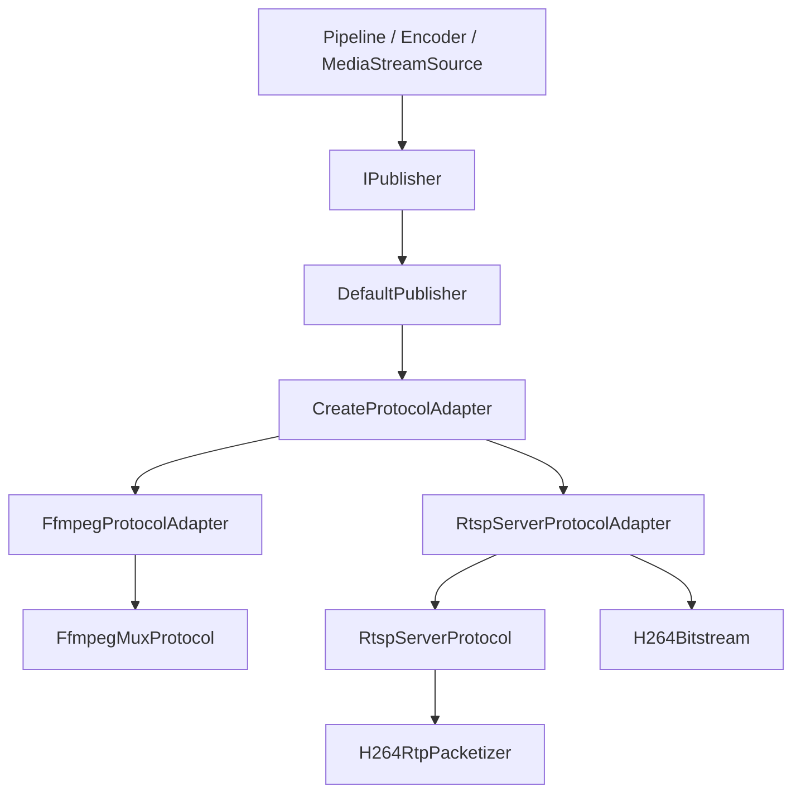

# Publisher / Protocol 设计文档

本文档说明当前 `publisher` 与 `protocol` 分层的实现、职责边界、调用关系和后续扩展方式。当前实现已删除旧的 `media/pusher` 体系，发布出口统一收敛到 `IPublisher`。

## 设计目标

1. 用一个统一出口承接 pipeline 的发布需求。
2. 区分“发布策略”和“协议运行时”，避免把 RTSP server、FFmpeg muxer、RTP packetizer 混在一个类里。
3. 支持两类发布角色：
   - Push client：主动推到远端媒体服务器，例如 RTMP/RTSP 推到 ZLMediaKit。
   - Pull server：本机监听端口，客户端直接拉流，例如本机 RTSP server。
4. 让后续扩展协议、编码格式、发布策略时有明确落点。

## 总体结构



核心规则：

- `IPublisher` 面向业务和 pipeline。
- `IProtocolAdapter` 面向项目内部数据模型，负责把 `MediaPacket` 转成协议需要的数据。
- `IProtocol` 面向协议运行时，不直接依赖 pipeline 的复杂上下文。
- codec 级别的解析、分片和打包放在独立工具或 packetizer 中。

## 配置模型

配置定义在 `include/media/publisher/publisher_config.h`。

### PublisherConfig

`PublisherConfig` 描述一次发布任务。

关键字段：

- `mode`：发布角色。
  - `PublishMode::PushClient`：主动连接远端服务器。
  - `PublishMode::PullServer`：本机监听，客户端来拉。
- `protocol`：协议实现。
  - `Auto`：由 `DefaultPublisher` 根据 `mode` 推断。
  - `FfmpegMux`：使用 FFmpeg muxer 推流。
  - `RtspServer`：本机 RTSP server。
  - `RtpUdp`：预留，当前校验中暂不支持。
- `url`：Push client 的目标地址，也可作为 Pull server 的显示地址。
- `listen_host` / `listen_port` / `stream_path`：Pull server 监听参数。
- `tracks`：媒体 track 元数据。
- `ffmpeg`：FFmpeg muxer 选项。
- `rtsp`：RTSP server 选项。
  - `enable_tcp_interleaved`：是否接受 `RTP/AVP/TCP`。
  - `enable_udp`：是否接受 UDP unicast 和 UDP multicast。
  - `multicast_address` / `multicast_rtp_port` / `multicast_rtcp_port` / `multicast_ttl`：客户端 SETUP multicast 时未指定目标信息，则使用这些默认值。
  - `max_payload_size`：H264 RTP payload 最大分片大小。

### MediaTrackConfig

`MediaTrackConfig` 描述一条媒体轨道。

关键字段：

- `track_id`：内部 track id。
- `media_type`：视频、音频等。
- `codec_type`：H264、H265、AAC 等。
- `width` / `height` / `fps`：视频参数。
- `sample_rate` / `channels`：音频参数。
- `time_base_num` / `time_base_den`：packet 时间基。
- `extra_data`：编码参数，例如 H264 SPS/PPS。
- `rtp_payload_type` / `rtp_clock_rate`：RTP track 参数。

当前 RTSP server MVP 支持单路 H264 视频，默认 payload type 为 96，RTP clock rate 为 90000。

## Publisher 层

### IPublisher

定义在 `include/media/publisher/i_publisher.h`。

职责：

- 提供 pipeline 侧统一发布接口。
- 管理发布生命周期。
- 对外暴露播放地址和统计信息。

接口：

```cpp
class IPublisher {
public:
    virtual bool Start(const PublisherConfig& config) = 0;
    virtual bool Publish(const MediaPacket& packet) = 0;
    virtual void Stop() = 0;

    virtual std::string GetPlayUrl() const = 0;
    virtual PublisherStats GetStats() const = 0;

    static std::unique_ptr<IPublisher> Create(PublisherConfig config);
};
```

`IPublisher` 不关心具体协议，也不负责 H264 拆包、RTSP 会话、FFmpeg muxer 这些细节。

### DefaultPublisher

定义在 `include/media/publisher/default_publisher.h`，实现位于 `src/media/publisher/default_publisher.cpp`。

职责：

- 作为默认 `IPublisher` 实现。
- 根据 `PublisherConfig` 选择协议 adapter。
- 管理 adapter 的生命周期。
- 将 `Publish()` 转发给 adapter。

它不是协议实现，也不直接处理 RTP/RTSP/FFmpeg。

协议推断规则：

```text
protocol != Auto       -> 使用显式 protocol
mode == PullServer     -> RtspServer
mode == PushClient     -> FfmpegMux
```

调用链：

```text
IPublisher::Create(config)
  -> DefaultPublisher
DefaultPublisher::Start(config)
  -> ResolveProtocol(config)
  -> CreateProtocolAdapter(protocol)
  -> adapter->Open(config)
DefaultPublisher::Publish(packet)
  -> adapter->Send(packet)
```

## Protocol Adapter 层

### IProtocolAdapter

定义在 `include/media/protocol/i_protocol_adapter.h`。

职责：

- 连接项目内部数据模型和协议运行时。
- 接收 `MediaPacket`。
- 完成协议需要的格式转换。
- 持有或创建一个 `IProtocol`。

接口：

```cpp
class IProtocolAdapter {
public:
    virtual bool Open(const PublisherConfig& config) = 0;
    virtual bool Send(const MediaPacket& packet) = 0;
    virtual void Close() = 0;

    virtual std::string GetOutputUrl() const = 0;
    virtual PublisherStats GetStats() const = 0;
};
```

扩展协议时，通常先新增一个 adapter，再新增一个 protocol。

### FfmpegProtocolAdapter

定义在 `include/media/protocol/ffmpeg_protocol_adapter.h`，实现位于 `src/media/protocol/ffmpeg_protocol_adapter.cpp`。

职责：

- 面向 FFmpeg muxer 的 adapter。
- 将 `MediaPacket` 映射为 `EncodedAccessUnit`。
- 单 track 发布时，强制映射到配置里的 `track_id`，避免编码器输出包的 `stream_index` 不稳定导致写入失败。
- 调用 `FfmpegMuxProtocol::Write()`。

它不直接调用 `avformat_write_header` 或 `av_write_frame`，这些属于 `FfmpegMuxProtocol`。

### RtspServerProtocolAdapter

定义在 `include/media/protocol/rtsp_server_protocol_adapter.h`，实现位于 `src/media/protocol/rtsp_server_protocol_adapter.cpp`。

职责：

- 面向本机 RTSP server 的 adapter。
- 当前只支持 H264 video。
- 将 `MediaPacket` 拆成 H264 NAL units。
- 支持 Annex-B 和 AVCC 两类 H264 packet。
- 从 `extra_data` 识别 AVCC NAL length size。
- 将项目内部时间戳换算成 RTP 90000 Hz timestamp。
- 将结果写入 `RtspServerProtocol`。

关键转换：

```text
MediaPacket
  -> H264Bitstream::SplitPacket()
  -> EncodedAccessUnit{nals, rtp timestamp, keyframe}
  -> RtspServerProtocol::Write()
```

注意：`EncodedAccessUnit.pts` 在 RTSP server 路径中已经被 adapter 转换成 RTP timestamp，`time_base` 会被设置为 `1/90000`。

## Protocol 层

### IProtocol

定义在 `include/media/protocol/i_protocol.h`。

职责：

- 表示协议运行时。
- 负责启动、写入、停止协议资源。
- 不直接依赖业务 pipeline。

接口：

```cpp
class IProtocol {
public:
    virtual bool Start(const PublisherConfig& config,
                       const std::vector<MediaTrackConfig>& tracks) = 0;
    virtual bool Write(const EncodedAccessUnit& access_unit) = 0;
    virtual void Stop() = 0;

    virtual std::string GetOutputUrl() const = 0;
    virtual PublisherStats GetStats() const = 0;
};
```

### FfmpegMuxProtocol

定义在 `include/media/protocol/ffmpeg_mux_protocol.h`，实现位于 `src/media/protocol/ffmpeg_mux_protocol.cpp`。

职责：

- 封装 FFmpeg muxer 生命周期。
- 创建 `AVFormatContext`。
- 根据 `MediaTrackConfig` 创建 `AVStream`。
- 写 header、写 packet、写 trailer。
- 管理 FFmpeg output URL。

内部对应 FFmpeg 调用：

```text
Start()
  -> avformat_alloc_output_context2
  -> avformat_new_stream
  -> avio_open2
  -> avformat_write_header

Write()
  -> av_packet_ref / av_new_packet
  -> av_write_frame

Stop()
  -> av_write_trailer
  -> avio_closep
  -> avformat_free_context
```

适用场景：

- RTMP 推到 ZLMediaKit。
- RTSP publish client 推到媒体服务器。
- 其它 FFmpeg 支持的 muxer 输出。

### RtspServerProtocol

定义在 `include/media/protocol/rtsp_server_protocol.h`，实现位于 `src/media/protocol/rtsp_server_protocol.cpp`。

职责：

- 本机启动 RTSP server。
- 使用 Boost.Asio 监听 TCP 端口。
- 管理 RTSP client session。
- 处理 RTSP 方法。
- 在 PLAY 状态下给客户端发送 RTP packet，当前支持 TCP interleaved、UDP unicast 和 UDP multicast。
- 生成 SDP。

当前支持的 RTSP 方法：

- `OPTIONS`
- `DESCRIBE`
- `SETUP`
- `PLAY`
- `PAUSE`
- `TEARDOWN`
- `GET_PARAMETER`

当前 RTP 传输：

- 支持 `RTP/AVP/TCP;unicast;interleaved=0-1`
- 支持 `RTP/AVP;unicast;client_port=RTP-RTCP`
- 支持 `RTP/AVP;multicast;destination=239.x.x.x;port=RTP-RTCP;source=server-ip;ttl=N`
- 暂不支持 RTCP sender report

写入链路：

```text
RtspServerProtocol::Write(access_unit)
  -> H264RtpPacketizer::Packetize(access_unit)
  -> snapshot current sessions
  -> TCP interleaved / UDP unicast: 逐个 PLAYING client session 发送
  -> UDP multicast: 只通过 protocol 级共享 sender 发送一份 RTP
  -> TCP interleaved RTP frame 或 UDP RTP datagram
```

RTSP server 和 FFmpeg muxer 的角色差异：

| Protocol | 网络角色 | 行为 |
|---|---|---|
| `FfmpegMuxProtocol` | Push client | 主动连接远端服务器并写入 |
| `RtspServerProtocol` | Pull server | 本机监听端口，等待客户端拉流 |

## H264 工具与 RTP packetizer

### H264Bitstream

定义在 `include/media/protocol/h264_bitstream.h`，实现位于 `src/media/protocol/h264_bitstream.cpp`。

职责：

- 判断 packet 是否 Annex-B。
- 拆 Annex-B NAL。
- 拆 AVCC length-prefixed NAL。
- 解析 AVCC extradata 中的 NAL length size。
- 从 extradata 或 NAL 列表中提取 SPS/PPS。
- base64 编码 SPS/PPS，用于 SDP 的 `sprop-parameter-sets`。

当前支持：

- Annex-B start code：`00 00 01` 和 `00 00 00 01`
- AVCC length size：1 到 4 字节
- H264 SPS/PPS 提取

### H264RtpPacketizer

定义在 `include/media/protocol/h264_rtp_packetizer.h`，实现位于 `src/media/protocol/h264_rtp_packetizer.cpp`。

职责：

- 将 H264 NAL units 转成 RTP payload。
- 小 NAL 直接单包发送。
- 大 NAL 使用 FU-A 分片。
- 设置 RTP marker bit。

它只生成 RTP payload，不写 RTP header，也不写 socket。RTP header 和 TCP interleaved header 由 `RtspServerProtocol::ClientSession` 生成。

## 典型使用方式

### 推到远端媒体服务器

```cpp
PublisherConfig config;
config.mode = PublishMode::PushClient;
config.protocol = PublishProtocol::FfmpegMux;
config.url = "rtmp://127.0.0.1/live/main";
config.ffmpeg.format_name = "flv";

MediaTrackConfig track;
track.track_id = 0;
track.media_type = MediaType::VIDEO;
track.codec_type = CodecType::H264;
track.width = 1920;
track.height = 1080;
track.time_base_num = 1;
track.time_base_den = 1000000;
track.extra_data = encoder.GetExtraData();
config.tracks.push_back(track);

auto publisher = IPublisher::Create(config);
publisher->Start(config);
publisher->Publish(packet);
publisher->Stop();
```

### 本机 RTSP server 发布

```cpp
PublisherConfig config;
config.mode = PublishMode::PullServer;
config.protocol = PublishProtocol::RtspServer;
config.listen_host = "0.0.0.0";
config.listen_port = 8554;
config.stream_path = "/live/main";

MediaTrackConfig track;
track.track_id = 0;
track.media_type = MediaType::VIDEO;
track.codec_type = CodecType::H264;
track.width = 1920;
track.height = 1080;
track.time_base_num = 1;
track.time_base_den = 1000000;
track.extra_data = encoder.GetExtraData();
config.tracks.push_back(track);

auto publisher = IPublisher::Create(config);
publisher->Start(config);

// Client can play:
// rtsp://127.0.0.1:8554/live/main
publisher->Publish(packet);
```

## 扩展指南

### 新增一种协议

例如新增裸 RTP UDP 发布。

步骤：

1. 在 `PublishProtocol` 中启用或新增枚举值。
2. 新增 `RtpUdpProtocolAdapter : IProtocolAdapter`。
3. 新增 `RtpUdpProtocol : IProtocol`。
4. 在 `CreateProtocolAdapter()` 中注册。
5. 添加协议级单元测试和至少一个集成测试。

落点判断：

- 需要处理 `MediaPacket`、codec、时间戳、extradata：写在 adapter。
- 需要处理 socket、协议状态、连接、发送：写在 protocol。
- 需要处理 H264/H265/AAC RTP 分片：写在 packetizer。

### 新增一种 codec

例如新增 H265 over RTSP。

步骤：

1. 新增 `H265Bitstream` 或通用 NAL parser。
2. 新增 `H265RtpPacketizer`。
3. 扩展 `RtspServerProtocolAdapter`，根据 `CodecType::H265` 选择 parser。
4. 扩展 `RtspServerProtocol::BuildSdp()`，生成 H265 SDP。
5. 增加 H265 单测和 RTSP 拉流验证。

### 新增一种发布策略

不是所有扩展都应该新增 `IPublisher` 实现。判断规则：

```text
协议差异 -> 扩展 IProtocolAdapter / IProtocol
发布策略差异 -> 扩展 IPublisher
```

适合新增 `IPublisher` 实现的例子：

- `MultiPublisher`：同时发布到 RTSP server 和 RTMP server。
- `QueuedPublisher`：内部带队列，避免网络写阻塞 pipeline。
- `FailoverPublisher`：主备发布地址自动切换。
- `ManagedPublisher`：带重连、健康检查、状态事件。

当前 `DefaultPublisher` 适合单协议、单发布目标场景。

## 当前限制

RTSP server 当前限制：

- 仅支持 H264 video。
- 仅支持单视频 track。
- 支持 RTSP over TCP interleaved、UDP unicast 和标准共享 UDP multicast。
- UDP multicast 使用 protocol 级共享 socket、SSRC 和 sequence；多个客户端订阅同一个组播流，不会按客户端数量重复发送。
- 暂不发送 RTCP sender report。
- RTSP request parser 是最小可用实现，不是完整 RFC 解析器。
- SDP 中 SPS/PPS 可从 `extra_data` 或写入包中更新，但客户端通常在 `DESCRIBE` 阶段就需要完整参数，因此生产路径建议在 `MediaTrackConfig.extra_data` 中提供 SPS/PPS。

FFmpeg muxer 当前限制：

- 多 track 支持依赖 `track_id` 与 packet 映射。
- 单 track 时 adapter 会忽略不稳定的 `packet.stream_index`，直接映射到配置中的唯一 track。

## 测试覆盖

当前相关测试：

- `test_publisher_protocol`
  - `PublisherConfig` 校验。
  - Annex-B H264 拆包。
  - AVCC extradata SPS/PPS 解析。
  - AVCC packet 拆包。
  - H264 FU-A 分片。
- `test_rtsp_server_publisher`
  - 启动本机 RTSP publisher。
  - 执行 `DESCRIBE -> SETUP -> PLAY`。
  - 发布一帧 H264 packet。
  - 验证客户端收到 RTP over TCP interleaved frame。
  - 验证 UDP unicast SETUP 返回 `server_port`，并且客户端 UDP socket 能收到 RTP packet。
  - 验证 UDP multicast SDP/SETUP 返回 `destination/port/source/ttl`，两个 RTSP 客户端订阅时仍只发送一份组播 RTP。
- `test_rtsp_decode_encode_push_zlm`
  - 已迁移为通过 `IPublisher` 使用 `FfmpegMuxProtocol` 推到 ZLMediaKit。

运行：

```powershell
.\build.ps1 -Action test -Tests
```

## 文件地图

Publisher 层：

- `include/media/publisher/i_publisher.h`
- `include/media/publisher/publisher_config.h`
- `include/media/publisher/default_publisher.h`
- `src/media/publisher/default_publisher.cpp`

Protocol 抽象：

- `include/media/protocol/i_protocol.h`
- `include/media/protocol/i_protocol_adapter.h`
- `include/media/protocol/protocol_types.h`
- `src/media/protocol/protocol_adapter_factory.cpp`

FFmpeg 协议：

- `include/media/protocol/ffmpeg_protocol_adapter.h`
- `include/media/protocol/ffmpeg_mux_protocol.h`
- `src/media/protocol/ffmpeg_protocol_adapter.cpp`
- `src/media/protocol/ffmpeg_mux_protocol.cpp`

RTSP server 协议：

- `include/media/protocol/rtsp_server_protocol_adapter.h`
- `include/media/protocol/rtsp_server_protocol.h`
- `include/media/protocol/rtsp_transport_spec.h`
- `src/media/protocol/rtsp_server_protocol_adapter.cpp`
- `src/media/protocol/rtsp_server_protocol.cpp`
- `src/media/protocol/rtsp_transport_spec.cpp`

H264/RTP 工具：

- `include/media/protocol/h264_bitstream.h`
- `include/media/protocol/h264_rtp_packetizer.h`
- `src/media/protocol/h264_bitstream.cpp`
- `src/media/protocol/h264_rtp_packetizer.cpp`

测试：

- `test/test_publisher_protocol.cpp`
- `test/test_rtsp_server_publisher.cpp`
- `test/test_rtsp_decode_encode_push_zlm.cpp`
