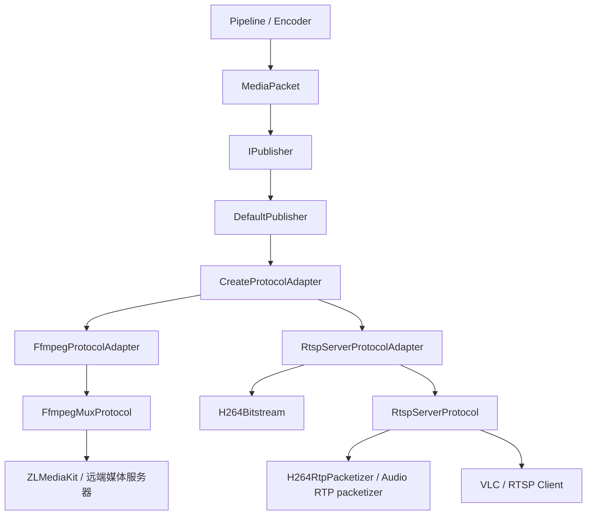

# Publisher 模块设计与扩展计划

本文档说明当前 Publisher 模块的架构、接口契约、协议实现、测试现状和后续改进计划。文档以当前代码为准，覆盖 FFmpeg 复用推流和本机 RTSP Server 两条发布链路。

最后更新：2026-07-29。

## 1. 模块定位

Publisher 位于编码器和网络协议之间，接收已经编码完成的 `MediaPacket`，将它发布到远端媒体服务器，或者在本机提供可供客户端拉流的服务。

当前支持两种发布角色：

| 发布角色 | 配置 | 当前实现 | 使用场景 |
|---|---|---|---|
| Push Client | `PublishMode::PushClient` | `FfmpegMuxProtocol` | 主动向 ZLMediaKit 等服务器推送 RTSP/RTMP 流 |
| Pull Server | `PublishMode::PullServer` | `RtspServerProtocol` | 本机监听 RTSP 端口，VLC 等客户端直接拉流 |

Publisher 不负责拉流、解码、推理和编码。这些步骤由 pipeline 上游完成。Publisher 的输入必须是编码后的 packet，并且 packet 的 codec、track、时间基和 extradata 应与 `PublisherConfig::tracks` 一致。

## 2. 总体架构



模块按职责分为四层：

| 层级 | 核心类型 | 职责 | 不应承担的职责 |
|---|---|---|---|
| 业务入口 | `IPublisher` | 为 pipeline 提供统一生命周期和发布接口 | RTP 分片、RTSP 会话、FFmpeg API 调用 |
| 发布编排 | `DefaultPublisher` | 解析配置、选择 adapter、转发生命周期 | 具体协议实现、数据格式解析 |
| 模型适配 | `IProtocolAdapter` | 将 `MediaPacket` 转成协议层的 `EncodedAccessUnit` | socket 会话、协议状态机 |
| 协议运行时 | `IProtocol` | 管理协议资源，启动、写入、停止和统计 | 依赖具体 pipeline 或编码器 |

codec 解析和 RTP 分片放在独立工具或 packetizer 中，避免 `DefaultPublisher` 和协议会话类继续膨胀。

## 3. 核心数据模型

### 3.1 PublisherConfig

`PublisherConfig` 描述一次发布任务：

```cpp
struct PublisherConfig {
    PublishMode mode;
    PublishProtocol protocol;

    std::string url;
    std::string listen_host;
    std::uint16_t listen_port;
    std::string stream_path;

    std::vector<MediaTrackConfig> tracks;
    FfmpegPublishOptions ffmpeg;
    RtspServerOptions rtsp;
};
```

主要字段：

| 字段 | 含义 |
|---|---|
| `mode` | 网络角色，主动推流或本机等待拉流 |
| `protocol` | 显式选择协议，或者使用 `Auto` |
| `url` | Push Client 的目标地址；Pull Server 也可将其作为输出地址 |
| `listen_host` / `listen_port` | RTSP Server 的监听地址和端口 |
| `stream_path` | RTSP Server 对外暴露的流路径，应以 `/` 开头 |
| `tracks` | 本次发布的所有音视频轨道 |
| `ffmpeg` | FFmpeg 输出格式和 RTSP transport 选项 |
| `rtsp` | 本机 RTSP Server 的 TCP、UDP、组播和 RTP 包大小配置 |

`Auto` 当前只有两条推断规则：

```text
PullServer -> RtspServer
PushClient -> FfmpegMux
```

建议生产代码显式填写 `protocol`。这样新增协议后不会因为默认推断规则改变而产生行为漂移。

配置校验分为两步：

- `ValidateStructure()` 校验 track 基础参数和 `track_id` 唯一性。
- `ValidateProtocol()` 校验 mode/protocol 组合、协议 codec 能力、RTP payload type、RTSP transport 和组播端口对。
- `Validate()` 依次执行前两步，并返回包含错误码和消息的 `PublisherResult`。

### 3.2 MediaTrackConfig

`MediaTrackConfig` 是 Publisher 的静态轨道描述：

| 字段 | 约束和用途 |
|---|---|
| `track_id` | Publisher 内唯一的轨道编号，也是 RTSP `trackN` 和协议写入时的路由键 |
| `media_type` / `codec_type` | 媒体类型和编码格式 |
| `width` / `height` / `fps` | 视频参数 |
| `sample_rate` / `channels` | 音频参数 |
| `time_base_num` / `time_base_den` | 上游 packet 的时间基描述 |
| `extra_data` | H264 SPS/PPS、AAC AudioSpecificConfig 等初始化数据 |
| `rtp_payload_type` | SDP 和 RTP header 中使用的 payload type |
| `rtp_clock_rate` | RTP timestamp 的时钟频率；H264 通常为 90000，音频使用采样率 |

多轨发布时，当前 adapter 使用 `MediaPacket::stream_index` 匹配 `track_id`。因此上游必须保证二者一致。单轨发布会直接映射到唯一 track，不依赖 `stream_index`。

### 3.3 MediaPacket 与 EncodedAccessUnit

`MediaPacket` 是 pipeline 对外的编码包模型，`EncodedAccessUnit` 是 protocol 内部使用的模型。两者之间的转换由 adapter 完成。

`EncodedAccessUnit` 保留以下协议必需信息：

- `track_id`、媒体类型和 codec。
- `pts`、`dts`、`duration` 和时间基。
- keyframe 标记。
- 编码数据 buffer 和可选的 FFmpeg backend handle。
- H264 拆分后的 NAL unit 列表。

FFmpeg 路径保留源 packet 的时间基，写入前转换到 `AVStream::time_base`。RTSP Server 路径则由 adapter 先把 PTS 转换为对应 track 的 RTP timestamp。

### 3.4 PublisherStats

当前公开统计如下：

| 字段 | 含义 |
|---|---|
| `packets_published` | protocol 接受并发布的 access unit 数量，不是 RTP 分片数量 |
| `bytes_published` | 编码 access unit 字节数或 FFmpeg packet 字节数 |
| `clients_connected` | RTSP Server 当前有效客户端会话数 |
| `rtcp_receiver_reports_received` | 收到且匹配本端 SSRC 的 RTCP report block 数量 |

当前统计用于基本可观测性，尚不能表达每个 track、客户端和传输模式的质量情况。

## 4. Publisher 层

### 4.1 IPublisher

`IPublisher` 是 pipeline 唯一应该依赖的发布接口：

```cpp
class IPublisher {
public:
    virtual PublisherResult Start() = 0;
    virtual PublisherResult Publish(const MediaPacket& packet) = 0;
    virtual void Stop() = 0;

    virtual std::string GetPlayUrl() const = 0;
    virtual PublisherStats GetStats() const = 0;
    virtual PublisherResult GetLastResult() const = 0;

    static std::unique_ptr<IPublisher> Create(PublisherConfig config);
};
```

接口语义：

- `Create(config)` 固定本次发布配置，消除构造和启动阶段的双配置源。
- `Start()` 使用已固定的配置创建协议资源。重复调用时，当前默认实现会先停止旧任务。
- `Publish()` 只接受已编码 packet，并返回结构化结果。
- `Stop()` 可以重复调用，析构函数也会执行停止。
- `GetPlayUrl()` 返回协议输出地址。对 Push Client 来说是推流地址，对 Pull Server 来说是客户端播放地址。
- `GetStats()` 返回当前统计快照。
- `GetLastResult()` 返回最近一次启动或发布操作的结果。

`PublisherResult` 当前可以区分配置错误、不支持的协议/codec、非法状态、无效 packet、资源打开或端口绑定失败、连接失败、远端拒绝和运行时断流。状态回调、异步结果和背压语义仍未实现。

### 4.2 DefaultPublisher

`DefaultPublisher` 是当前唯一的 `IPublisher` 实现。它是单目标、单 adapter 的发布编排器，而不是一种协议。

调用链如下：

```text
IPublisher::Create(config)
  -> DefaultPublisher(config)

DefaultPublisher::Start()
  -> Stop()
  -> ResolvePublishProtocol(config_)
  -> PublisherConfig::Validate()
  -> CreateProtocolAdapter(protocol)
  -> adapter->Open(config)

DefaultPublisher::Publish(packet)
  -> adapter->Send(packet)

DefaultPublisher::Stop()
  -> adapter->Close()
  -> destroy adapter
```

`DefaultPublisher` 适合当前的单目标发布，但后续仍可增加其他 `IPublisher` 实现。是否新增实现应由“发布策略是否变化”决定，而不是由“协议是否变化”决定：

| 需求 | 扩展位置 |
|---|---|
| 新增 SRT、WebRTC、裸 RTP 等协议 | `IProtocolAdapter` + `IProtocol` |
| 同时发布到多个目标 | `MultiPublisher : IPublisher` |
| 网络写入与 pipeline 解耦 | `QueuedPublisher : IPublisher` 或统一异步编排层 |
| 主备目标自动切换 | `FailoverPublisher : IPublisher` |
| 自动重连、健康检查和状态事件 | `ManagedPublisher : IPublisher`，或作为通用装饰器 |

不要为每一种协议都新增一个 `IPublisher`。协议差异应留在 adapter/protocol 层。

## 5. Protocol Adapter 层

### 5.1 IProtocolAdapter

Adapter 是项目数据模型与协议运行时的边界：

```cpp
class IProtocolAdapter {
public:
    virtual PublisherResult Open(const PublisherConfig& config) = 0;
    virtual PublisherResult Send(const MediaPacket& packet) = 0;
    virtual void Close() = 0;

    virtual std::string GetOutputUrl() const = 0;
    virtual PublisherStats GetStats() const = 0;
};
```

Adapter 应负责：

- 校验协议支持的 track 和 codec。
- 将 `stream_index` 映射成 `track_id`。
- 处理 packet 时间基和协议时间戳转换。
- 解析协议需要的 bitstream 元数据。
- 创建并持有对应的 `IProtocol`。

Adapter 不应负责 socket 收发、客户端会话和 FFmpeg muxer 的资源生命周期。

### 5.2 FfmpegProtocolAdapter

`FfmpegProtocolAdapter` 的转换较薄：

- 单轨时直接使用唯一的 `track_id`。
- 多轨时使用 `MediaPacket::stream_index` 作为 `track_id`。
- 保留 packet 的 PTS/DTS/duration/time base、buffer 和 FFmpeg backend handle。
- 调用 `FfmpegMuxProtocol::Write()`。

它不解析 H264 NAL，也不修改 bitstream。目标 muxer 是否要求 Annex-B、AVCC 或额外 bitstream filter，当前由上游和 FFmpeg muxer 的兼容性共同保证。

### 5.3 RtspServerProtocolAdapter

`RtspServerProtocolAdapter` 当前支持 H264 视频和 AAC/G711 音频，负责：

- 校验 RTSP Server 支持的 codec。
- 按 `track_id`、媒体类型和 codec 查找目标 track。
- 将音频 `rtp_clock_rate` 规范为采样率。
- 识别 Annex-B 和 AVCC H264 packet，并拆成 NAL units。
- 从 H264 extradata 中解析 AVCC NAL length size 和 SPS/PPS。
- 在关键帧缺少 SPS/PPS 时补入已知参数集。
- 为每个 track 建立独立时间戳原点，将 packet PTS 转换成从 0 开始的 RTP timestamp。
- 将音频编码数据原样交给 RTSP protocol 做 RTP payload 封装。

这里的 RTP timestamp 使用无符号 32 位回绕语义。当前没有处理输入 PTS 大幅回退、跨 discontinuity 重建时间戳原点等异常流场景。

## 6. Protocol 层

### 6.1 IProtocol

`IProtocol` 表示一个协议运行时实例：

```cpp
class IProtocol {
public:
    virtual PublisherResult Start(
        const PublisherConfig& config,
        const std::vector<MediaTrackConfig>& tracks) = 0;
    virtual PublisherResult Write(const EncodedAccessUnit& access_unit) = 0;
    virtual void Stop() = 0;

    virtual std::string GetOutputUrl() const = 0;
    virtual PublisherStats GetStats() const = 0;
};
```

它管理网络、muxer、线程和会话等运行时资源，但不依赖解码器、编码器或 pipeline。

### 6.2 FfmpegMuxProtocol

`FfmpegMuxProtocol` 封装 FFmpeg 输出复用器：

```text
Start
  -> avformat_alloc_output_context2
  -> 为每个 MediaTrackConfig 创建 AVStream
  -> 写入 codec parameters 和 extradata
  -> avio_open2
  -> avformat_write_header

Write
  -> 引用 FFmpeg AVPacket 或复制编码 buffer
  -> track_id 映射到 AVStream index
  -> av_packet_rescale_ts 到输出 stream time base
  -> av_write_frame

Stop
  -> av_write_trailer
  -> avio_closep
  -> avformat_free_context
```

代码中的 codec 映射包括 H264、H265、AAC、Opus、G711A 和 G711U。最终能否发布还取决于所选容器、FFmpeg muxer 和远端服务器是否接受该 codec 组合。

当前 `Write()` 是同步调用。远端拥塞、断网或 muxer 阻塞可能直接拖慢调用它的 pipeline 线程。

### 6.3 RtspServerProtocol

`RtspServerProtocol` 使用 Boost.Asio 实现本机 RTSP Server。它拥有一个 `io_context` 线程，并为每个 RTSP TCP 连接创建 `ClientSession`。

已实现的 RTSP 方法：

- `OPTIONS`
- `DESCRIBE`
- `SETUP`
- `PLAY`
- `PAUSE`
- `TEARDOWN`
- `GET_PARAMETER`

已实现的传输模式：

| 模式 | SETUP Transport 示例 | 视频 | 音频 | RTCP |
|---|---|---:|---:|---:|
| TCP interleaved | `RTP/AVP/TCP;unicast;interleaved=0-1` | 支持 | 支持 | SR 发送、RR 接收 |
| UDP unicast | `RTP/AVP;unicast;client_port=5000-5001` | 支持 | 支持 | SR 发送、RR 接收 |
| UDP multicast | `RTP/AVP;multicast;destination=239.x.x.x;port=5004-5005` | 仅 H264 | 暂不支持 | 共享 SR 发送、RR 接收 |

`RtspTransportSpec` 独立负责解析 Transport 候选项，以及生成 SETUP 响应。RTSP protocol 根据配置决定是否接受 TCP、UDP 和 multicast。

### 6.4 RTP 与 SDP

当前 RTSP Server codec 能力：

| Codec | SDP | RTP payload |
|---|---|---|
| H264 | `H264/90000`，包含 profile-level-id 和可选 sprop-parameter-sets | 单 NAL 或 FU-A 分片 |
| AAC | RFC 3640 `MPEG4-GENERIC`，包含 AAC-hbr fmtp 和 AudioSpecificConfig | AU header + raw AAC access unit；输入带 ADTS 时会去掉 ADTS header |
| G711A | `PCMA/<sample_rate>/<channels>` | 编码数据直接作为 RTP payload |
| G711U | `PCMU/<sample_rate>/<channels>` | 编码数据直接作为 RTP payload |

H264 packetizer 只负责生成 RTP payload 和 marker，不负责 RTP header、sequence、SSRC 或 socket。后者由 session 或共享 multicast sender 管理。

多轨 RTSP 会话按 track 维护独立的 payload type、SSRC、sequence 和 RTCP 状态。multicast 目前仍是 protocol 级共享的单 H264 sender，所以尚不能承载音频或多个视频 track。

### 6.5 RTCP

当前行为：

- 每个 TCP/UDP unicast track 在发送首个 RTP 后发送 Sender Report，后续有媒体写入时每 5 秒补发。
- multicast 使用共享 SSRC、packet count 和 octet count 生成 Sender Report。
- TCP interleaved、UDP unicast 和 UDP multicast 都可以解析 compound RTCP。
- Receiver Report 中的 fraction lost、cumulative lost、highest sequence、jitter、LSR 和 DLSR 会被解析。
- multicast 按 reporter SSRC 聚合反馈。
- SDES、BYE 和 APP 当前仅识别并忽略。

Sender Report 目前由媒体发送路径触发，不是独立定时器。因此流暂停或长时间没有新 packet 时，不会单独周期发送 SR。

## 7. 两条典型数据链路

### 7.1 推送到 ZLMediaKit

```text
MediaPacket(H264/AAC)
  -> DefaultPublisher
  -> FfmpegProtocolAdapter
  -> EncodedAccessUnit
  -> FfmpegMuxProtocol
  -> FFmpeg RTSP muxer over TCP
  -> ZLMediaKit
```

示例配置：

```cpp
PublisherConfig config;
config.mode = PublishMode::PushClient;
config.protocol = PublishProtocol::FfmpegMux;
config.url = "rtsp://127.0.0.1:554/live/main";
config.ffmpeg.format_name = "rtsp";
config.ffmpeg.rtsp_transport = "tcp";
config.tracks = {video_track, aac_audio_track};

auto publisher = IPublisher::Create(config);
if (!publisher) {
    // 创建失败。
}
const auto start_result = publisher->Start();
if (!start_result) {
    // 启动失败。
}
```

当前摄像头手动测试会把视频编码为 H264、把音频编码为 AAC，然后同时注册到 ZLM publisher。

### 7.2 本机 RTSP Server

```text
MediaPacket(H264/AAC/G711)
  -> DefaultPublisher
  -> RtspServerProtocolAdapter
  -> NAL split / RTP timestamp conversion
  -> RtspServerProtocol
  -> SDP + RTSP session + RTP/RTCP
  -> VLC
```

示例配置：

```cpp
PublisherConfig config;
config.mode = PublishMode::PullServer;
config.protocol = PublishProtocol::RtspServer;
config.listen_host = "0.0.0.0";
config.listen_port = 8554;
config.stream_path = "/live/main";
config.rtsp.enable_tcp_interleaved = true;
config.rtsp.enable_udp = true;
config.rtsp.enable_multicast = false;
config.tracks = {video_track, audio_track};

auto publisher = IPublisher::Create(config);
const auto result = publisher->Start();
// 播放地址：rtsp://127.0.0.1:8554/live/main
```

multicast 默认关闭。只有确实需要组播且客户端只订阅当前支持的 H264 track 时才应开启。

## 8. 生命周期、并发与错误边界

当前约束：

- `DefaultPublisher` 本身没有锁，不应在多个线程并发调用 `Start()`、`Publish()` 和 `Stop()`。
- `FfmpegMuxProtocol::Write()` 是同步的，也没有内部并发保护，应由单一发布线程调用。
- `RtspServerProtocol` 的网络事件运行在内部 Asio 线程；`Write()` 可读取 session 快照并把发送任务交给会话，但调用方仍应串行发布同一 track，保证 packet 顺序。
- `Stop()` 会关闭协议资源。调用方必须先停止上游继续产生 packet，避免 `Publish()` 与 `Stop()` 竞争。
- 当前错误主要写日志并返回 `false`，没有结构化错误原因和状态事件。

推荐的 pipeline 停止顺序：

```text
停止输入/拉流
  -> 停止向编码器送帧
  -> flush 编码器并发布剩余 packet
  -> 停止 Publisher
  -> 销毁编码器和上游资源
```

## 9. 当前能力状态

| 能力 | 状态 | 说明 |
|---|---|---|
| FFmpeg RTSP/RTMP push | 已实现 | 具体格式由 URL 和 `format_name` 决定 |
| FFmpeg 多音视频轨 | 已实现 | `stream_index` 必须与 `track_id` 对齐 |
| 本机 RTSP H264 | 已实现 | Annex-B、AVCC、FU-A、SPS/PPS |
| 本机 RTSP AAC/G711 | 已实现 | TCP interleaved 和 UDP unicast |
| UDP multicast | 部分实现 | 仅共享 H264 video sender |
| RTCP SR/RR | 已实现基础版本 | 缺 SDES/BYE、超时和详细指标导出 |
| 裸 RTP UDP publisher | 未实现 | `RtpUdp` 统一返回结构化 `UnsupportedProtocol` |
| WebRTC publisher | 未实现 | `WebRtc` 统一返回结构化 `UnsupportedProtocol`，独立规划文档已存在 |
| 自动重连/主备切换 | 未实现 | FFmpeg 写失败后由调用方处理 |
| 发布队列和背压 | 未实现 | 当前同步传播协议写入延迟 |
| RTSP 鉴权/TLS | 未实现 | 仅适合可信网络内使用 |

## 10. 已知限制与技术债

### 配置与接口

- `PublisherConfig::IsValid()` 只做基础校验，没有完整检查 mode/protocol 组合、重复 track id、重复 payload type、端口对和 codec/协议兼容性。
  - 状态：已修复。
  - 修复日期：2026-07-31。
  - 修复方法：新增 `MediaTrackConfig::ValidateStructure()`、`PublisherConfig::ValidateStructure()` 和 `ValidateProtocol()`；统一校验轨道结构、唯一 `track_id`、RTSP 唯一 payload type、角色/协议组合、监听和组播地址、transport 开关、组播偶数 RTP/相邻 RTCP 端口及协议 codec 能力。`Validate()` 返回首个结构化错误。
- `PublishProtocol::WebRtc` 可以通过基础配置校验，但 adapter 工厂会返回空；`RtpUdp` 则在配置校验阶段直接失败，两种占位协议的行为不一致。
  - 状态：已修复。
  - 修复日期：2026-07-31。
  - 修复方法：所有配置先通过 `ResolvePublishProtocol()` 解析 `Auto`；未实现的 `WebRtc` 和 `RtpUdp` 均在 `ValidateProtocol()` 返回 `PublisherErrorCode::UnsupportedProtocol`，不会进入 adapter 工厂或创建协议资源。
- `IPublisher::Create(config)` 保存一份配置，但 `Start(config)` 又接受一份配置，存在“双配置源”。
  - 状态：已修复。
  - 修复日期：2026-07-31。
  - 修复方法：保留 `IPublisher::Create(config)` 作为唯一配置入口，删除 `Start(config)`，改为无参数 `Start()`；`DefaultPublisher` 启动时只读取构造阶段固定的 `config_`。
- 布尔返回值无法区分配置错误、网络错误、远端拒绝和运行时断流。
  - 状态：已修复。
  - 修复日期：2026-07-31。
  - 修复方法：新增 `PublisherResult`、`PublisherErrorCode` 和 `native_error`，并贯穿 `IPublisher`、`IProtocolAdapter` 和 `IProtocol`。FFmpeg 路径区分连接失败、header 被拒绝和运行时写入断开；RTSP Server 路径区分配置、资源打开、端口绑定、状态和 packet 错误；`GetLastResult()` 保存最近一次结果。

### FFmpeg 推流

- 同步写入可能阻塞 pipeline。
- 没有自动重连、退避、关键帧等待和断线期间的 packet 丢弃策略。
- 没有统一 bitstream filter 层；不同 muxer 的 H264/H265 格式要求需要逐个验证。
- 多轨路由依赖 `stream_index == track_id` 的外部约定。

### RTSP Server

- RTSP request parser 是最小可用实现，不是完整 RFC 解析器。
- 没有 Basic/Digest 鉴权、RTSPS、会话 idle timeout、访问控制和连接数限制。
- 只支持 H264 视频，尚未支持 H265。
- multicast 只有单 H264 track，共享一组 RTP/RTCP 端口、SSRC 和 sequence。
- 没有 RTCP SDES/BYE，也没有基于 RR 的质量告警或码率反馈。
- 时间戳异常、重连后的 discontinuity 和长时间运行时的回绕测试还不充分。

### 可维护性与测试

- `RtspServerProtocol` 同时承担 RTSP 解析、会话、RTP header、音频 packetizer、RTCP 和 multicast，类体积较大。
- 手动摄像头链路和协议自动测试目前混在 `test_rtsp_server_publisher`，并通过常量选择；当前默认进入不设时长的摄像头循环。
- 部分协议测试函数在 `main()` 中被注释，没有作为 CTest 自动回归执行。
- 缺少断网、慢客户端、并发客户端、长时间运行和错误配置测试。

## 11. 扩展方法

### 11.1 新增协议

以 SRT 或裸 RTP UDP 为例：

1. 在 `PublishProtocol` 中增加或启用枚举值。
2. 定义协议专用配置，避免把所有字段继续堆进 `PublisherConfig` 顶层。
3. 新增 `XxxProtocolAdapter : IProtocolAdapter`，完成 track、时间戳和 bitstream 适配。
4. 新增 `XxxProtocol : IProtocol`，管理协议连接和写入。
5. 在 `CreateProtocolAdapter()` 注册。
6. 为配置校验、adapter 转换和 protocol 生命周期添加单元测试。
7. 添加至少一个真实接收端的端到端测试。

职责判断：

```text
MediaPacket / track / codec / timestamp 转换 -> Adapter
连接 / socket / muxer / 会话 / 重连       -> Protocol
NAL / AU / RTP payload 分片                -> Packetizer
队列 / 多目标 / 主备 / 策略                -> Publisher
```

### 11.2 新增 codec

以 H265 over RTSP 为例：

1. 增加 H265 Annex-B/HVCC parser 和 VPS/SPS/PPS 提取。
2. 实现 RFC 7798 RTP packetizer。
3. 扩展 `RtspServerProtocolAdapter` 的 codec 校验和 access unit 转换。
4. 扩展 SDP，生成 `H265/90000` 和对应 fmtp。
5. 验证单 NAL、分片、关键帧参数集、多客户端和三种 transport。

FFmpeg mux 路径已有 H265 codec 映射，但仍需针对目标格式和服务器验证 bitstream 形式。

### 11.3 新增发布策略

发布策略应实现或组合 `IPublisher`：

- `QueuedPublisher`：有界队列、丢包策略、独立工作线程和背压统计。
- `MultiPublisher`：把同一个 packet 发布到多个子 publisher，并定义部分失败语义。
- `FailoverPublisher`：主目标失败后切到备用目标。
- `ManagedPublisher`：状态机、重连退避、健康检查和事件回调。

这些策略可以用装饰器组合，避免把队列、重连、多目标全部塞入 `DefaultPublisher`。

## 12. 后续改进计划

路线图按依赖关系排列。P0 先固定接口契约和回归基线，P1 再补可靠性与缺失媒体能力，P2 扩展协议和生产能力。

### P0：稳定当前边界和回归基线

#### 12.1 配置校验和能力查询

目标：让不支持的组合在创建网络资源前给出明确错误。

进度（2026-07-31）：配置结构和协议能力校验已完成；公开的 `ProtocolCapabilities` 查询仍待实现。

工作项：

- 将 `IsValid()` 拆成结构校验和协议能力校验。
- 校验 mode/protocol 是否匹配、track id 和 RTP payload type 是否唯一。
- 校验 RTSP transport 至少启用一种，multicast 必须依赖 UDP。
- 校验 RTP/RTCP 端口、payload type 范围、音频采样率和 codec 必需 extradata。
- 统一 `RtpUdp`、`WebRtc` 等未实现协议的失败行为。
- 提供 `ProtocolCapabilities` 或等价查询，让上层在启动前获知 codec、transport 和多轨能力。

验收标准：错误配置不启动 socket/muxer，并能得到稳定的错误码和可读消息。

#### 12.2 生命周期和错误模型

目标：明确 Publisher 状态和失败恢复方式。

进度（2026-07-31）：单配置源和同步操作的结构化错误已完成；完整状态机、异步状态事件和重连事件仍待实现。

工作项：

- 引入 `Created/Starting/Running/Stopping/Stopped/Failed` 状态。
- 已采用构造时固定配置，并将启动接口统一为无参数 `Start()`。
- 用 `PublisherResult`/`PublisherError` 替代只有布尔值的失败结果。
- 明确 `Publish()` 与 `Stop()` 的并发契约，并补竞态测试。
- 增加启动失败、运行时断流和停止完成事件。

验收标准：调用方不解析日志即可区分配置、连接、写入和远端错误。

#### 12.3 测试拆分和自动化

目标：默认测试有限时、可重复、无需摄像头和外部服务。

工作项：

- 将协议自动测试与无限时摄像头手动测试拆成两个 executable。
- 恢复 TCP、UDP unicast、音视频和 multicast 测试函数的默认执行。
- 将有限时协议测试注册到 CTest。
- 保留摄像头和 ZLMediaKit 链路为显式手动测试。
- 增加异常 Transport、错误 CSeq/Session、客户端中途断开和重复 Stop 测试。

验收标准：无外部设备时可自动覆盖 Publisher 创建、SDP、SETUP/PLAY、RTP 和 RTCP 基础路径。

### P1：补齐媒体能力和发布可靠性

#### 12.4 多轨 multicast

目标：支持 H264 + AAC/G711 的标准组播发布。

工作项：

- multicast 状态从单一全局 sender 改为 `track_id -> MulticastTrackState`。
- 每个 track 分配独立 RTP/RTCP 端口、SSRC、sequence 和 RTCP 计数。
- SDP 为每个 multicast track 输出正确的 `m=` 端口。
- 音频使用自身 payload type 和 clock rate。
- 按 track 和 reporter SSRC 聚合 RR。
- 增加双客户端订阅同一音视频组播但每个 track 只发送一份数据的测试。

验收标准：VLC 可通过 multicast 同时播放 H264 + AAC/G711，RTCP SR/RR 分轨正确。

#### 12.5 RTCP 完整性与质量统计

目标：让 RTCP 既满足互操作，也能用于诊断网络质量。

工作项：

- 使用独立 timer 调度周期 SR，不依赖新媒体 packet 触发。
- 增加 SDES CNAME，在停止 track/session 时发送 BYE。
- 暴露 per-track/per-client 丢包率、jitter、RTT、最后 RR 时间。
- 对长时间无 RR、持续高丢包和高 jitter 提供状态事件。
- 增加 NTP/RTP 映射、32 位 timestamp 回绕和 compound RTCP 边界测试。

验收标准：Wireshark 校验 RTCP compound packet 合法，统计可定位到客户端和 track。

#### 12.6 异步队列和背压

目标：远端网络阻塞不拖住解码、推理和编码线程。

工作项：

- 实现有界 `QueuedPublisher`，由专用线程调用下游 publisher。
- 支持按媒体类型配置队列容量和丢弃策略。
- 视频拥塞时优先丢弃非关键帧，并在恢复后等待关键帧。
- 音频定义连续性策略，避免无限积压导致延迟不断增长。
- 增加 queue depth、dropped packets、write latency 和 last error 统计。

验收标准：模拟慢写入时 pipeline 延迟有界，内存不持续增长，恢复后能从关键帧正常播放。

#### 12.7 FFmpeg 推流重连

目标：ZLMediaKit 重启或短时断网后自动恢复。

工作项：

- 为 FFmpeg protocol 增加连接状态和指数退避。
- 重建 `AVFormatContext`、stream 和 header。
- 重连期间执行有界丢包，并在连接恢复后等待视频关键帧。
- 确保 AAC extradata、H264 SPS/PPS 和时间戳在新会话中重新初始化。
- 增加 MediaServer 重启集成测试。

验收标准：远端恢复后无需重启 pipeline，播放器可重新拉到音视频且时间戳单调。

### P2：协议扩展和生产化

#### 12.8 H265 over RTSP

按照 11.2 的扩展步骤实现 H265 parser、packetizer、SDP 和测试。优先复用通用 NAL 工具，但不要用 H264 的 NAL type 和 FU-A 逻辑硬套 H265。

#### 12.9 RTSP Server 生产能力

工作项：

- 将 request parser、session、RTP sender、RTCP 和 multicast 拆为独立组件。
- 增加 Basic/Digest 鉴权、会话超时、最大连接数和访问控制。
- 评估 RTSPS、IPv6、RTSP aggregate control 和更完整的 RFC 错误响应。
- 增加慢客户端隔离和每客户端发送队列上限。
- 使用 VLC、FFmpeg、GStreamer 和常见 NVR 做互操作矩阵测试。

#### 12.10 多目标和主备发布

先实现 `MultiPublisher` 的失败策略，再在其上实现 `FailoverPublisher`：

- 明确 all-success、any-success 和 required-target 语义。
- 每个目标拥有独立队列和状态，单个慢目标不能拖慢其他目标。
- 允许本机 RTSP Server 与 ZLM push 同时发布。
- 汇总统计时保留每个子 publisher 的明细。

#### 12.11 WebRTC 和其他协议

WebRTC 按 [WebRTC RTC 模块计划](webrtc-rtc-module-plan.md) 单独推进，通过 `PublishProtocol::WebRtc` 接入现有 Publisher 边界。裸 RTP UDP 可作为更小的协议先实现，用于验证 protocol/adapter 扩展流程。

### P3：长期优化

- 将 publisher 指标接入统一 metrics/HTTP API。
- 增加 packet trace id 和结构化事件，串联 pull、decode、encode、publish 延迟。
- 评估 buffer 零拷贝和 RTP scatter/gather write，减少高码率多客户端场景的复制。
- 增加 24 小时稳定性测试、时间戳回绕测试和故障注入。
- 建立协议兼容性文档，记录 codec、容器、服务器和播放器组合。

## 13. 推荐实施顺序

建议按以下里程碑推进：

| 里程碑 | 内容 | 依赖 |
|---|---|---|
| M1 | 测试拆分、配置校验、结构化错误 | 无 |
| M2 | RTCP timer/SDES/BYE、分轨质量统计 | M1 |
| M3 | 多轨音视频 multicast | M1、M2 的分轨状态模型 |
| M4 | QueuedPublisher、背压和 FFmpeg 重连 | M1 |
| M5 | MultiPublisher/FailoverPublisher | M4 |
| M6 | H265、RTSP 鉴权和互操作增强 | M1，可与 M4 并行 |
| M7 | WebRTC 或其他新协议 | M1、统一能力查询和错误模型 |

其中 M1 应优先完成。它不会扩大协议功能，但会显著降低后续每次扩展的调试成本。

## 14. 测试与验证

当前相关测试：

| 测试 | 覆盖内容 |
|---|---|
| `test_publisher_protocol` | 配置基础校验、Annex-B/AVCC、H264 FU-A、RTSP Transport 解析 |
| `test_rtsp_server_publisher` | TCP/UDP/multicast、音视频 SDP、RTP、RTCP，以及手动摄像头双路发布 |
| `test_local_mp4_decode_rtsp_publisher` | 根目录 `test.mp4` 解码、编码并通过本机 RTSP 发布 |
| `test_rtsp_decode_encode_push_zlm` | RTSP 拉流、解码、编码并通过 FFmpeg publisher 推送 ZLM |

构建和运行默认测试：

```powershell
.\build.ps1 -Action test -Tests
```

手动摄像头链路当前使用固定地址：

```text
输入：rtsp://192.168.66.83/live/mainstream
本机 RTSP：rtsp://127.0.0.1:7852/camera/mainstream
ZLM RTSP：rtsp://127.0.0.1:554/live/video_pipeline_av_test
```

该测试持续拉取摄像头，不限制时长和帧数，必须手动结束。它不应作为后续默认 CTest 用例。

## 15. 文件地图

Publisher 接口和实现：

- `include/media/publisher/i_publisher.h`
- `include/media/publisher/publisher_config.h`
- `include/media/publisher/publisher_result.h`
- `include/media/publisher/default_publisher.h`
- `src/media/publisher/publisher_config.cpp`
- `src/media/publisher/default_publisher.cpp`

Protocol 抽象和工厂：

- `include/media/protocol/i_protocol.h`
- `include/media/protocol/i_protocol_adapter.h`
- `include/media/protocol/protocol_types.h`
- `src/media/protocol/protocol_adapter_factory.cpp`

FFmpeg publisher：

- `include/media/protocol/ffmpeg_protocol_adapter.h`
- `include/media/protocol/ffmpeg_mux_protocol.h`
- `src/media/protocol/ffmpeg_protocol_adapter.cpp`
- `src/media/protocol/ffmpeg_mux_protocol.cpp`

RTSP Server publisher：

- `include/media/protocol/rtsp_server_protocol_adapter.h`
- `include/media/protocol/rtsp_server_protocol.h`
- `include/media/protocol/rtsp_transport_spec.h`
- `src/media/protocol/rtsp_server_protocol_adapter.cpp`
- `src/media/protocol/rtsp_server_protocol.cpp`
- `src/media/protocol/rtsp_transport_spec.cpp`

RTP/bitstream 工具：

- `include/media/protocol/h264_bitstream.h`
- `include/media/protocol/h264_rtp_packetizer.h`
- `src/media/protocol/h264_bitstream.cpp`
- `src/media/protocol/h264_rtp_packetizer.cpp`

测试：

- `test/media/test_publisher_protocol.cpp`
- `test/media/test_rtsp_server_publisher.cpp`
- `test/media/test_local_mp4_decode_rtsp_publisher.cpp`
- `test/media/test_rtsp_decode_encode_push_zlm.cpp`

## 16. 关联文档

- [RTSP / ZLMediaKit Pipeline 排障记录](rtsp-zlm-pipeline-troubleshooting.md)
- [WebRTC RTC 模块计划](webrtc-rtc-module-plan.md)
