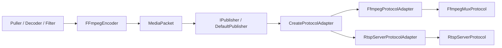
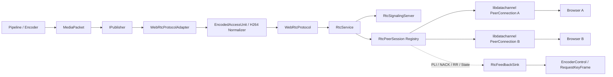

# WebRTC 接入与 RTC 模块演进计划

> 文档状态：Draft  
> 基线日期：2026-07-27  
> 适用工程：`video-pipeline`  
> 目标读者：媒体链路、网络协议、前端播放器、测试与部署人员

## 1. 结论摘要

当前工程适合接入 WebRTC，已有的 Publisher / Protocol 分层可以继续复用，不需要重构主 pipeline。仓库还已经具备以下基础：

- `PublishProtocol` 已预留 `WebRtc`。
- `MediaPacket`、`MediaTrackConfig` 和 `EncodedAccessUnit` 已能描述编码数据、轨道、时间基和关键帧。
- `RtspServerProtocolAdapter` 已实现 H264 Annex-B / AVCC 拆分、SPS/PPS 提取、关键帧补参数集和 RTP 时间戳转换，这些逻辑可抽取后复用于 WebRTC。
- 编码器已支持 H264 和 Opus，且具备 `zerolatency`、无 B 帧等低延迟配置。
- `vcpkg.json` 已声明 `libdatachannel`，本机安装版本为 `0.24.5`，可通过 `LibDataChannel::LibDataChannel` 接入 CMake。
- 工程自带 ZLMediaKit，现有配置已开启 RTC 信令、ICE/TURN、UDP/TCP 传输及 NACK 相关能力。

建议采用“双阶段、单目标”路线：

1. **短期验证路线：ZLMediaKit 网关。** 复用现有 RTSP/FFmpeg 推流链路，由 ZLMediaKit 转为 WebRTC，快速完成浏览器播放、网络和部署验证。
2. **正式目标路线：原生 RTC 模块。** 基于 `libdatachannel` 实现 `WebRtcProtocolAdapter + WebRtcProtocol + rtc/*`，由本工程直接管理 PeerConnection、信令、ICE、RTP/RTCP、会话和统计。

ZLMediaKit 路线用于快速交付和回归对照，不作为原生 RTC 模块完成后的永久双实现。以下任一条件成立时，应优先推进原生路线：

- 需要精确控制 PLI、NACK、码率、关键帧和端到端延迟。
- 需要 DataChannel、会话级鉴权或业务信令。
- 需要减少外部媒体服务器依赖。
- 需要把 RTC 状态纳入当前工程统一的统计、日志和生命周期管理。

## 2. 范围与非目标

### 2.1 本计划范围

- 浏览器以 WebRTC 方式播放本工程发布的实时音视频。
- 第一阶段支持 H264 视频，第二阶段增加 Opus 音频。
- 支持局域网播放，并逐步扩展到 NAT、公网和 TURN 中继环境。
- 支持多个浏览器客户端同时订阅同一路流。
- 支持基础 RTCP 反馈、关键帧请求、NACK 重传和连接质量统计。
- 为后续拥塞控制、多路流、DataChannel、WHEP 和硬件编码留出边界。

### 2.2 首版非目标

- 不在首版实现浏览器向服务端推流。
- 不在首版实现 SFU、MCU 或跨节点媒体路由。
- 不在首版实现 Simulcast、SVC、H265、AV1 或 VP9。
- 不在首版实现完整 TURN 服务；生产环境优先部署独立 coturn，或在验证期使用 ZLMediaKit 的 TURN 能力。
- 不在 `IProtocolAdapter` 中实现业务鉴权、用户体系或复杂房间逻辑。

## 3. 当前工程评估

### 3.1 现有发布链路



现有职责边界与 WebRTC 的匹配关系如下：

| 现有组件 | 可复用内容 | 当前缺口 |
| --- | --- | --- |
| `IPublisher` | 生命周期、统一发布入口、统计查询 | 无需新增 WebRTC 专用业务入口 |
| `PublisherConfig` | 发布模式、监听地址、轨道配置 | 缺少 ICE、信令、payload type、会话限制等 RTC 配置 |
| `IProtocolAdapter` | `MediaPacket` 到协议数据的转换边界 | 工厂未注册 `WebRtc` |
| `EncodedAccessUnit` | 编码帧、NAL、时间戳、关键帧信息 | 后续可补充采集时间和帧 ID，首版不强制 |
| `H264Bitstream` | Annex-B / AVCC、SPS/PPS 处理 | 应抽取公共 Access Unit 规范化逻辑，避免 RTSP/RTC 复制 |
| `IProtocol` | 协议运行时、写入、URL、统计 | 缺少异步反馈回调和会话级统计能力 |
| `FFmpegEncoder` | H264/Opus、无 B 帧、低延迟参数 | 缺少运行时请求 IDR 和动态码率接口 |
| `PublisherStats` | 包、字节、客户端、RTCP RR | 缺少 ICE/DTLS、RTT、丢包、重传、PLI、发送码率等指标 |
| ZLMediaKit | 已有 RTC、TURN、NACK 和浏览器接入能力 | 属于外部网关，无法完全纳入本工程内部控制 |

### 3.2 关键可行性判断

**架构可行。** WebRTC 可以作为新的 `PublishProtocol` 接入，不会侵入 Puller、Decoder、Filter 和 Encoder 主路径。

**媒体格式可行。** 浏览器 WebRTC 的首选组合为 H264 + Opus。工程已具备两种编码能力，但需要补齐 H264 profile 约束、SPS/PPS 注入、Opus 48 kHz 帧长和 SDP 协商规则。

**网络可行。** `libdatachannel` 提供 PeerConnection、ICE、DTLS/SRTP、媒体 Track、H264/Opus RTP packetizer、RTCP SR 和 NACK responder。工程仍需自行实现信令 API、会话管理、鉴权和部署配置。

**风险可控。** 最大风险不在“能否发送媒体”，而在弱网反馈、关键帧恢复、线程模型、客户端积压和公网 ICE。计划必须把这些工作放入正式里程碑，而不是停留在视频能播放的 demo 状态。

## 4. 技术路线决策

### 4.1 路线对比

| 维度 | ZLMediaKit 网关 | 原生 libdatachannel |
| --- | --- | --- |
| 接入速度 | 快，复用现有 RTSP/FFmpeg 推流 | 中等，需要新增信令和会话层 |
| 对现有代码改动 | 小 | 中等，主要集中在 `media/protocol` 和新增 `media/rtc` |
| 延迟可控性 | 受转协议和网关缓存影响 | 可直接控制发送、队列和反馈 |
| RTCP/PLI/NACK 控制 | 主要由 ZLMediaKit 管理 | 由本工程统一管理 |
| DataChannel | 需要依赖网关能力和接口 | 可原生接入业务消息 |
| 运维依赖 | 需要独立媒体服务进程和端口 | 依赖本工程进程及 TURN 服务 |
| 多路分发能力 | 成熟，适合大量流和客户端 | 首版适合单机、中小规模 fan-out |
| 适用阶段 | 快速验证、兼容回归、临时交付 | 正式模块、深度控制、长期演进 |

### 4.2 推荐决策

- **交付验证基线：** 先打通 `H264 -> ZLMediaKit -> WebRTC -> Browser`，验证浏览器、证书、端口和公网策略。
- **正式开发主线：** 原生 `libdatachannel`。
- **接口主入口：** 保持 `IPublisher` 不变，通过 `PublishProtocol::WebRtc` 显式选择，不修改 `Auto` 的现有推断行为。
- **首版角色：** `PublishMode::PullServer`，含义为本机提供信令并等待浏览器订阅。WebRTC 的 `PushClient` 语义留给后续 WHIP。
- **首版媒体：** H264 video-only；稳定后增加 Opus。
- **首版 ICE：** 非 trickle ICE，等待本地 candidate 收集完成后返回 answer；公网阶段再增加 WebSocket + trickle ICE。

## 5. 目标架构



### 5.1 模块职责

#### `WebRtcProtocolAdapter`

- 校验 WebRTC 支持的轨道组合。
- 根据 `stream_index`、媒体类型和 codec 定位 track。
- 复用 H264 解析逻辑，把 Annex-B 或 AVCC 输入统一成 NAL 列表。
- 在 IDR 前补齐缺失的 SPS/PPS。
- 将输入 PTS 转为每条轨道的 RTP clock。
- 将规范化后的 `EncodedAccessUnit` 写入 `WebRtcProtocol`。
- 不管理 HTTP、ICE、PeerConnection 或客户端生命周期。

#### `WebRtcProtocol`

- 实现 `IProtocol`，对 Publisher 层隐藏 RTC 运行时细节。
- 创建并持有 `RtcService`。
- 将 Access Unit fan-out 到所有可发送的 `RtcPeerSession`。
- 聚合协议级统计并生成播放/信令 URL。
- 负责停止顺序：停止接收信令、关闭会话、清空队列、释放 RTC 全局资源。

#### `RtcService`

- 管理信令服务和会话注册表。
- 建立 offer/answer 事务与 `session_id` 的映射。
- 管理最大客户端数、会话超时、鉴权钩子和关闭回调。
- 将媒体帧发布给当前流对应的会话。
- 提供 session snapshot，供统计和管理 API 使用。

#### `RtcPeerSession`

- 一位远端浏览器对应一个实例。
- 持有一个 `rtc::PeerConnection` 及视频/音频 Track。
- 为每个 Track 创建独立 SSRC、sequence、timestamp 基准和 packetizer。
- 处理 ICE、DTLS、PeerConnection、Track 状态。
- 处理 RTCP SR、RR、PLI、NACK 和发送失败。
- 维护有界发送队列；慢客户端不得阻塞 Publisher 主线程。

#### `RtcSignalingServer`

- 首版提供 HTTP offer/answer API 和健康检查。
- 后续提供 WebSocket candidate 交换、会话事件和 DataChannel 辅助信令。
- 只处理 JSON、鉴权和会话路由，不直接处理媒体数据。

#### `RtcFeedbackSink`

- 将 PLI/FIR 转成编码器关键帧请求。
- 将目标码率变化转成编码器码率控制。
- 该接口用于解耦 RTC 模块与具体 FFmpeg 编码器。
- 首版允许仅记录反馈并等待下一自然 IDR，进入弱网里程碑后必须接通编码器控制。

## 6. 代码组织计划

建议新增以下文件：

```text
include/media/
├── protocol/
│   ├── webrtc_protocol_adapter.h
│   └── webrtc_protocol.h
└── rtc/
    ├── rtc_feedback_sink.h
    ├── rtc_peer_session.h
    ├── rtc_service.h
    ├── rtc_signaling_server.h
    └── rtc_types.h

src/media/
├── protocol/
│   ├── webrtc_protocol_adapter.cpp
│   └── webrtc_protocol.cpp
└── rtc/
    ├── rtc_peer_session.cpp
    ├── rtc_service.cpp
    └── rtc_signaling_server.cpp

test/media/
├── test_webrtc_protocol_adapter.cpp
├── test_rtc_peer_session.cpp
└── test_webrtc_browser_e2e.cpp
```

文件归属原则：

- `protocol` 负责适配现有 Publisher 契约。
- `rtc` 负责可独立演进的 WebRTC 会话与网络能力。
- H264 通用解析继续放在 `media/protocol/h264_bitstream.*`；可复用的 Access Unit 规范化逻辑应抽成公共 helper，RTSP 与 WebRTC 共用。
- 浏览器测试页属于测试资源，不进入核心 C++ 库。

## 7. 配置与接口设计

### 7.1 CMake

第一步接入依赖：

```cmake
find_package(LibDataChannel CONFIG REQUIRED)

target_link_libraries(video_pipeline_lib
    PUBLIC
        LibDataChannel::LibDataChannel
)
```

后续建议增加开关，允许不需要 RTC 的构建裁剪依赖：

```cmake
option(VIDEO_PIPELINE_BUILD_WEBRTC "Build native WebRTC publisher" ON)
```

当开关关闭时：

- 不查找 `LibDataChannel`。
- 排除 `src/media/rtc` 与 WebRTC protocol 源文件。
- `CreateProtocolAdapter(PublishProtocol::WebRtc)` 返回空并记录明确错误。

### 7.2 `PublisherConfig`

建议新增：

```cpp
struct IceServerConfig {
    std::string url;
    std::string username;
    std::string credential;
};

struct WebRtcPublishOptions {
    std::string signaling_path{"/api/webrtc"};
    std::vector<IceServerConfig> ice_servers;
    std::string advertised_ip;

    std::uint8_t video_payload_type{102};
    std::uint8_t audio_payload_type{111};
    std::size_t max_clients{8};
    std::size_t max_pending_frames_per_client{30};

    std::chrono::milliseconds signaling_timeout{10000};
    std::chrono::milliseconds disconnected_timeout{15000};
    bool wait_for_ice_gathering_complete{true};
    bool enable_audio{false};
};
```

实际落地时可避免把 `std::chrono` 暴露到序列化配置层，改用带单位的整数，例如 `signaling_timeout_ms`。字段校验规则：

- `WebRtc` 首版只接受 `PublishMode::PullServer`。
- `listen_port`、`stream_path` 和 `signaling_path` 必须有效。
- 必须存在一条 H264 视频轨道。
- 视频 RTP clock 固定为 90000。
- 开启音频时只接受 Opus、48 kHz、1 或 2 声道，RTP payload type 默认 111。
- 视频和音频 payload type 不得重复，也不得进入 RTCP 保留范围。
- `max_clients` 和每客户端队列上限必须大于 0。

### 7.3 工厂注册

在 `CreateProtocolAdapter` 中增加：

```cpp
case PublishProtocol::WebRtc:
    return std::make_unique<WebRtcProtocolAdapter>();
```

不建议在首版修改 `ResolveProtocol()`：

- `Auto + PullServer` 继续解析为 `RtspServer`，保持已有行为兼容。
- 使用 WebRTC 时必须显式设置 `PublishProtocol::WebRtc`。
- 等原生 RTC 稳定并明确产品默认出口后，再讨论是否调整 `Auto`。

### 7.4 编码器控制接口

弱网阶段前增加最小控制接口：

```cpp
class IEncoderControl {
public:
    virtual ~IEncoderControl() = default;
    virtual bool RequestKeyFrame() = 0;
    virtual bool SetTargetBitrate(std::int64_t bitrate_bps) = 0;
};
```

不建议把 RTC 回调直接写入 `IEncoder::Encode()`。`IEncoderControl` 可由 `FFmpegEncoder` 实现，pipeline 负责将其注册给 RTC feedback sink。

首版尚未接入 `IEncoderControl` 时：

- GOP 建议设置为 1 至 2 秒。
- 新客户端必须等待首个 IDR 后再开始发视频。
- 收到 PLI 时记录指标和限频日志，不能假装已完成关键帧请求。

### 7.5 统计模型

保留 `PublisherStats` 的兼容字段，并增加 RTC 扩展统计。建议先采用嵌套快照，而不是不断向通用结构追加平铺字段：

```cpp
struct RtcPublisherStats {
    std::uint64_t sessions_created{0};
    std::uint64_t sessions_closed{0};
    std::uint64_t active_sessions{0};
    std::uint64_t bytes_sent{0};
    std::uint64_t rtp_packets_sent{0};
    std::uint64_t retransmitted_packets{0};
    std::uint64_t nack_received{0};
    std::uint64_t pli_received{0};
    std::uint64_t frames_dropped_by_backpressure{0};
    std::uint64_t signaling_failures{0};
};
```

会话级快照至少包含：

- `session_id`、远端地址、创建时间和最后活动时间。
- PeerConnection、ICE、DTLS 和 Track 状态。
- 当前 RTT、丢包率、jitter、发送码率。
- NACK、PLI、重传和主动丢帧计数。
- 当前队列深度和最后发送的 RTP timestamp。

## 8. 信令协议

### 8.1 MVP HTTP API

浏览器先创建 recv-only transceiver，再生成 offer：

```javascript
const pc = new RTCPeerConnection({ iceServers });
pc.addTransceiver("video", { direction: "recvonly" });
pc.addTransceiver("audio", { direction: "recvonly" });
const offer = await pc.createOffer();
await pc.setLocalDescription(offer);
```

请求：

```http
POST /api/webrtc/offer
Content-Type: application/json
Authorization: Bearer <token>

{
  "stream": "/live/main",
  "type": "offer",
  "sdp": "v=0..."
}
```

响应：

```json
{
  "session_id": "opaque-random-id",
  "type": "answer",
  "sdp": "v=0..."
}
```

关闭：

```http
DELETE /api/webrtc/session/{session_id}
```

健康检查：

```http
GET /api/webrtc/health
```

### 8.2 信令约束

- 所有 session id 使用不可预测的随机值，不使用递增整数。
- SDP body 设置大小上限，建议 64 KiB。
- offer、stream、token、Origin 和 Content-Type 必须校验。
- API 错误使用稳定错误码，例如 `STREAM_NOT_FOUND`、`UNSUPPORTED_CODEC`、`SESSION_LIMIT_REACHED`。
- 非 trickle ICE 模式下，服务端等待 candidate gathering 完成再返回 answer，但必须受 `signaling_timeout` 限制。
- API handler 不等待媒体关键帧；连接完成后由 session 进入 `WaitingForKeyFrame`。

### 8.3 后续 WebSocket / Trickle ICE

公网和移动网络阶段扩展：

```text
client -> server: offer
server -> client: answer
client <-> server: candidate
client -> server: close
server -> client: state / error
```

HTTP MVP 和 WebSocket 信令应复用同一个 `RtcService`，避免存在两套 PeerConnection 创建逻辑。

## 9. 媒体处理细节

### 9.1 H264 约束

首版建议：

- 编码格式：H264。
- profile：优先 Baseline 或 Constrained Baseline；如需 Main/High，必须完成目标浏览器兼容验证。
- B 帧：0。
- GOP：25 fps 时建议 25 至 50 帧。
- tune：`zerolatency`。
- RTP clock：90000。
- 单个 RTP payload 目标上限：约 1200 字节，降低跨公网分片风险。

Access Unit 处理：

1. 根据 track 的 extradata 判断 AVCC length size。
2. 将 Annex-B 或 AVCC packet 拆成 NAL 列表。
3. 检测 IDR，不能只信任 `packet.keyframe`。
4. IDR 缺少 SPS/PPS 时，从 track extradata 前置补齐。
5. 为 `libdatachannel` 的 H264 packetizer 生成明确的 Annex-B 或 length-prefix 输入，分隔格式必须与 packetizer 配置一致。
6. 每帧只推进一次 RTP timestamp；同一帧的所有 FU-A/STAP-A packet 共用 timestamp，仅最后一个 packet 设置 marker。

建议将 RTSP adapter 内以下逻辑抽取为公共 helper：

- `TimestampToUs`
- `IsH264Keyframe`
- `HasH264NalType`
- `PrependParameterSetsToKeyframe`
- packet 到 RTP timestamp 的每轨道 origin 管理

### 9.2 Opus 音频

音频里程碑采用：

- codec：Opus。
- sample rate：48000 Hz。
- channel：1 或 2。
- packet duration：20 ms，单声道每帧 960 samples。
- payload type：111。
- RTP clock：48000。

注意事项：

- 输入不是 48 kHz 时，先通过现有音频 resample filter 转换。
- 不把 AAC 作为浏览器原生 WebRTC 的首选音频格式。
- A/V 同步使用同一单调时钟域映射，不使用系统墙上时间直接生成 RTP timestamp。
- 首包 timestamp origin 可独立，但 RTCP Sender Report 中的 NTP 映射必须来自同一时钟基准。
- 音频不能因为等待视频 IDR 而无限期阻塞；会话状态需允许音频先行或配置为 A/V 同步启动。

### 9.3 RTP / RTCP

每个 session、每条 track 独立维护：

- SSRC。
- sequence number。
- RTP timestamp origin。
- packet count / octet count。
- RTCP Sender Report 状态。
- NACK 重传缓存。

使用 `libdatachannel 0.24.5` 现有 handler：

- `rtc::H264RtpPacketizer`
- `rtc::OpusRtpPacketizer`
- `rtc::RtcpSrReporter`
- `rtc::RtcpNackResponder`

接入前需要通过小型 spike 验证 handler 链顺序、输入帧格式、时间戳推进方式以及 PLI 回调路径。不要同时使用工程自有 `H264RtpPacketizer` 和 libdatachannel packetizer 对同一帧进行二次 RTP 封装。

### 9.4 新客户端起播

会话状态建议：

```text
Created
  -> Negotiating
  -> Connecting
  -> WaitingForKeyFrame
  -> Streaming
  -> Disconnected
  -> Closed
```

起播规则：

- Track open 前不发送媒体。
- 新会话丢弃所有非 IDR 视频帧。
- 首个 IDR 必须包含或前置 SPS/PPS。
- 收到首个有效 IDR 后进入 `Streaming`。
- `WaitingForKeyFrame` 超时后触发 `RequestKeyFrame()`；仍未获得 IDR 则关闭会话并报告原因。

## 10. 并发、队列与生命周期

### 10.1 线程模型

建议明确三个执行域：

- **Publisher 线程：** 接收 `MediaPacket`，完成轻量规范化并投递，不等待网络。
- **RTC service 线程：** 创建/删除会话，处理 PeerConnection 状态和信令事务。
- **每会话发送执行器或共享发送线程池：** 顺序发送同一 track 的帧，维护会话队列。

约束：

- `Publish()` 不得因 ICE、DTLS 或某个浏览器慢而长时间阻塞。
- PeerConnection 回调不得在持有 session registry 全局锁时调用外部对象。
- Stop 必须可重复调用。
- 回调捕获使用 `weak_ptr`，防止关闭后的异步回调访问已释放 session。
- Registry 删除和 PeerConnection close 必须定义固定顺序。

### 10.2 背压策略

每个客户端使用独立有界队列：

- 视频队列以 Access Unit 为单位，不以 RTP packet 为单位。
- 队列超过阈值时，优先丢弃最旧的非关键帧。
- 发生连续积压后清空到下一个 IDR，并请求新关键帧。
- 音频队列使用更短的时间上限，过期音频直接丢弃，避免播放越来越慢。
- 一个客户端的丢帧和关闭不能影响其他客户端。

建议首版默认值：

| 项目 | 初始值 | 后续调优依据 |
| --- | ---: | --- |
| 最大客户端数 | 8 | CPU、带宽、加密开销 |
| 视频队列 | 30 帧 | 实际 fps 和目标延迟 |
| 音频队列 | 200 ms | 音频连续性与延迟 |
| 断连回收 | 15 s | ICE 状态和移动网络 |
| 起播等待 IDR | 3 s | GOP 和关键帧请求 |
| NACK 缓存 | 500 至 1000 ms | RTT、内存和丢包 |

## 11. 分阶段实施计划

以下工期以一名熟悉 C++、FFmpeg 和网络编程的开发者为参考，不包含跨团队证书、域名、防火墙审批时间。

### Phase 0：依赖与技术验证

预计：0.5 至 1.5 人日。

任务：

- 确认 `LibDataChannel::LibDataChannel` 在 Debug/Release 均能配置、链接和运行。
- 编写最小 PeerConnection spike，完成浏览器 offer 到本地 answer。
- 验证 H264 packetizer 输入格式、Track open 和首帧发送。
- 记录 libdatachannel 回调线程、关闭行为和所需运行时 DLL。

交付物：

- 一个不进入正式模块的最小验证程序或临时测试。
- 一页 spike 结论，明确 packetizer 和 RTCP handler 的正确组合。

退出条件：

- 浏览器 PeerConnection 进入 `connected`。
- 能发送一段固定 H264 Annex-B 样本并解码。
- Debug/Release 无缺失 DLL 或 ABI 问题。

### Phase 1：ZLMediaKit WebRTC 基线

预计：1 至 2 人日。

任务：

- 复用现有 H264 发布测试，把流推到 ZLMediaKit。
- 使用 ZLMediaKit RTC 信令端口和 WebRTC 播放入口完成浏览器播放。
- 固化 `externIP`、RTC UDP/TCP 端口、防火墙和 HTTPS/证书说明。
- 记录局域网端到端延迟、起播时间、丢包恢复行为。

交付物：

- 可重复执行的 ZLM WebRTC smoke test。
- 浏览器测试页或命令说明。
- 一组基线指标，供原生实现对照。

退出条件：

- Chrome/Edge 至少连续播放 30 分钟。
- video-only 起播成功率达到测试环境目标。
- 已明确公网部署所需端口和证书。

### Phase 2：原生 video-only MVP

预计：4 至 6 人日。

任务：

- 新增 WebRTC build option 和 CMake 依赖。
- 新增 `WebRtcPublishOptions` 及校验。
- 实现 `WebRtcProtocolAdapter` 并注册 factory。
- 抽取公共 H264 Access Unit 规范化逻辑。
- 实现 `RtcSignalingServer` 的 HTTP offer/answer。
- 实现 `RtcService` 和单/多 `RtcPeerSession`。
- 完成 H264 Track、RTP packetizer、RTCP SR 和基础统计。
- 新客户端等待 IDR，SPS/PPS 正确注入。

交付物：

- `PublishProtocol::WebRtc` 可直接启动。
- 局域网浏览器可播放 H264。
- 支持至少 2 个并发浏览器会话。

退出条件：

- 单元测试覆盖配置、H264 规范化、时间戳和会话状态。
- Chrome/Edge 连续播放 2 小时无崩溃、无持续内存增长。
- `Stop()` 在连接中、协商中和无客户端三种状态下均可安全退出。

### Phase 3：反馈与弱网恢复

预计：3 至 5 人日。

任务：

- 接入 `RtcpNackResponder` 和重传缓存。
- 解析或接收 PLI/FIR，增加限频和去抖。
- 实现 `IEncoderControl::RequestKeyFrame()`。
- 增加会话队列、背压、慢客户端隔离。
- 增加 RTT、jitter、loss、NACK、PLI、retransmit 指标。
- 用网络模拟执行丢包、抖动、限速和短时断网测试。

交付物：

- 丢包后可自动恢复，而不是等待下一个长 GOP。
- 慢客户端不阻塞 Publisher。
- 日志能定位“未起播、无关键帧、NACK 过多、ICE 失败”等主要问题。

退出条件：

- 5% 随机丢包下画面可恢复，恢复时间满足产品目标。
- 单客户端限速不影响其他客户端。
- PLI 能在限频策略下触发真实 IDR。

### Phase 4：Opus 音频与 A/V 同步

预计：3 至 4 人日。

任务：

- 补齐 Opus 48 kHz / 20 ms 编码和 resample。
- 增加 audio SDP、Track 和 RTP packetizer。
- 建立统一单调时钟映射和 RTCP SR。
- 增加音频队列与过期丢弃策略。
- 执行长时间 lip-sync 和漂移测试。

交付物：

- H264 + Opus 双轨播放。
- 浏览器静音、取消静音和设备输出切换正常。

退出条件：

- 连续播放 2 小时，A/V 偏差不持续扩大。
- 音频断续、视频重连和单轨失败时状态可观测。
- Chrome/Edge 双轨 SDP 协商稳定。

### Phase 5：公网与生产化

预计：3 至 5 人日。

任务：

- 增加 STUN/TURN 配置和 candidate 过滤。
- 增加 trickle ICE 与 WebSocket 信令。
- 接入 TLS、Origin 校验、token 鉴权、速率限制。
- 增加 session 配额、空闲回收和优雅关闭。
- 完成 NAT、双网卡、公网 IP、UDP 禁用和 TURN-only 测试。
- 增加 Prometheus 或现有监控系统导出。

交付物：

- 公网浏览器稳定播放。
- NAT 失败时可回退 TURN。
- 部署文档包含端口、证书、环境变量、健康检查和容量建议。

退出条件：

- 完成至少三种网络环境：同网段、不同 NAT、公网 TURN-only。
- 鉴权失败、配额耗尽、SDP 非法均返回可诊断错误。
- 进程升级和关闭不会留下不可回收会话。

### Phase 6：灰度与默认能力评审

预计：2 至 3 人日。

任务：

- 原生 WebRTC 与 ZLMediaKit 基线做同源 A/B 对比。
- 对比起播、端到端延迟、CPU、内存、发送带宽和弱网恢复。
- 按流或配置灰度启用原生 WebRTC。
- 明确 ZLMediaKit 回退开关和故障手册。
- 评审是否调整 `PublishProtocol::Auto`，默认仍建议保持不变。

最终退出条件：

- 原生路线达到业务 SLA。
- 回退流程经过演练。
- 已决定 ZLMediaKit 路线保留为测试基线、应急通路或完全下线。

## 12. 可直接转为任务的工作分解

| ID | 任务 | 依赖 | 产出 | 估算 |
| --- | --- | --- | --- | ---: |
| RTC-001 | libdatachannel CMake 与运行时验证 | 无 | build option、链接验证 | 0.5d |
| RTC-002 | offer/answer + 固定 H264 spike | RTC-001 | 技术结论 | 1d |
| RTC-003 | ZLM WebRTC 基线测试 | 无 | smoke test、基线指标 | 1-2d |
| RTC-010 | `WebRtcPublishOptions` 和校验 | RTC-001 | 配置模型与测试 | 0.5-1d |
| RTC-011 | 抽取 H264 Access Unit normalizer | 无 | RTSP/RTC 共用 helper | 1d |
| RTC-012 | `WebRtcProtocolAdapter` 和 factory | RTC-010、RTC-011 | Publisher 接入 | 1d |
| RTC-013 | `RtcSignalingServer` HTTP MVP | RTC-002 | offer/answer API | 1-1.5d |
| RTC-014 | `RtcPeerSession` video Track | RTC-002、RTC-011 | H264 发送会话 | 1.5-2d |
| RTC-015 | `RtcService` 与多客户端 fan-out | RTC-013、RTC-014 | session registry | 1-1.5d |
| RTC-016 | video-only E2E | RTC-012 至 RTC-015 | 浏览器回归测试 | 1d |
| RTC-020 | 会话队列和背压 | RTC-015 | 慢客户端隔离 | 1-1.5d |
| RTC-021 | NACK 重传缓存 | RTC-014 | 丢包恢复 | 0.5-1d |
| RTC-022 | PLI/FIR 到编码器控制 | RTC-014 | 主动 IDR | 1-1.5d |
| RTC-023 | RTC 统计和日志 | RTC-015、RTC-021 | 质量指标 | 1d |
| RTC-024 | 弱网自动化测试 | RTC-020 至 RTC-023 | 测试报告 | 1d |
| RTC-030 | Opus 编码和重采样配置 | video MVP | 48 kHz/20 ms 音频包 | 1d |
| RTC-031 | Opus Track 与 SDP | RTC-030 | 双轨会话 | 1d |
| RTC-032 | A/V 时钟与 RTCP SR | RTC-031 | 同步播放 | 1-1.5d |
| RTC-033 | 双轨长稳测试 | RTC-032 | 漂移报告 | 0.5-1d |
| RTC-040 | STUN/TURN 与 candidate 策略 | video MVP | 公网 ICE | 1d |
| RTC-041 | WebSocket trickle ICE | RTC-040 | 增量 candidate | 1-1.5d |
| RTC-042 | TLS、鉴权、Origin、限流 | RTC-013 | 安全信令 | 1-1.5d |
| RTC-043 | 公网矩阵和 TURN-only 测试 | RTC-041、RTC-042 | 部署验证 | 1d |
| RTC-044 | 监控、容量和运维文档 | RTC-023、RTC-043 | 生产手册 | 1d |

主线总估算约为 **17 至 28 人日**。可以并行的部分：

- `RTC-003` 可与原生 spike 并行。
- H264 normalizer、配置模型和信令服务可并行。
- Opus 编码准备可在弱网阶段后半程提前进行。
- 安全信令与 ICE 公网测试可在 video-only MVP 后并行。

## 13. 测试计划

### 13.1 单元测试

`test_webrtc_protocol_adapter`：

- WebRTC 配置合法/非法组合。
- 单轨和双轨 packet 匹配。
- Annex-B、AVCC 2/4 字节长度前缀。
- IDR 识别和 SPS/PPS 补齐。
- PTS 为零、负值、跳变、不同 time base 和回绕。
- 不支持 codec、空 buffer、未知 track。

`test_rtc_peer_session`：

- 状态转换和重复 close。
- Track 未 open 时不发送。
- 等待 IDR 与首帧门控。
- 队列上限、丢帧和慢客户端隔离。
- session 销毁后异步回调安全。

`test_rtc_signaling`：

- 正常 offer/answer。
- 非法 JSON、超大 SDP、错误 stream。
- 超时、重复 session、达到客户端上限。
- token 和 Origin 校验。

### 13.2 集成测试

- 本地 C++ publisher + 浏览器测试页。
- 单客户端 video-only。
- 2、4、8 客户端 fan-out。
- 客户端反复刷新、关闭、网络切换。
- Publisher 先启动/后启动、客户端先到/后到。
- H264 profile、分辨率、帧率和码率矩阵。
- H264 + Opus 长时间播放。

浏览器 E2E 建议通过 Playwright 驱动，并读取：

- `RTCPeerConnection.connectionState`
- `iceConnectionState`
- `getStats()` 中的 `framesDecoded`、`bytesReceived`、`packetsLost`、`jitter`、`freezeCount`
- `<video>` 的 `readyState`、`currentTime` 和分辨率

### 13.3 弱网测试矩阵

| 场景 | 参数示例 | 预期 |
| --- | --- | --- |
| 随机丢包 | 1%、3%、5%、10% | NACK 增长；可恢复；无永久黑屏 |
| RTT | 50、100、200、500 ms | 统计准确；队列不无限增长 |
| 抖动 | 20、50、100 ms | 播放可恢复，延迟受控 |
| 限速 | 低于编码码率 | 丢帧/降码率策略生效 |
| 短时断网 | 1、3、10 s | 按策略恢复或回收 |
| UDP 禁止 | TCP/TURN fallback | 能连接或给出明确错误 |
| candidate 不可达 | 错误公网 IP | 信令超时并清理 session |

Windows 开发环境可使用代理或独立 Linux 网络命名空间执行弱网测试；不要把不可复现的手工拔网线作为唯一验收方式。

### 13.4 回归测试

WebRTC 改动必须继续运行：

- `test_publisher_protocol`
- `test_rtsp_server_publisher`
- `test_local_mp4_decode_rtsp_publisher`
- `test_rtsp_decode_encode_push_zlm`
- `test_ffmpeg_audio_encoder`
- `test_filter_audio_resample`

原因是 H264 normalizer、时间戳和 Publisher config 会被 RTSP、FFmpeg mux 和 WebRTC 共用。

## 14. 验收指标

以下是建议初始目标，最终值应由产品场景和部署网络确认：

| 指标 | 局域网目标 | 公网目标 |
| --- | ---: | ---: |
| offer 到首帧 | P95 < 1.5 s | P95 < 3 s |
| 端到端视频延迟 | P95 < 500 ms | P95 < 1 s |
| 正常网络连续播放 | 2 h 无中断 | 2 h 无中断 |
| 会话成功率 | > 99.5% | > 99% |
| 5% 丢包恢复 | < 2 s | < 3 s |
| A/V 偏差 | 稳态绝对值 < 80 ms | 稳态绝对值 < 120 ms |
| Stop / 会话回收 | < 5 s | < 15 s |
| 内存 | 无随连接次数持续增长 | 无随连接次数持续增长 |

这些数值是工程目标，不代表 libdatachannel 或 ZLMediaKit 的默认保证。测试报告应同时记录输入编码参数、客户端数量、机器配置和网络条件。

## 15. 可观测性与运维

### 15.1 日志

日志必须带：

- `stream_path`
- `session_id`
- PeerConnection / ICE state
- remote endpoint
- video/audio track
- close reason 或 error code

高频 NACK、RTP packet 和逐帧日志默认不得使用 INFO。建议：

- INFO：会话创建、连接成功、关闭、轨道打开。
- WARN：ICE 超时、长时间等不到 IDR、队列连续积压、PLI 过频。
- ERROR：SDP 失败、DTLS/SRTP 错误、不可恢复的发送失败。
- DEBUG/TRACE：candidate、RTCP 详情、逐会话质量采样。

### 15.2 指标

协议级：

- active/created/closed sessions
- signaling request/error/timeout
- ICE success/failure，按 host/srflx/relay 分类
- outbound bitrate、RTP packets、retransmits
- NACK、PLI、RTT、loss、jitter
- queue depth、backpressure drops

业务级：

- 首帧时间。
- 等待 IDR 时间。
- 播放时长。
- 关闭原因分布。
- 每路流客户端数和出口带宽。

### 15.3 容量估算

原生 fan-out 的出口带宽近似：

```text
总带宽 = 单路音视频码率 × 客户端数量 × 协议与重传系数
```

初始容量测试至少覆盖：

- 2 Mbps video-only × 8 clients。
- 4 Mbps video + 64/128 kbps Opus × 8 clients。
- 5% 丢包下的重传带宽和 CPU。
- Debug/Release 分别测量，容量结论以 Release 为准。

## 16. 安全与部署

- 公网 WebRTC 页面必须使用 HTTPS；信令使用 HTTPS/WSS。
- DTLS-SRTP 由 WebRTC 栈处理，但信令本身仍需 TLS 和鉴权。
- 限制 SDP、JSON、header 和 WebSocket message 大小。
- 校验 `Origin`，不要默认允许任意网页调用本地信令服务。
- 对 offer、session 创建和失败重试做 IP/token 级限流。
- TURN 凭证不要写入仓库；生产环境使用短期凭证或受控密钥分发。
- 不在日志中打印完整 token、TURN credential 或完整 SDP。
- 明确开放端口：
  - HTTPS/WSS 信令端口。
  - ICE UDP 端口或端口段。
  - TURN UDP/TCP/TLS 端口。
- 多网卡部署必须区分 bind address 与 advertised/public address。

## 17. 风险与应对

| 风险 | 表现 | 应对 |
| --- | --- | --- |
| H264 profile 不兼容 | SDP 成功但浏览器黑屏 | 固定首版 profile，做 Chrome/Edge 矩阵 |
| SPS/PPS 缺失 | 新客户端长期无首帧 | IDR 前补参数集，起播状态等待有效 IDR |
| PLI 未接编码器 | 弱网后长时间不恢复 | Phase 3 接入真实 `RequestKeyFrame()` |
| 时间戳错误 | 卡顿、快慢播放、A/V 漂移 | 每轨道 RTP clock + 统一单调时钟映射 |
| 慢客户端阻塞 | 所有客户端卡顿 | 每会话有界队列和独立背压 |
| ICE candidate 错误 | 局域网可用，公网失败 | 区分 bind/advertised IP，TURN-only 回归 |
| 异步关闭竞态 | 偶发崩溃或泄漏 | `weak_ptr` 回调、固定关闭顺序、压力测试 |
| 双路线长期分叉 | 修复只落在一条链路 | 共享 H264 helper，定义 ZLM 退出条件 |
| 依赖升级破坏 ABI/API | 构建或运行失败 | 固定 vcpkg baseline，升级单独验证 |
| 单机 fan-out 达到上限 | CPU/带宽快速上升 | 容量指标触发 SFU/网关架构评审 |

## 18. 发布、灰度与回退

### 18.1 发布策略

- WebRTC 必须由显式配置启用。
- 首次上线按单路流、少量客户端灰度。
- 保留 RTSP 和 ZLMediaKit WebRTC 入口作为对照。
- 每次扩大客户端上限前先完成容量测试。

### 18.2 回退策略

原生 RTC 发生问题时：

1. 停止新建原生 WebRTC session。
2. 允许现有 session 在短暂宽限期内退出。
3. 播放入口切换到 ZLMediaKit WebRTC。
4. Publisher 继续使用现有 RTSP/FFmpeg 推流链路。
5. 保留错误时段的 RTC 指标和最小必要日志。

回退不应要求重新编码或重启整条 pipeline。

## 19. RTC 模块后续拓展与改进计划

### 19.1 近期：稳定性和控制面

触发条件：原生 H264 + Opus 已完成生产验证。

- 将 `RtcFeedbackSink` 正式接入编码器控制，支持 IDR 和动态目标码率。
- 完善 PLI/FIR 限频、NACK 缓存和重传预算。
- 增加连接质量分级：Good、Degraded、Recovering、Failed。
- 将会话和 stream 管理 API 接入现有应用控制面。
- 增加运行时配置热更新，但 ICE server、证书等需要新会话生效。
- 增加服务 drain：升级时停止新会话，等待旧会话退出。
- 增加崩溃恢复和连接风暴保护。

### 19.2 中期：自适应码率和多档流

触发条件：公网弱网成为主要场景，单一固定码率无法满足体验。

- 接收 REMB/TWCC 反馈，建立 bandwidth estimator。
- 将目标码率变化通过 `IEncoderControl` 反馈到 FFmpeg 或硬件编码器。
- 先实现单层流动态码率，再评估 Simulcast。
- Simulcast 建议输出 low/mid/high 三档独立编码，session 按带宽选择。
- 若使用 SVC，优先选择浏览器和服务端共同成熟支持的 codec，不在 H264 首版中强行实现。
- 增加 pacing，避免关键帧和重传形成突发流量。
- 建立“编码码率 + retransmit budget + pacing rate”的统一发送预算。

设计约束：

- 拥塞控制属于 `rtc` 发送策略，不应散落在 signaling 或 Publisher。
- 动态码率控制必须有上下限、冷却时间和滞回，避免频繁振荡。
- 多档编码会显著增加编码 CPU/GPU，必须以容量测试驱动。

### 19.3 中期：标准信令和互操作

触发条件：需要接入第三方播放器、CDN 或媒体基础设施。

- 为播放出口增加 WHEP 兼容层。
- 浏览器/设备推流需求出现时增加 WHIP，映射为新的 ingest 角色，不复用 `PullServer` 的含义。
- 保留内部 session API，但把 offer/answer 核心逻辑收敛到共享 service。
- 增加 SDP codec/filter 策略，明确 H264 packetization-mode、profile-level-id 和 rtcp-fb。
- 增加 ICE restart 和会话恢复。

### 19.4 中期：DataChannel

触发条件：需要低延迟控制、元数据或状态回传。

可用于：

- 云台或设备控制。
- 检测框、时间戳和推理元数据。
- 播放器质量状态和心跳。
- 截图、关键帧、码率切换等轻量指令。

边界：

- 媒体帧仍走 media Track，不通过 DataChannel 传输。
- 每类消息定义 schema、版本、大小上限和可靠性策略。
- 控制指令必须鉴权和限流。
- 不把 DataChannel 当作通用远程执行通道。

### 19.5 中长期：接收端和双向 RTC

触发条件：浏览器推流、远程采集或互动通话进入需求范围。

- 新增 `RtcReceiver` / `WebRtcIngestProtocol`，不要把接收逻辑塞入当前 sender session。
- 接收 RTP 后使用 depacketizer 还原 H264/Opus Access Unit。
- 引入接收 jitter buffer、NACK sender、PLI sender 和时钟恢复。
- 输出继续适配为 `MediaPacket`，接入现有 Decoder / Filter / Inference。
- 双向场景再引入房间、角色、发布/订阅权限和 echo cancellation 相关策略。

### 19.6 中长期：多流、SFU 与横向扩展

触发条件：

- 单机出口带宽或加密 CPU 达到容量上限。
- 单路流客户端数量明显超过当前 fan-out 设计。
- 需要跨节点容灾、就近接入或大规模房间。

演进顺序：

1. 将 `RtcService` 的 stream registry 与 session registry 分离。
2. 将媒体源抽象为可订阅的 `EncodedMediaSource`。
3. 引入节点级 stream routing 和会话调度。
4. 评估继续自研 SFU、使用 ZLMediaKit，或接入成熟 SFU。
5. 只有在业务规模明确后才实现跨节点 RTP 转发。

不建议在当前阶段直接建设 SFU。当前工程首先需要稳定的单机 sender、反馈闭环和可观测性。

### 19.7 长期：Codec 与硬件能力

- H265：受浏览器和 SDP 互操作限制，应以实际目标客户端为准。
- AV1/VP9：适合后续高压缩或 SVC，但编码成本高。
- 硬件编码：为 NVENC、QSV、VAAPI 等实现统一 `IEncoderControl`。
- 零拷贝：在编码输出、Access Unit fan-out 和 SRTP 发送之间减少复制。
- 编码共享：同一路同档编码只生成一次，多个 session 共享不可变 Access Unit。
- 编码参数变更：分辨率/profile 变化应触发 track renegotiation 或新会话，不能静默替换。

### 19.8 长期：质量数据闭环

- 汇总浏览器 `getStats()` 与服务端 RTC stats。
- 通过 session id 对齐服务端发送、网络反馈和客户端解码。
- 建立 QoE 指标：首帧、卡顿、冻结、清晰度、A/V 偏差、退出原因。
- 使用真实数据校准队列、NACK、GOP、码率和 TURN 策略。
- 在具备数据前，不用单一实验室网络结果决定所有默认参数。

## 20. 架构升级触发条件

| 现象 | 应启动的改进 |
| --- | --- |
| PLI 多、恢复慢 | 关键帧控制、GOP 和 SPS/PPS 检查 |
| NACK/重传持续高 | 拥塞控制、降码率、pacing |
| 队列频繁溢出 | 慢客户端策略、动态码率 |
| TURN 比例高 | candidate、NAT 和部署网络优化 |
| 单机出口带宽接近上限 | 多档流、SFU/网关评审 |
| 单机 CPU 主要耗在重复加密/发送 | 横向扩展或 SFU |
| 需要第三方 CDN 播放 | WHEP |
| 需要浏览器推流 | WHIP + receiver 模块 |
| 需要实时控制/元数据 | DataChannel |
| Codec 兼容投诉增加 | SDP 策略和客户端能力探测 |

## 21. Definition of Done

RTC 模块达到首个生产版本，至少满足：

- `PublishProtocol::WebRtc` 可通过标准 Publisher 配置启动和停止。
- H264 + Opus 可在目标 Chrome/Edge 版本稳定播放。
- 局域网和公网 TURN-only 场景通过。
- PLI 能触发真实 IDR，NACK 能触发受限重传。
- 慢客户端不会阻塞其他客户端或 pipeline。
- 多客户端、重复连接和长时间运行无持续泄漏。
- 信令具备 TLS、鉴权、Origin 校验、大小限制和限流。
- 关键状态、错误、质量和容量指标可观测。
- 自动化测试覆盖协议适配、会话状态、浏览器 E2E 和弱网矩阵。
- ZLMediaKit 回退路径经过演练。
- 部署、排障、容量和升级文档齐全。

## 22. 相关工程文档

- [Publisher / Protocol 设计文档](publisher-protocol-design.md)
- [RTSP / ZLMediaKit Pipeline 排障记录](rtsp-zlm-pipeline-troubleshooting.md)
- [Windows vcpkg 环境配置](vcpkg-windows-setup.md)

